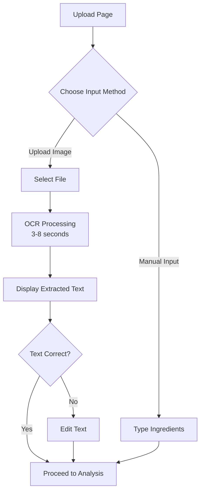
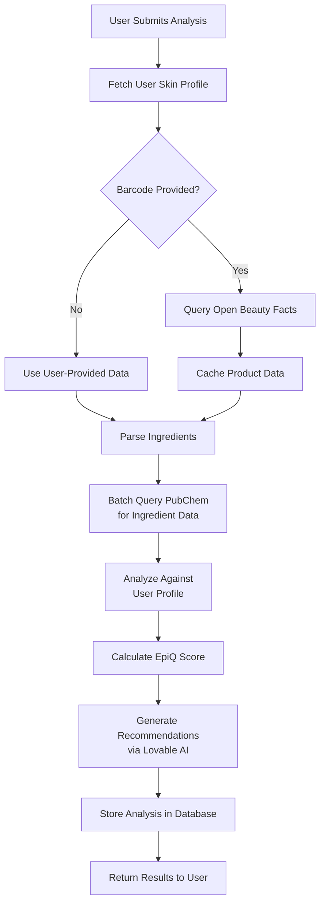
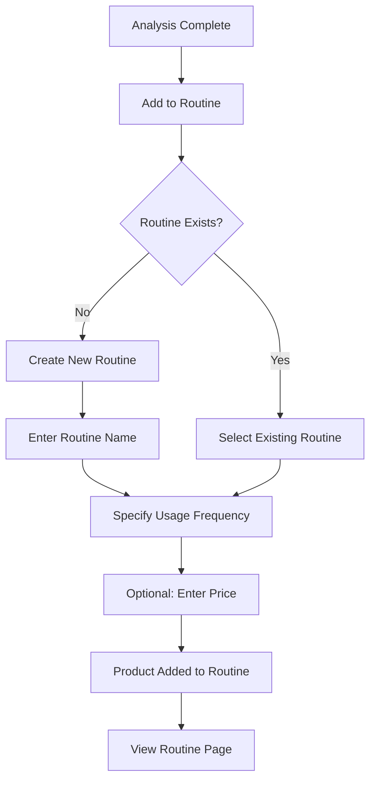

# MVP Document
## SkinLytix - Minimum Viable Product Specification

**Document Version:** 1.0  
**Last Updated:** October 6, 2025  
**Status:** Active Development  
**Owner:** Product & Engineering Teams

---

## Table of Contents

1. [Executive Summary](#executive-summary)
2. [MVP Vision & Scope](#mvp-vision--scope)
3. [Core Features (Must-Have)](#core-features-must-have)
4. [Deferred Features (Post-MVP)](#deferred-features-post-mvp)
5. [User Stories & Acceptance Criteria](#user-stories--acceptance-criteria)
6. [Technical Implementation](#technical-implementation)
7. [Launch Criteria](#launch-criteria)
8. [Metrics & Success Indicators](#metrics--success-indicators)
9. [Risk Mitigation](#risk-mitigation)
10. [Post-Launch Iteration Plan](#post-launch-iteration-plan)

---

## Executive Summary

### What is the MVP?

SkinLytix MVP is a **web-based skincare ingredient analysis platform** that enables users to instantly analyze product ingredients using AI, receive personalized recommendations based on their skin profile, and build optimized skincare routines.

### Why This MVP?

The MVP focuses on solving the **most critical user pain point**: understanding complex ingredient lists and their suitability for individual skin types. By delivering this core value quickly, we can:

1. Validate product-market fit with real users
2. Generate early feedback to guide feature development
3. Build a community-verified product database
4. Establish brand credibility in the competitive skincare space

### MVP Timeline

- **Development:** Weeks 1-8 (✅ Complete)
- **Beta Testing:** Weeks 9-10
- **Soft Launch:** Week 11 (first 100 users)
- **Public Launch:** Week 12+

### MVP Success Metrics

- 1,000+ waitlist signups
- 70%+ waitlist-to-active conversion
- 4.0+ average satisfaction rating
- 60% 30-day retention rate
- 3+ analyses per user in first month

---

## MVP Vision & Scope

### MVP Core Value Proposition

**"Analyze any skincare product in 3 seconds and know if it's right for YOUR skin"**

### What Makes It Minimal?

The MVP includes **only** the features required to:
1. ✅ Capture user skin profile
2. ✅ Extract ingredient lists from product images (OCR)
3. ✅ Analyze ingredients with AI personalization
4. ✅ Generate personalized recommendations
5. ✅ Allow users to build and optimize routines
6. ✅ Collect feedback for iteration

### What Makes It Viable?

- **Fast:** 3-5 second analysis time (OCR + AI)
- **Accurate:** 80%+ user satisfaction with recommendations
- **Personal:** Scoring adapts to each user's skin profile
- **Actionable:** Clear recommendations, not just ratings
- **Scalable:** Built on Lovable Cloud / Supabase for auto-scaling

### What Makes It a Product?

- **Complete User Journey:** Signup → Profile → Analyze → Routine → Optimize
- **Polished UX:** Clean, intuitive interface with minimal friction
- **Reliable:** 99%+ uptime, < 2% error rate
- **Feedback Loop:** Built-in rating and feedback system
- **Data Flywheel:** Every analysis improves the product database

---

## Core Features (Must-Have)

### 1. User Authentication & Onboarding

**Why It's Critical:** Personalization requires user data; authentication enables data persistence and routine management.

#### Features Included:
- ✅ Email/password signup and login (Supabase Auth)
- ✅ Auto-confirm email signups (beta only)
- ✅ Protected routes with authentication guards
- ✅ Onboarding flow to capture skin profile

#### Onboarding Flow:


#### Skin Profile Data Collected:
- **Skin Type:** Normal, Oily, Dry, Combination, Sensitive
- **Skin Concerns:** Acne, Aging, Dark Spots, Dryness, Redness, Dullness, Large Pores (multi-select)
- **Display Name:** Optional
- **Email:** Auto-filled from auth

#### Technical Details:
- **Database Table:** `profiles`
- **RLS Policy:** Users can view/update own profile only
- **Validation:** Skin type required, at least 1 concern required

---

### 2. Product Image Upload & OCR

**Why It's Critical:** Manual ingredient typing is friction-heavy and error-prone. OCR is 10x faster and drives adoption.

#### Features Included:
- ✅ Drag-and-drop file upload
- ✅ File picker for mobile/desktop
- ✅ Tesseract.js OCR engine for text extraction
- ✅ Progress indicator during processing
- ✅ Editable text field for manual corrections
- ✅ Support for JPG, PNG, HEIC (up to 10MB)

#### User Flow:


#### OCR Accuracy Targets:
- 90%+ accuracy on clear product images
- 70%+ accuracy on photos with glare/shadows
- < 10 second processing time (p95)

#### Technical Details:
- **Library:** Tesseract.js 6.0.1
- **Language:** English only (MVP)
- **Processing:** Client-side (no server upload needed)
- **Fallback:** Manual text input always available

---

### 3. AI-Powered Ingredient Analysis

**Why It's Critical:** This is the core product value. Without accurate, personalized analysis, there's no differentiation from competitors.

#### Features Included:
- ✅ Personalized EpiQ Score (0-100) based on skin profile
- ✅ Identification of beneficial ingredients for user
- ✅ Flagging of problematic ingredients (irritants, allergens)
- ✅ Integration with PubChem API for molecular data
- ✅ Integration with Open Beauty Facts for product metadata
- ✅ AI-generated recommendations for usage, timing, application

#### Analysis Pipeline:


#### EpiQ Scoring Logic:
```
Base Score: 70

Beneficial Ingredient Bonuses:
+ Active ingredients matching skin concerns: +3 each
+ Hydrating agents (hyaluronic acid, glycerin): +2 each
+ Antioxidants (vitamin C, E, niacinamide): +2 each

Problematic Ingredient Penalties:
- Irritants for sensitive skin types: -10 each
- Known allergens (fragrance, essential oils): -8 each
- Comedogenic ingredients (for acne-prone): -8 each
- High alcohol content (drying): -5 each

Final Score: Clamped to 0-100 range
```

#### Recommendations Generated:
1. **Optimal Usage Time:** AM/PM based on ingredient properties (e.g., retinol = PM only)
2. **Application Technique:** Patting, massaging, layering order
3. **Interaction Warnings:** Ingredients that shouldn't be mixed (e.g., retinol + vitamin C)
4. **Skin Type Tips:** Specific advice for user's skin type
5. **Routine Suggestions:** Up to 5 ways to integrate product into routine

#### Technical Details:
- **Edge Function:** `supabase/functions/analyze-product/index.ts`
- **AI Model:** Lovable AI - Gemini 2.5 Flash
- **External APIs:** PubChem, Open Beauty Facts
- **Caching:** 30-day product cache, 90-day ingredient cache
- **Average Execution Time:** 8-12 seconds

---

### 4. Analysis Results Display

**Why It's Critical:** Great analysis is useless if poorly communicated. Clear, actionable results drive user satisfaction.

#### Features Included:
- ✅ Prominent EpiQ Score display (large, color-coded)
- ✅ Score interpretation (Excellent, Good, Fair, Poor)
- ✅ List of beneficial ingredients with explanations
- ✅ List of problematic ingredients with warnings
- ✅ Actionable recommendations (usage, timing, tips)
- ✅ Product metadata (name, brand, category)
- ✅ "Add to Routine" button
- ✅ Feedback form for analysis quality

#### Score Color Coding:
- **90-100:** Green (Excellent Match)
- **70-89:** Light Green (Good Match)
- **50-69:** Yellow (Fair Match - Use with Caution)
- **0-49:** Orange/Red (Poor Match - Not Recommended)

#### Results Page Layout:
```
+--------------------------------+
| EpiQ Score: 87                 |
| Good Match for Your Skin       |
+--------------------------------+
| Product: CeraVe Moisturizing   |
| Brand: CeraVe | Category: Moisturizer |
+--------------------------------+
| ✅ Beneficial Ingredients      |
| - Hyaluronic Acid: Hydration   |
| - Ceramides: Barrier repair    |
| - Niacinamide: Brightening     |
+--------------------------------+
| ⚠️ Watch Out For               |
| - Fragrance: May irritate      |
+--------------------------------+
| 💡 Recommendations             |
| 1. Use AM & PM after cleansing |
| 2. Apply to damp skin          |
| 3. Pair with SPF in morning    |
+--------------------------------+
| [Add to Routine] [Done]        |
+--------------------------------+
```

---

### 5. Routine Builder

**Why It's Critical:** Single-product analysis is useful, but routine-level insights unlock the next level of value and stickiness.

#### Features Included:
- ✅ Create multiple named routines (e.g., "Morning Routine", "Evening Routine")
- ✅ Add analyzed products to routines
- ✅ Specify usage frequency (daily, weekly, monthly)
- ✅ Optional product price input
- ✅ View routine with all products
- ✅ Delete products from routine
- ✅ Delete entire routines

#### User Flow:


#### Routine Display:
```
+--------------------------------+
| Morning Routine                |
| 4 products | $87 total cost    |
+--------------------------------+
| 1. CeraVe Cleanser             |
|    Daily | $12                 |
|    [View Analysis] [Remove]    |
+--------------------------------+
| 2. Vitamin C Serum             |
|    Daily | $25                 |
|    [View Analysis] [Remove]    |
+--------------------------------+
| 3. CeraVe Moisturizer          |
|    Daily | $16                 |
|    [View Analysis] [Remove]    |
+--------------------------------+
| 4. EltaMD UV Clear SPF 46      |
|    Daily | $34                 |
|    [View Analysis] [Remove]    |
+--------------------------------+
| [Optimize Routine]             |
+--------------------------------+
```

#### Technical Details:
- **Database Tables:** `routines`, `routine_products`
- **RLS Policy:** Users can manage own routines only
- **Relationships:** routine_products → user_analyses (analysis_id FK)

---

### 6. AI Routine Optimization

**Why It's Critical:** This is a **unique differentiator**. No competitor offers AI-powered routine analysis.

#### Features Included:
- ✅ One-click routine optimization
- ✅ AI identifies ingredient redundancies
- ✅ AI flags conflicting actives
- ✅ Cost optimization suggestions
- ✅ Product order recommendations
- ✅ Savings calculations

#### Optimization Output:
```
+--------------------------------+
| Routine Optimization Results   |
+--------------------------------+
| 🔄 Redundancies Found          |
| - Hyaluronic acid in 3 products|
|   → Remove from 2 to avoid     |
|     over-hydration             |
|   Potential savings: $18/month |
+--------------------------------+
| ⚠️ Conflicting Ingredients     |
| - Retinol + Vitamin C          |
|   → Use retinol PM only,       |
|     Vitamin C AM only          |
+--------------------------------+
| 💰 Cost Optimization           |
| Current cost: $87/month        |
| Optimized cost: $62/month      |
| Savings: $25/month (29%)       |
|                                |
| Suggested swap:                |
| - Replace "Premium Moisturizer"|
|   ($35) with "CeraVe Cream"    |
|   ($16) → Same actives!        |
+--------------------------------+
| 📋 Recommended Order           |
| 1. Cleanser                    |
| 2. Vitamin C Serum (AM) /      |
|    Retinol (PM)                |
| 3. Moisturizer                 |
| 4. SPF (AM only)               |
+--------------------------------+
```

#### Technical Details:
- **Edge Function:** `supabase/functions/optimize-routine/index.ts`
- **AI Model:** Lovable AI - Gemini 2.5 Flash
- **Input:** Routine ID (fetches all products + analyses)
- **Output:** JSON with redundancies, conflicts, cost optimization
- **Storage:** `routine_optimizations` table
- **Average Execution Time:** 10-15 seconds

---

### 7. Feedback & Rating System

**Why It's Critical:** User feedback is essential for iterating and improving analysis accuracy. Also builds trust.

#### Features Included:
- ✅ Post-analysis feedback form (5-star rating + optional message)
- ✅ General feedback widget (persistent on all pages)
- ✅ Anonymous or authenticated feedback
- ✅ Context-aware (tracks analysis ID or page URL)

#### Feedback Collection Points:
1. **Post-Analysis:** Immediately after viewing results
   - "How satisfied are you with this analysis?"
   - 5-star rating + optional text
2. **General Widget:** Bottom-right corner on all pages
   - "Send us feedback"
   - Rating + message form

#### Technical Details:
- **Database Table:** `feedback`
- **RLS Policy:** Anyone can submit, users can view own feedback
- **Columns:** feedback_type, rating, message, context_type, context_id, page_url

---

### 8. Community Product Database

**Why It's Critical:** Every analysis contributes to a shared database, reducing API calls and improving speed over time.

#### Features Included:
- ✅ Products saved after first analysis
- ✅ Verification count increments with each user analysis
- ✅ Product ingredients stored for future lookups
- ✅ Product cache with 30-day TTL
- ✅ Ingredient cache with 90-day TTL

#### How It Works:
1. User analyzes product with barcode
2. System checks if product exists in `products` table
3. If exists → Increment verification_count, return cached data
4. If new → Insert into `products` + `product_ingredients`, cache API data
5. Future users get instant results (no API calls)

#### Database Schema:
```sql
-- Products
CREATE TABLE products (
  id UUID PRIMARY KEY,
  product_name TEXT NOT NULL,
  brand TEXT,
  category TEXT,
  barcode TEXT UNIQUE,
  verification_count INTEGER DEFAULT 1,
  contributed_by_user_id UUID
);

-- Product Ingredients
CREATE TABLE product_ingredients (
  id UUID PRIMARY KEY,
  product_id UUID REFERENCES products,
  ingredient_name TEXT,
  ingredient_order INTEGER,
  pubchem_cid TEXT
);

-- Caches
CREATE TABLE product_cache (
  barcode TEXT UNIQUE,
  obf_data_json JSONB,
  cached_at TIMESTAMP
);

CREATE TABLE ingredient_cache (
  ingredient_name TEXT UNIQUE,
  pubchem_cid TEXT,
  properties_json JSONB,
  cached_at TIMESTAMP
);
```

#### Technical Details:
- **Edge Function:** `supabase/functions/save-product/index.ts`
- **RLS Policy:** Anyone can view, authenticated users can contribute
- **Target:** 5,000+ products by Month 6

---

## Deferred Features (Post-MVP)

### Why Defer?

These features add value but are **not essential** for validating product-market fit. They will be prioritized based on user feedback after launch.

### Phase 2 Features (Months 4-6)

#### 1. Native Mobile Apps (iOS & Android)
- **Why Deferred:** Web app is mobile-responsive; native apps require significant dev time
- **Value:** Camera-first experience, barcode scanning, push notifications
- **Priority:** High (roadmap for Month 7-9)

#### 2. Advanced Barcode Scanner
- **Why Deferred:** Web barcode scanning has limited browser support; requires native app
- **Value:** Real-time scanning, instant product lookup
- **Priority:** High (requires mobile app first)

#### 3. Product Comparison Tool
- **Why Deferred:** Users must understand single products before comparing multiple
- **Value:** Side-by-side ingredient comparison, price/value analysis
- **Priority:** Medium

#### 4. Routine Sharing & Social Features
- **Why Deferred:** Community features require critical mass of users
- **Value:** Public profiles, routine discovery feed, upvoting
- **Priority:** Medium (roadmap for Month 10-12)

#### 5. AI Product Recommendations
- **Why Deferred:** Requires large product database and user behavior data
- **Value:** Proactive product suggestions, "Products You'll Love" feed
- **Priority:** Low-Medium (Year 2)

### Never in MVP

- ❌ Premium subscriptions (freemium model deferred to Month 10+)
- ❌ Dermatologist profiles and expert network (Year 2)
- ❌ Brand dashboard and B2B features (Year 3)
- ❌ International expansion and multi-language support (Year 2)

---

## User Stories & Acceptance Criteria

### Epic 1: User Onboarding

#### Story 1.1: As a new user, I want to create an account so I can save my analyses
**Acceptance Criteria:**
- [ ] User can sign up with email and password
- [ ] Email validation (valid format required)
- [ ] Password requirements: 6+ characters
- [ ] User receives success message after signup
- [ ] User is auto-logged in after signup
- [ ] User is redirected to onboarding flow

#### Story 1.2: As a new user, I want to complete my skin profile so I get personalized recommendations
**Acceptance Criteria:**
- [ ] User selects 1 of 5 skin types
- [ ] User selects 1+ skin concerns from 7 options
- [ ] User can optionally add display name
- [ ] Form validates required fields
- [ ] Profile is marked as complete in database
- [ ] User is redirected to upload page after completion

---

### Epic 2: Product Analysis

#### Story 2.1: As a user, I want to upload a product image so I don't have to type ingredients manually
**Acceptance Criteria:**
- [ ] User can drag-and-drop image or use file picker
- [ ] Supported formats: JPG, PNG, HEIC (up to 10MB)
- [ ] Progress bar shows OCR processing status
- [ ] Extracted text is displayed in editable text field
- [ ] User can proceed to analysis after OCR completes

#### Story 2.2: As a user, I want to analyze a product's ingredients so I know if it's safe for my skin
**Acceptance Criteria:**
- [ ] User submits product name, brand, ingredients, category
- [ ] Analysis completes in < 15 seconds (p95)
- [ ] EpiQ Score is prominently displayed (0-100)
- [ ] Beneficial ingredients are listed with explanations
- [ ] Problematic ingredients are flagged with warnings
- [ ] 3-5 actionable recommendations are provided
- [ ] User can rate the analysis (1-5 stars)

#### Story 2.3: As a user, I want to manually input ingredients if OCR fails
**Acceptance Criteria:**
- [ ] "Manual Input" option is always visible
- [ ] Text area accepts multi-line ingredient lists
- [ ] User can proceed to analysis with manual input
- [ ] Same analysis results as OCR path

---

### Epic 3: Routine Management

#### Story 3.1: As a user, I want to create a routine so I can organize my products
**Acceptance Criteria:**
- [ ] User can create new routine with custom name
- [ ] User can add analyzed products to routine
- [ ] User specifies usage frequency (daily/weekly/monthly)
- [ ] User can optionally add product price
- [ ] Routine displays list of products with metadata

#### Story 3.2: As a user, I want to optimize my routine so I can eliminate redundancies and save money
**Acceptance Criteria:**
- [ ] "Optimize Routine" button is visible on routine page
- [ ] Optimization completes in < 20 seconds
- [ ] Results show ingredient redundancies
- [ ] Results flag conflicting actives
- [ ] Results show cost optimization suggestions
- [ ] Savings are calculated and displayed
- [ ] User can view detailed optimization report

---

### Epic 4: Feedback & Iteration

#### Story 4.1: As a user, I want to provide feedback on analysis quality so the product improves
**Acceptance Criteria:**
- [ ] Feedback form appears after analysis
- [ ] User can rate 1-5 stars
- [ ] User can optionally add text message
- [ ] Feedback is stored with analysis context
- [ ] User receives thank you message

#### Story 4.2: As a user, I want to submit general feedback so I can report bugs or suggest features
**Acceptance Criteria:**
- [ ] Feedback widget is visible on all pages
- [ ] User can submit feedback without interrupting workflow
- [ ] Feedback includes current page URL for context
- [ ] Anonymous users can submit feedback

---

## Technical Implementation

### Frontend Stack

**Framework & Build:**
- React 18.3.1 with TypeScript 5.x
- Vite 6.x for fast builds and hot module replacement
- React Router DOM 6.x for routing

**Styling:**
- Tailwind CSS 3.x for utility-first styling
- shadcn/ui (Radix UI primitives) for accessible components
- Custom design system in `index.css` and `tailwind.config.ts`

**State Management:**
- React Query (TanStack Query 5.x) for server state
- useState/useContext for local UI state
- Supabase client for real-time subscriptions (future use)

**Forms & Validation:**
- React Hook Form 7.x for form state
- Zod for schema validation
- Custom form components in `src/components/ui/form.tsx`

**OCR:**
- Tesseract.js 6.0.1 for client-side OCR
- Web Workers for non-blocking processing

---

### Backend Stack (Lovable Cloud / Supabase)

**Database:**
- PostgreSQL 15.x
- 11 tables: profiles, products, product_ingredients, user_analyses, routines, routine_products, routine_optimizations, feedback, waitlist, product_cache, ingredient_cache
- Row-Level Security (RLS) on all tables

**Authentication:**
- Supabase Auth with email/password
- Auto-confirm email for beta
- JWT-based sessions (7-day expiry)

**Edge Functions (Deno):**
- `analyze-product`: Core analysis with AI + APIs
- `optimize-routine`: AI-powered routine optimization
- `save-product`: Community database contribution
- `query-pubchem`: Batch ingredient lookup with caching

**AI Integration:**
- Lovable AI Gateway (Gemini 2.5 Flash)
- Endpoint: `https://ai.gateway.lovable.dev/v1/chat/completions`
- Authentication: `LOVABLE_API_KEY` (auto-provisioned)

**External APIs:**
- PubChem API: Ingredient molecular data
- Open Beauty Facts API: Product metadata

---

### Database Schema (Complete)

```sql
-- User Profiles
CREATE TABLE profiles (
  id UUID PRIMARY KEY,
  user_id UUID REFERENCES auth.users NOT NULL,
  email TEXT,
  display_name TEXT,
  skin_type TEXT, -- enum
  skin_concerns JSONB DEFAULT '[]',
  is_profile_complete BOOLEAN DEFAULT FALSE,
  created_at TIMESTAMP DEFAULT NOW(),
  updated_at TIMESTAMP DEFAULT NOW()
);

-- Products
CREATE TABLE products (
  id UUID PRIMARY KEY,
  product_name TEXT NOT NULL,
  brand TEXT,
  category TEXT,
  barcode TEXT UNIQUE,
  image_url TEXT,
  contributed_by_user_id UUID,
  verification_count INTEGER DEFAULT 1,
  last_verified_date TIMESTAMP DEFAULT NOW(),
  date_added TIMESTAMP DEFAULT NOW(),
  updated_at TIMESTAMP DEFAULT NOW()
);

-- Product Ingredients
CREATE TABLE product_ingredients (
  id UUID PRIMARY KEY,
  product_id UUID REFERENCES products NOT NULL,
  ingredient_name TEXT NOT NULL,
  ingredient_order INTEGER NOT NULL,
  pubchem_cid TEXT,
  created_at TIMESTAMP DEFAULT NOW()
);

-- User Analyses
CREATE TABLE user_analyses (
  id UUID PRIMARY KEY,
  user_id UUID REFERENCES auth.users NOT NULL,
  product_id UUID REFERENCES products,
  product_name TEXT NOT NULL,
  brand TEXT,
  category TEXT,
  ingredients_list TEXT NOT NULL,
  epiq_score INTEGER,
  recommendations_json JSONB,
  analyzed_at TIMESTAMP DEFAULT NOW()
);

-- Routines
CREATE TABLE routines (
  id UUID PRIMARY KEY,
  user_id UUID REFERENCES auth.users NOT NULL,
  routine_name TEXT NOT NULL,
  created_at TIMESTAMP DEFAULT NOW(),
  updated_at TIMESTAMP DEFAULT NOW()
);

-- Routine Products
CREATE TABLE routine_products (
  id UUID PRIMARY KEY,
  routine_id UUID REFERENCES routines NOT NULL,
  analysis_id UUID REFERENCES user_analyses NOT NULL,
  usage_frequency TEXT NOT NULL,
  product_price NUMERIC,
  created_at TIMESTAMP DEFAULT NOW()
);

-- Routine Optimizations
CREATE TABLE routine_optimizations (
  id UUID PRIMARY KEY,
  routine_id UUID REFERENCES routines NOT NULL,
  optimization_data JSONB NOT NULL,
  created_at TIMESTAMP DEFAULT NOW()
);

-- Feedback
CREATE TABLE feedback (
  id UUID PRIMARY KEY,
  user_id UUID,
  feedback_type TEXT NOT NULL,
  rating INTEGER,
  message TEXT NOT NULL,
  context_type TEXT,
  context_id UUID,
  page_url TEXT,
  created_at TIMESTAMP DEFAULT NOW()
);

-- Waitlist
CREATE TABLE waitlist (
  id UUID PRIMARY KEY,
  first_name TEXT NOT NULL,
  last_name TEXT NOT NULL,
  email TEXT NOT NULL UNIQUE,
  skin_type TEXT NOT NULL,
  skin_condition TEXT NOT NULL,
  money_spent TEXT NOT NULL,
  created_at TIMESTAMP DEFAULT NOW()
);

-- Product Cache
CREATE TABLE product_cache (
  id UUID PRIMARY KEY,
  barcode TEXT NOT NULL UNIQUE,
  obf_data_json JSONB NOT NULL,
  cached_at TIMESTAMP DEFAULT NOW()
);

-- Ingredient Cache
CREATE TABLE ingredient_cache (
  id UUID PRIMARY KEY,
  ingredient_name TEXT NOT NULL UNIQUE,
  pubchem_cid TEXT,
  molecular_weight NUMERIC,
  properties_json JSONB,
  cached_at TIMESTAMP DEFAULT NOW()
);
```

---

### Key Technical Decisions

#### 1. Why Tesseract.js for OCR?
- ✅ Free and open-source
- ✅ Client-side processing (no server upload)
- ✅ Good accuracy (85-90% on clear images)
- ✅ Active community and maintenance
- ❌ Alternative considered: Google Vision API (rejected due to cost at scale)

#### 2. Why Lovable AI (Gemini 2.5 Flash)?
- ✅ No API key management required
- ✅ Pre-provisioned in Lovable Cloud
- ✅ Cost-effective for MVP (free tier included)
- ✅ Fast response times (3-5 seconds)
- ❌ Alternative considered: OpenAI GPT (rejected due to API key requirement)

#### 3. Why PubChem API?
- ✅ Free, government-maintained database
- ✅ Comprehensive molecular data
- ✅ Reliable uptime (99%+)
- ✅ No API key required
- ❌ Alternative considered: Proprietary databases (rejected due to cost)

#### 4. Why Supabase / Lovable Cloud?
- ✅ Rapid development with managed backend
- ✅ Auto-scaling with no DevOps overhead
- ✅ Built-in authentication and RLS
- ✅ Edge functions for serverless logic
- ❌ Alternative considered: Custom Node.js backend (rejected due to dev time)

---

## Launch Criteria

### Pre-Launch Requirements (Beta Testing)

#### Functionality:
- [ ] All 8 core features implemented and tested
- [ ] Zero critical bugs (app-breaking issues)
- [ ] < 5 medium-priority bugs
- [ ] All user flows complete (signup → analysis → routine → optimize)
- [ ] Error handling on all edge cases

#### Performance:
- [ ] Page load time < 2 seconds (first contentful paint)
- [ ] OCR processing < 10 seconds (p95)
- [ ] Analysis completion < 15 seconds (p95)
- [ ] Database query latency < 500ms (p95)
- [ ] Edge function error rate < 2%

#### Security:
- [ ] RLS policies on all user data tables
- [ ] No sensitive data in logs
- [ ] HTTPS-only in production
- [ ] Authentication guards on protected routes
- [ ] Rate limiting on edge functions

#### User Experience:
- [ ] Mobile-responsive design (tested on iOS, Android, desktop)
- [ ] Clear error messages and loading states
- [ ] Accessible UI (keyboard navigation, screen readers)
- [ ] Consistent design system (colors, typography, spacing)
- [ ] No placeholder text or "lorem ipsum"

---

### Soft Launch Requirements (First 100 Users)

#### Waitlist:
- [ ] 500+ signups collected
- [ ] Email sequence prepared (welcome, onboarding tips, feedback request)
- [ ] Invitation system ready (manual or automated)

#### Monitoring:
- [ ] Analytics tracking key events (signup, analysis, routine creation)
- [ ] Error logging and alerts (Sentry or equivalent)
- [ ] Database monitoring (Supabase dashboard)
- [ ] User feedback collection (post-analysis + general widget)

#### Support:
- [ ] Support email set up (support@skinlytix.com)
- [ ] FAQ page or help section
- [ ] Bug reporting process
- [ ] Response time target: < 24 hours

---

### Public Launch Requirements (All Waitlist Users)

#### Quality Assurance:
- [ ] 90%+ satisfaction rating from soft launch users
- [ ] Zero critical bugs reported in soft launch
- [ ] 70%+ waitlist-to-active conversion in soft launch
- [ ] Average of 3+ analyses per user in soft launch

#### Scalability:
- [ ] Load testing passed (1,000 concurrent users)
- [ ] Database indexes optimized
- [ ] Caching strategy validated (60%+ hit rate)
- [ ] Edge function concurrency tested

#### Marketing:
- [ ] Press release prepared
- [ ] Social media posts scheduled
- [ ] Influencer partnerships confirmed (3-5 partners)
- [ ] Product Hunt launch planned (optional)

---

## Metrics & Success Indicators

### MVP Success Criteria (First 30 Days)

#### User Acquisition:
- **Target:** 1,000 active users (70% waitlist conversion)
- **Measurement:** User signups + profile completion
- **Success Threshold:** 700+ users

#### Engagement:
- **Target:** 3+ analyses per user in first 30 days
- **Measurement:** user_analyses table count / unique users
- **Success Threshold:** 2.5+ avg analyses per user

#### Retention:
- **Target:** 60% 30-day retention
- **Measurement:** Users active on Day 30 / Total signups
- **Success Threshold:** 50%+ retention

#### Satisfaction:
- **Target:** 4.0+ average rating on analysis quality
- **Measurement:** Avg of feedback.rating where context_type = 'post_analysis'
- **Success Threshold:** 3.8+ avg rating

#### Product Database:
- **Target:** 2,000+ products in database
- **Measurement:** products table count
- **Success Threshold:** 1,500+ products

---

### Key Performance Indicators (Ongoing)

**Daily Metrics:**
- New user signups
- Total analyses completed
- Average analysis time (OCR + AI)
- Edge function error rate
- Page load times (p50, p95)

**Weekly Metrics:**
- Weekly Active Users (WAU)
- Analyses per active user
- Routines created
- Optimizations requested
- User feedback submissions

**Monthly Metrics:**
- Monthly Active Users (MAU)
- 30-day retention rate
- Average satisfaction rating
- Product database growth
- Cache hit rate

---

## Risk Mitigation

### Technical Risks

**Risk 1: OCR Fails on Poor Quality Images**
- **Mitigation:**
  - Always allow manual text input as fallback
  - Add image quality tips on upload page
  - Implement image preprocessing (contrast, rotation)
  - Show confidence score to user ("OCR confidence: 75%")

**Risk 2: AI Analysis is Slow or Inaccurate**
- **Mitigation:**
  - Set timeout at 30 seconds, return graceful error
  - Implement retry logic for failed API calls
  - Validate AI outputs against known ingredient lists
  - Collect user feedback to identify accuracy issues

**Risk 3: Database Performance Degrades at Scale**
- **Mitigation:**
  - Add indexes on frequently queried columns
  - Implement pagination on large result sets
  - Archive old analyses after 12 months
  - Monitor query performance in Supabase dashboard

---

### Product Risks

**Risk 1: Low User Engagement After First Analysis**
- **Mitigation:**
  - Prompt users to create routine immediately after analysis
  - Email reminders to analyze more products
  - Highlight value of routine optimization
  - Implement achievement badges or streaks (future)

**Risk 2: Users Find Recommendations Too Generic**
- **Mitigation:**
  - Collect detailed feedback on each analysis
  - A/B test different recommendation formats
  - Improve AI prompt with user feedback
  - Add more skin profile data points (future)

**Risk 3: Community Database Has Low Coverage**
- **Mitigation:**
  - Incentivize product contributions (gamification)
  - Partner with beauty retailers for bulk product data
  - Manual admin uploads for popular products
  - Display "Help build the database" CTA

---

### Business Risks

**Risk 1: Waitlist Doesn't Convert to Active Users**
- **Mitigation:**
  - Personalized onboarding emails
  - Highlight key benefits in welcome sequence
  - Offer early-access perks to beta users
  - Make signup-to-first-analysis flow frictionless

**Risk 2: Negative Word-of-Mouth from Inaccurate Analysis**
- **Mitigation:**
  - Add disclaimers ("Not medical advice, consult dermatologist")
  - Set expectations (AI-powered, not infallible)
  - Respond quickly to user feedback
  - Iterate on analysis accuracy based on feedback

---

## Post-Launch Iteration Plan

### Week 1-2: Stabilization

**Focus:** Fix critical bugs, monitor performance, respond to user feedback

**Actions:**
- Daily check of error logs and user feedback
- Hot fixes for any critical bugs within 24 hours
- Monitor database performance and optimize slow queries
- Send "How's it going?" email to first 100 users

**Metrics to Track:**
- Error rate by feature
- Average response time (page loads, API calls)
- User feedback sentiment
- Daily active users (DAU)

---

### Week 3-4: Quick Wins

**Focus:** Implement high-impact, low-effort improvements

**Candidate Features:**
- Add barcode input field (manual barcode entry)
- Improve OCR tips and image quality guidance
- Add product search to routine builder
- Implement routine templates (e.g., "Basic 3-Step Routine")
- Add "Copy Routine" feature (duplicate existing routine)

**Prioritization Criteria:**
- User feedback frequency (most requested)
- Development time (< 1 day per feature)
- Impact on engagement or satisfaction

---

### Month 2-3: Data-Driven Iteration

**Focus:** Analyze user behavior, identify drop-off points, optimize funnels

**Analytics to Review:**
- Onboarding completion rate (% who finish skin profile)
- Upload method split (OCR vs. manual input)
- Routine builder adoption (% of users who create routines)
- Optimization feature usage (% who click "Optimize Routine")
- Feedback rating distribution

**Hypotheses to Test:**
- If onboarding completion is low → Test shorter profile form
- If routine adoption is low → Prompt to create routine immediately after analysis
- If optimization usage is low → Highlight feature with tutorial or tooltip

---

### Month 4-6: Feature Expansion

**Focus:** Build Phase 2 features based on validated user needs

**Top Candidates:**
- Product comparison tool (side-by-side analysis)
- Product search and discovery (browse database)
- Routine sharing (public profiles)
- Email notifications (routine reminders)
- Advanced filters (price range, ingredient preferences)

**Decision Framework:**
- User feedback: Is this feature frequently requested?
- Competitive analysis: Do competitors have this?
- Engagement: Will this increase retention or usage?
- Monetization: Does this support future premium tier?

---

## Appendix

### MVP Feature Checklist

#### User Management
- [x] Email/password signup and login
- [x] Auto-confirm email (beta)
- [x] Protected routes with auth guards
- [x] Onboarding flow (skin type + concerns)
- [x] User profile page
- [x] Profile completion tracking

#### Product Analysis
- [x] Image upload (drag-and-drop + file picker)
- [x] OCR with Tesseract.js
- [x] Progress indicator during OCR
- [x] Manual text input fallback
- [x] Product details form (name, brand, category)
- [x] AI analysis with Lovable AI (Gemini 2.5 Flash)
- [x] PubChem API integration
- [x] Open Beauty Facts integration
- [x] Personalized EpiQ Score (0-100)
- [x] Beneficial ingredients display
- [x] Problematic ingredients display
- [x] Actionable recommendations (3-5)
- [x] Post-analysis feedback form

#### Routine Management
- [x] Create routine with custom name
- [x] Add analyzed products to routine
- [x] Specify usage frequency
- [x] Optional product price input
- [x] View routine with all products
- [x] Delete products from routine
- [x] Delete entire routines
- [x] AI routine optimization
- [x] Optimization results display

#### Community Features
- [x] Product database (products table)
- [x] Product verification tracking
- [x] Product cache (30-day TTL)
- [x] Ingredient cache (90-day TTL)
- [x] Community contribution tracking

#### Feedback & Support
- [x] Post-analysis feedback form
- [x] General feedback widget
- [x] Anonymous feedback support
- [x] Context-aware feedback (analysis ID, page URL)

#### Waitlist & Marketing
- [x] Waitlist signup form on landing page
- [x] HubSpot integration via Zapier
- [x] Email validation and duplicate prevention
- [x] Waitlist data storage

---

### Technical Debt & Future Optimization

**Code Quality:**
- Add comprehensive unit tests (React Testing Library)
- Add E2E tests (Playwright or Cypress)
- Improve TypeScript type coverage (strict mode)
- Refactor large components into smaller, focused components

**Performance:**
- Implement virtual scrolling for large product lists
- Add image optimization (WebP format, lazy loading)
- Implement service workers for offline support
- Add CDN caching for static assets

**Security:**
- Add CAPTCHA to signup form (prevent spam)
- Implement rate limiting on client-side API calls
- Add content security policy (CSP) headers
- Conduct security audit before scaling

---

### Contact & Support

**Product Team:**
- Product Manager: [Name]
- Engineering Lead: [Name]
- Designer: [Name]

**Support Channels:**
- Email: support@skinlytix.com
- Feedback Widget: In-app (bottom-right corner)
- Bug Reports: [GitHub Issues or Notion]

---

**End of MVP Document**

*For questions or updates to this MVP spec, contact the Product Team.*
