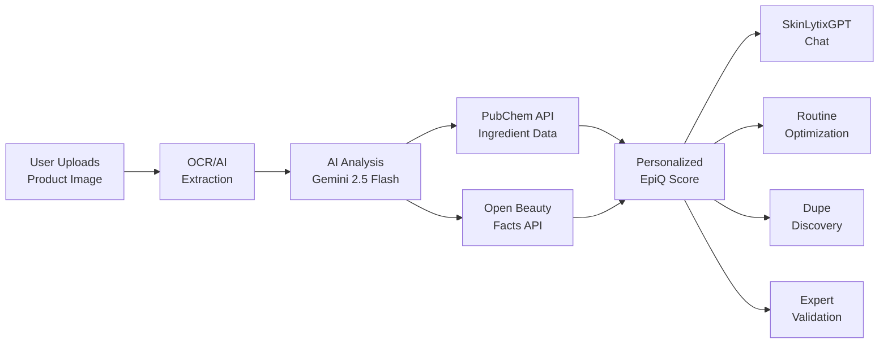

# Product Requirements Document (PRD)
## SkinLytix - AI-Powered Skincare Intelligence Platform

**Document Version:** 2.0  
**Last Updated:** December 31, 2025  
**Status:** Active Development - Beta Phase  
**Owner:** Product Team

---

## Table of Contents

1. [Executive Summary](#executive-summary)
2. [Product Overview](#product-overview)
3. [Market Analysis & Target Users](#market-analysis--target-users)
4. [Feature Specifications](#feature-specifications)
5. [Technical Requirements](#technical-requirements)
6. [Success Metrics & KPIs](#success-metrics--kpis)
7. [Roadmap & Milestones](#roadmap--milestones)
8. [Competitive Analysis](#competitive-analysis)

---

## Executive Summary

### Vision Statement
SkinLytix aims to democratize skincare transparency by providing instant, AI-powered ingredient analysis that empowers consumers to make informed decisions about their skincare products based on their unique skin profiles.

### Mission
To eliminate the confusion and frustration of deciphering complex ingredient lists by delivering personalized, science-backed skincare recommendations in seconds.

### Target Market Analysis
- **Primary Market:** Health-conscious consumers aged 25-45 (predominantly female, 70%)
- **Secondary Market:** Individuals with sensitive skin or specific skin concerns
- **Tertiary Market:** Budget-conscious consumers seeking value optimization
- **Market Size:** $180B+ global skincare market, growing at 4.4% CAGR

### Key Business Objectives (18 Months)
1. Acquire 10,000+ active users within first 12 months
2. Achieve 75%+ user satisfaction rating for product analysis accuracy
3. Build community database of 50,000+ verified products
4. Generate $500K ARR through premium subscriptions by Month 18
5. Establish partnerships with 3+ cosmetic science programs

### Current MVP Status (December 2025)
- ✅ Core analysis workflow complete
- ✅ SkinLytixGPT chat implemented
- ✅ Routine builder with AI optimization
- ✅ Dupe discovery feature launched
- ✅ Freemium subscription model active
- ✅ Stripe payment integration complete
- 🔄 Beta testing in progress
- 📅 Academic partnership (Spelman) planned for 2026

---

## Product Overview

### Problem Statement

**The Skincare Transparency Gap:**

Modern consumers face significant challenges in understanding skincare products:

1. **Complexity Overload:** Ingredient lists contain 20-40+ complex chemical names
2. **Personalization Void:** Generic reviews don't account for individual skin types
3. **Cost Inefficiency:** $313/year average spend, 40% products abandoned
4. **Information Fragmentation:** No centralized, trustworthy source
5. **Decision Paralysis:** 73% feel overwhelmed choosing products
6. **AI Trust Issues:** Consumers skeptical of AI-only recommendations

### Solution Description

**SkinLytix: AI + Expert-Powered Skincare Intelligence**

### Unique Value Proposition

**"Know Your Skincare in 30 Seconds - Validated by Experts"**

| Feature | SkinLytix | Competitors |
|---------|-----------|-------------|
| Analysis Time | **10-15 sec** | 30-60 sec |
| Personalization | **100% Profile-Based** | Generic |
| Conversational AI | **SkinLytixGPT** | None |
| Routine Optimization | **AI-Powered** | Manual |
| Dupe Discovery | **Included** | Separate app |
| Expert Validation | **Academic Partnership** | None |
| Cost | **Freemium** | Free or Paid |

---

## Feature Specifications

### 1. Product Scanning & Analysis

**Status:** ✅ Implemented

**Components:**
- Image upload (drag-drop, file picker)
- Tesseract.js OCR for text extraction
- AI vision model for ingredient extraction
- Real-time progress indicator

**Edge Function:** `analyze-product`

**Output:**
- EpiQ Score (0-100)
- Sub-scores (Safety, Compatibility, Quality, Preservatives)
- Enriched ingredient list with explanations
- Key actives and red flags
- Personalized recommendations
- Professional referral when needed

---

### 2. SkinLytixGPT Chat

**Status:** ✅ Implemented

**Purpose:** Conversational AI for follow-up questions about product analysis.

**Features:**
- Context-aware responses (knows current product)
- Streaming responses (SSE)
- Conversation persistence
- Usage limits by tier (3/50/unlimited)
- Professional guardrails

**Edge Function:** `chat-skinlytix`

---

### 3. Routine Builder & Optimization

**Status:** ✅ Implemented

**Routine Builder:**
- Multiple named routines
- Product assignment with frequency
- Cost tracking
- Routine type (face/body/hair)

**AI Optimization:**
- Redundancy detection
- Conflict identification
- Cost savings recommendations
- Product order optimization

**Edge Function:** `optimize-routine`

---

### 4. Dupe Discovery

**Status:** ✅ Implemented

**Purpose:** Find affordable alternatives to expensive products.

**Features:**
- AI-powered similarity matching
- Price comparison
- Shared ingredient highlighting
- Save to favorites
- Limited saves on free tier

**Edge Function:** `find-dupes`

---

### 5. Subscription System

**Status:** ✅ Implemented

**Tiers:**

| Feature | Free | Premium | Pro |
|---------|------|---------|-----|
| Analyses | Unlimited | Unlimited | Unlimited |
| Score Breakdown | ❌ | ✅ | ✅ |
| AI Explanation | ❌ | ✅ | ✅ |
| SkinLytixGPT | 3/mo | 50/mo | Unlimited |
| Routines | 1 | 5 | Unlimited |
| Optimization | Preview | 3/mo | Unlimited |

**Pricing:**
- Premium: $7.99/month or $79/year
- Pro: $14.99/month or $149/year

**Trial:** 7 days free Premium for new users

---

### 6. Academic Partnership (Planned Q1 2026)

**Partner:** Spelman College Cosmetic Science Program

**Integration Points:**
- Expert Review Queue
- Student validation badges
- Ingredient deep-dive articles
- EpiQ Score calibration
- Research cohorts

**Trust Building:**
- "Validated by Experts" badges
- Student-authored content
- Certification program

---

## Technical Requirements

### Frontend Stack
- React 18 + TypeScript
- Vite build tool
- Tailwind CSS + shadcn/ui
- React Router 6
- TanStack Query
- Tesseract.js (OCR)
- Recharts (analytics)
- Framer Motion (animations)

### Backend Stack
- Supabase (PostgreSQL + Auth)
- Deno Edge Functions
- Lovable AI Gateway (Gemini 2.5)
- Stripe (payments)

### External APIs
- PubChem (ingredient data)
- Open Beauty Facts (product data)

### Performance Targets
- Analysis < 15 seconds
- Chat response < 2 seconds (first token)
- Page load < 3 seconds
- 99.9% uptime

---

## Success Metrics & KPIs

### User Engagement

| Metric | Target |
|--------|--------|
| DAU | 500+ |
| WAU | 2,000+ |
| MAU | 5,000+ |
| Analyses/User/Month | 5+ |
| Chat Messages/User/Month | 10+ |
| Routine Creation Rate | 50% |

### Conversion

| Metric | Target |
|--------|--------|
| Demo → Signup | 40% |
| Trial → Paid | 30% |
| Free → Premium | 10% |
| Premium → Pro | 15% |

### Retention

| Metric | Target |
|--------|--------|
| D1 Retention | 70% |
| D7 Retention | 50% |
| D30 Retention | 30% |
| Monthly Churn | < 5% |

### Revenue

| Metric | 6 Month Target | 12 Month Target |
|--------|----------------|-----------------|
| MRR | $10K | $40K |
| ARPU | $8 | $10 |
| LTV | $96 | $120 |
| CAC | < $20 | < $25 |

---

## Roadmap & Milestones

### Phase 1: Foundation (✅ Complete)
- Core analysis workflow
- User authentication
- Profile onboarding
- Basic routine builder

### Phase 2: AI Enhancement (✅ Complete)
- SkinLytixGPT chat
- Routine optimization
- Dupe discovery
- Sub-score breakdown

### Phase 3: Monetization (✅ Complete)
- Subscription tiers
- Stripe integration
- Trial system
- Usage limits

### Phase 4: Trust & Validation (Q1 2026)
- Spelman partnership launch
- Expert review system
- Validation badges
- Student content

### Phase 5: Scale (Q2-Q3 2026)
- Mobile PWA
- Push notifications
- Social features
- API for brands

### Phase 6: Enterprise (Q4 2026)
- White-label solutions
- Retail partnerships
- B2B analytics
- International expansion

---

## Competitive Analysis

### Direct Competitors

| Product | Strengths | Weaknesses |
|---------|-----------|------------|
| Think Dirty | Large database | Generic ratings, no personalization |
| INCI Beauty | Good ingredient detail | Manual input, no AI |
| CosDNA | Detailed analysis | Poor UX, no mobile |
| EWG Skin Deep | Trusted brand | Outdated, no personalization |
| Yuka | Popular in EU | Limited skincare focus |

### SkinLytix Differentiators

1. **AI-Powered Personalization** - Unique EpiQ scoring
2. **Conversational AI** - Only chat feature in market
3. **Routine Optimization** - No competitor offers this
4. **Dupe Discovery** - Built-in alternative finder
5. **Expert Validation** - Academic partnership (2026)
6. **Speed** - Fastest analysis time (10-15 sec)
