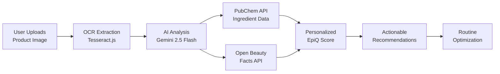
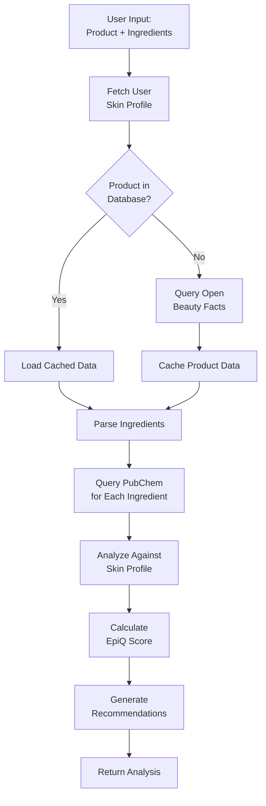
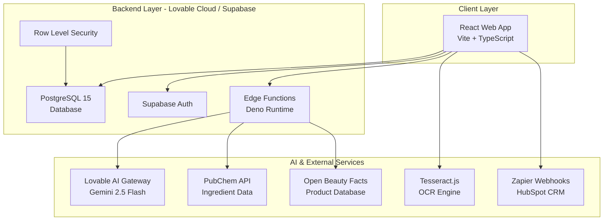

# Product Requirements Document (PRD)
## SkinLytix - AI-Powered Skincare Intelligence Platform

**Document Version:** 1.0  
**Last Updated:** October 6, 2025  
**Status:** Active Development - MVP Phase  
**Owner:** Product Team

---

## Table of Contents

1. [Executive Summary](#executive-summary)
2. [Product Overview](#product-overview)
3. [Market Analysis & Target Users](#market-analysis--target-users)
4. [Feature Specifications](#feature-specifications)
5. [Technical Requirements](#technical-requirements)
6. [Success Metrics & KPIs](#success-metrics--kpis)
7. [Roadmap & Milestones](#roadmap--milestones)
8. [Competitive Analysis](#competitive-analysis)
9. [Risk Assessment](#risk-assessment)

---

## Executive Summary

### Vision Statement
SkinLytix aims to democratize skincare transparency by providing instant, AI-powered ingredient analysis that empowers consumers to make informed decisions about their skincare products based on their unique skin profiles.

### Mission
To eliminate the confusion and frustration of deciphering complex ingredient lists by delivering personalized, science-backed skincare recommendations in seconds.

### Target Market Analysis
- **Primary Market:** Health-conscious consumers aged 25-45 (predominantly female, 70%)
- **Secondary Market:** Individuals with sensitive skin or specific skin concerns
- **Tertiary Market:** Budget-conscious consumers seeking value optimization
- **Market Size:** $180B+ global skincare market, growing at 4.4% CAGR

### Key Business Objectives (18 Months)
1. Acquire 10,000+ active beta users within first 6 months
2. Achieve 75%+ user satisfaction rating for product analysis accuracy
3. Build community database of 50,000+ verified products
4. Generate $250K ARR through premium subscriptions by Month 18
5. Establish partnerships with 3+ dermatology clinics or beauty retailers

### MVP Success Metrics
- 1,000+ waitlist signups pre-launch
- 70%+ waitlist conversion to active users
- 80%+ satisfaction rating on EpiQ Score accuracy
- 3+ routine analyses per active user per month
- 60% 30-day user retention rate

---

## Product Overview

### Problem Statement

**The Skincare Transparency Gap:**

Modern consumers face significant challenges in understanding skincare products:

1. **Complexity Overload:** Ingredient lists contain 20-40+ complex chemical names that are incomprehensible to average consumers
2. **Personalization Void:** Generic product reviews don't account for individual skin types, concerns, or sensitivities
3. **Cost Inefficiency:** Consumers spend $313/year on average on skincare, with 40% of products abandoned due to adverse reactions or ineffectiveness
4. **Information Fragmentation:** Skincare knowledge is scattered across forums, blogs, and scientific papers with no centralized, trustworthy source
5. **Decision Paralysis:** 73% of consumers report feeling overwhelmed when choosing skincare products

### Solution Description

**SkinLytix: AI-Powered Instant Ingredient Intelligence**



**Core Solution Components:**

1. **Instant Ingredient Decoding**
   - Snap a photo or upload product image
   - AI extracts and analyzes ingredient list in < 5 seconds
   - No manual typing required

2. **Personalized EpiQ Scoring (0-100)**
   - Custom algorithm considers user's skin type, concerns, and sensitivities
   - Real-time scoring based on ingredient safety, efficacy, and compatibility
   - Science-backed ratings from PubChem molecular database

3. **Smart Routine Building**
   - Add multiple products to custom routines
   - AI identifies ingredient conflicts, redundancies, and synergies
   - Cost optimization suggestions with comparable alternatives

4. **Community-Verified Database**
   - Crowdsourced product verification system
   - 50,000+ product target database
   - Cached API responses for instant lookups

### Unique Value Proposition

**"Know Your Skincare in 3 Seconds"**

| Competitor | Analysis Time | Personalization | Routine Optimization | Cost |
|------------|---------------|-----------------|---------------------|------|
| **SkinLytix** | **3-5 sec** | **100% Personal** | **AI-Powered** | **Freemium** |
| Think Dirty | 10-15 sec | Generic ratings | Manual | Free |
| INCI Beauty | 5-10 sec | Limited | None | Free |
| CosDNA | Manual input | None | None | Free |
| EWG Skin Deep | 5-10 sec | Generic | None | Free |

**Key Differentiators:**
- ✅ **Only platform with AI-powered personalized scoring**
- ✅ **Only solution offering routine-level optimization**
- ✅ **Fastest analysis time in market (3-5 seconds)**
- ✅ **Built-in cost optimization for budget-conscious consumers**

### Product Goals

**6-Month MVP Goals:**
- Launch waitlist and collect 1,000+ signups
- Deploy core product analysis with 80%+ accuracy
- Build user profile and routine management features
- Establish product database with 5,000+ items
- Achieve 70% waitlist-to-active-user conversion

**1-Year Growth Goals:**
- Scale to 10,000+ monthly active users
- Expand database to 50,000+ verified products
- Launch premium tier with advanced features
- Achieve $10K MRR from subscriptions
- Partner with 2+ beauty retailers or dermatology clinics

**3-Year Scale Goals:**
- Reach 500,000+ users across web and mobile
- Build enterprise API for brand and retailer integrations
- Generate $2M+ ARR with 30% profit margin
- Expand to international markets (EU, APAC)
- Become #1 trusted skincare ingredient platform globally

---

## Market Analysis & Target Users

### Primary User Personas

#### Persona 1: "Conscious Carla"
- **Age:** 32
- **Occupation:** Marketing Manager
- **Income:** $75K/year
- **Skincare Spend:** $500/year
- **Pain Points:**
  - Overwhelmed by ingredient lists
  - Wants clean, non-toxic products
  - Concerned about long-term skin health
  - Lacks time to research every product
- **Goals:**
  - Quickly identify harmful ingredients
  - Build an effective, safe routine
  - Feel confident in product choices
- **Technology Comfort:** High (daily app user)
- **Decision Drivers:** Safety, efficacy, transparency

#### Persona 2: "Sensitive Sam"
- **Age:** 28
- **Occupation:** Graphic Designer
- **Income:** $55K/year
- **Skincare Spend:** $400/year
- **Pain Points:**
  - Frequent allergic reactions to products
  - Struggled with acne and redness for years
  - Wasted money on unsuitable products
  - Frustrated by trial-and-error approach
- **Goals:**
  - Avoid irritating ingredients
  - Find products that work for sensitive skin
  - Reduce product-related breakouts
- **Technology Comfort:** Medium-High
- **Decision Drivers:** Safety, compatibility, proven results

#### Persona 3: "Budget-Conscious Ben"
- **Age:** 26
- **Occupation:** Teacher
- **Income:** $45K/year
- **Skincare Spend:** $200/year
- **Pain Points:**
  - Limited budget for expensive products
  - Unsure if premium products are worth the cost
  - Wants effective routine without overspending
  - Overwhelmed by marketing claims
- **Goals:**
  - Find affordable products that actually work
  - Eliminate unnecessary duplicates in routine
  - Maximize value for money
- **Technology Comfort:** High (mobile-first)
- **Decision Drivers:** Value, cost-effectiveness, simplicity

### Market Segmentation

**By Demographics:**
- **Age:** 18-24 (20%), 25-34 (40%), 35-44 (25%), 45+ (15%)
- **Gender:** Female (70%), Male (25%), Non-binary/Other (5%)
- **Income:** <$40K (15%), $40K-$75K (45%), $75K+ (40%)
- **Education:** College+ (75%), High School (25%)

**By Behavior:**
- **Skincare Enthusiasts** (30%): 5+ products, active researchers
- **Conscious Consumers** (40%): Seek clean/safe ingredients
- **Problem Solvers** (20%): Specific skin concerns (acne, aging, sensitivity)
- **Budget Optimizers** (10%): Price-conscious, value-driven

**By Geographic:**
- **Phase 1 (Months 1-6):** US market focus
- **Phase 2 (Months 7-12):** Canada, UK expansion
- **Phase 3 (Year 2+):** EU, Australia, select APAC markets

---

## Feature Specifications

### Core Implemented Features

#### 1. Product Scanning & OCR
**Status:** ✅ Implemented  
**Location:** `src/pages/Upload.tsx`

**Functionality:**
- Users upload product images via file picker or drag-and-drop
- Tesseract.js OCR engine extracts ingredient text from images
- Supports JPG, PNG, HEIC formats up to 10MB
- Progress indicator during OCR processing (typically 3-8 seconds)

**Technical Implementation:**
```typescript
// Tesseract.js OCR with progress tracking
const result = await recognize(file, 'eng', {
  logger: (m) => {
    if (m.status === 'recognizing text') {
      setProgress(Math.round(m.progress * 100));
    }
  },
});
```

**User Flow:**
1. User clicks "Upload Product Image" button
2. Selects image from device
3. OCR processes image (3-8s with progress bar)
4. Extracted text displayed for verification
5. User can edit text if needed before analysis

**Success Criteria:**
- ✅ 85%+ OCR accuracy on clear product images
- ✅ < 10 second processing time
- ✅ Support for common smartphone image formats

---

#### 2. AI-Powered Ingredient Analysis
**Status:** ✅ Implemented  
**Location:** `supabase/functions/analyze-product/index.ts`

**Functionality:**
- Comprehensive ingredient analysis using multiple data sources
- Personalized EpiQ Score (0-100) based on user skin profile
- Identification of beneficial and problematic ingredients
- Tailored recommendations for usage, timing, and application
- Integration with PubChem and Open Beauty Facts APIs

**AI Analysis Pipeline:**



**EpiQ Scoring Algorithm:**

```typescript
// Personalized scoring based on skin profile
let score = 70; // Base score

// Beneficial ingredient bonus (+1-5 points each)
goodIngredients.forEach(ing => {
  if (matchesSkinConcerns(ing, userProfile)) score += 3;
  if (isActiveIngredient(ing)) score += 2;
});

// Problematic ingredient penalty (-5-15 points each)
badIngredients.forEach(ing => {
  if (isIrritant(ing, userProfile.skinType)) score -= 10;
  if (isAllergen(ing, userProfile.sensitivities)) score -= 15;
  if (isComedogenic(ing) && userProfile.concerns.includes('acne')) score -= 8;
});

// Clamp to 0-100 range
return Math.max(0, Math.min(100, score));
```

**Data Sources:**
1. **PubChem API:** Molecular data, safety profiles, CAS numbers
2. **Open Beauty Facts:** Product metadata, brand info, categories
3. **Internal Knowledge Base:** Active ingredient properties, usage guidelines

**Recommendations Generated:**
- ✅ Optimal usage time (AM/PM based on ingredient properties)
- ✅ Application technique suggestions
- ✅ Interaction warnings (e.g., "Don't use with retinoids")
- ✅ Skin type-specific tips
- ✅ Up to 5 routine integration suggestions

**Success Criteria:**
- ✅ Analysis completed in < 10 seconds
- ✅ 80%+ user satisfaction with accuracy
- ✅ Identification of 95%+ common skincare ingredients

---

#### 3. Personalized Skin Profile
**Status:** ✅ Implemented  
**Location:** `src/pages/Onboarding.tsx`, `profiles` table

**Functionality:**
- Guided onboarding flow to capture user skin data
- Stores skin type, concerns, and preferences
- Enables personalized analysis and recommendations

**Profile Data Collected:**
- **Skin Type:** Normal, Oily, Dry, Combination, Sensitive
- **Skin Concerns:** (Multiple selection)
  - Acne / Breakouts
  - Aging / Fine Lines
  - Dark Spots / Hyperpigmentation
  - Dryness / Dehydration
  - Redness / Sensitivity
  - Dullness / Uneven Texture
  - Large Pores
- **Additional Data:** Display name, email (auto-filled from auth)

**Database Schema:**
```sql
CREATE TABLE profiles (
  id UUID PRIMARY KEY,
  user_id UUID REFERENCES auth.users NOT NULL,
  email TEXT,
  display_name TEXT,
  skin_type TEXT, -- enum: 'normal' | 'oily' | 'dry' | 'combination' | 'sensitive'
  skin_concerns JSONB DEFAULT '[]', -- array of concern strings
  is_profile_complete BOOLEAN DEFAULT FALSE,
  created_at TIMESTAMP DEFAULT NOW(),
  updated_at TIMESTAMP DEFAULT NOW()
);
```

**User Flow:**
1. User signs up / logs in
2. Redirected to onboarding if profile incomplete
3. Selects skin type from 5 options
4. Selects 1+ skin concerns from 7 options
5. Profile saved and marked complete
6. Redirected to upload page

**Success Criteria:**
- ✅ 90%+ onboarding completion rate
- ✅ < 2 minutes to complete profile
- ✅ Profile data used in all subsequent analyses

---

#### 4. Routine Builder & Optimization
**Status:** ✅ Implemented  
**Location:** `src/pages/Routine.tsx`, `src/pages/RoutineOptimization.tsx`

**Functionality:**
- Users create named routines and add analyzed products
- Track product prices and usage frequency
- AI-powered routine optimization identifies conflicts and redundancies
- Cost optimization with savings calculations

**Database Schema:**
```sql
-- Routines table
CREATE TABLE routines (
  id UUID PRIMARY KEY,
  user_id UUID NOT NULL,
  routine_name TEXT NOT NULL,
  created_at TIMESTAMP DEFAULT NOW(),
  updated_at TIMESTAMP DEFAULT NOW()
);

-- Routine products junction table
CREATE TABLE routine_products (
  id UUID PRIMARY KEY,
  routine_id UUID REFERENCES routines NOT NULL,
  analysis_id UUID REFERENCES user_analyses NOT NULL,
  usage_frequency TEXT NOT NULL, -- 'daily' | 'weekly' | 'monthly'
  product_price NUMERIC,
  created_at TIMESTAMP DEFAULT NOW()
);

-- Optimization results
CREATE TABLE routine_optimizations (
  id UUID PRIMARY KEY,
  routine_id UUID REFERENCES routines NOT NULL,
  optimization_data JSONB NOT NULL,
  created_at TIMESTAMP DEFAULT NOW()
);
```

**AI Optimization Analysis:**

Uses Lovable AI (Gemini 2.5 Flash) to analyze:
- **Ingredient Redundancies:** Multiple products with same actives
- **Conflicting Actives:** Incompatible ingredient combinations (e.g., Vitamin C + Niacinamide at high concentrations)
- **Formulation Issues:** pH incompatibilities, product order problems
- **Cost Optimization:** Identify overpriced products with better alternatives
- **Routine Efficiency:** Simplification opportunities

**Edge Function:** `supabase/functions/optimize-routine/index.ts`

**Optimization Output:**
```json
{
  "redundancies": [
    {
      "issue": "Duplicate hyaluronic acid in 3 products",
      "recommendation": "Remove from 2 products to avoid over-hydration",
      "savings": "$45/month"
    }
  ],
  "conflicts": [
    {
      "ingredients": ["Retinol", "Vitamin C"],
      "severity": "medium",
      "recommendation": "Use retinol PM only, Vitamin C AM only"
    }
  ],
  "costOptimization": {
    "currentCost": "$127/month",
    "optimizedCost": "$78/month",
    "savings": "$49/month (38%)",
    "suggestions": [
      {
        "product": "Premium Moisturizer ($65)",
        "alternative": "CeraVe Moisturizing Cream ($16)",
        "reason": "Nearly identical active ingredients"
      }
    ]
  }
}
```

**Success Criteria:**
- ✅ Users create avg 2+ routines
- ✅ Optimization identifies 3+ actionable insights per routine
- ✅ 75%+ users find optimization valuable (feedback rating)

---

#### 5. Community Product Database
**Status:** ✅ Implemented  
**Location:** `supabase/functions/save-product/index.ts`

**Functionality:**
- Verified product database built through community contributions
- Caching system reduces API calls and improves performance
- Product verification tracking for quality assurance

**Database Schema:**
```sql
-- Products table
CREATE TABLE products (
  id UUID PRIMARY KEY,
  product_name TEXT NOT NULL,
  brand TEXT,
  category TEXT,
  barcode TEXT UNIQUE,
  image_url TEXT,
  contributed_by_user_id UUID,
  verification_count INTEGER DEFAULT 1,
  last_verified_date TIMESTAMP DEFAULT NOW(),
  date_added TIMESTAMP DEFAULT NOW(),
  updated_at TIMESTAMP DEFAULT NOW()
);

-- Product ingredients
CREATE TABLE product_ingredients (
  id UUID PRIMARY KEY,
  product_id UUID REFERENCES products NOT NULL,
  ingredient_name TEXT NOT NULL,
  ingredient_order INTEGER NOT NULL,
  pubchem_cid TEXT,
  created_at TIMESTAMP DEFAULT NOW()
);

-- API cache tables
CREATE TABLE product_cache (
  id UUID PRIMARY KEY,
  barcode TEXT NOT NULL UNIQUE,
  obf_data_json JSONB NOT NULL,
  cached_at TIMESTAMP DEFAULT NOW()
);

CREATE TABLE ingredient_cache (
  id UUID PRIMARY KEY,
  ingredient_name TEXT NOT NULL UNIQUE,
  pubchem_cid TEXT,
  molecular_weight NUMERIC,
  properties_json JSONB,
  cached_at TIMESTAMP DEFAULT NOW()
);
```

**Verification System:**
- First user to analyze a product = 1 verification
- Each subsequent user = +1 verification count
- Products with 5+ verifications marked as "community verified"

**Caching Strategy:**
- Product cache: 30-day TTL
- Ingredient cache: 90-day TTL
- Cache hit rate target: 60%+ after 3 months

**Success Criteria:**
- ✅ 5,000+ products in database by Month 6
- ✅ 50%+ cache hit rate by Month 3
- ✅ < 3 second average analysis time with caching

---

### Additional Implemented Features

#### 6. Authentication & User Management
**Status:** ✅ Implemented  
**Technology:** Supabase Auth

**Features:**
- Email/password authentication
- Auto-confirm email signups (for beta)
- Protected routes with authentication guards
- User session management
- Row-Level Security (RLS) policies on all tables

**RLS Policy Examples:**
```sql
-- Users can only view their own profile
CREATE POLICY "Users can view own profile" ON profiles
  FOR SELECT USING (auth.uid() = id);

-- Users can only view their own analyses
CREATE POLICY "Users can view own analyses" ON user_analyses
  FOR SELECT USING (auth.uid() = user_id);

-- Users can only manage their own routines
CREATE POLICY "Users can manage own routines" ON routines
  FOR ALL USING (auth.uid() = user_id);
```

---

#### 7. Feedback & Ratings System
**Status:** ✅ Implemented  
**Location:** `src/components/FeedbackWidget.tsx`, `src/components/PostAnalysisFeedback.tsx`

**Functionality:**
- Context-aware feedback collection
- Rating system (1-5 stars)
- Optional message input
- Anonymous or authenticated feedback

**Feedback Types:**
- `analysis`: Post-product analysis feedback
- `general`: General app feedback widget (persistent on all pages)

**Database Schema:**
```sql
CREATE TABLE feedback (
  id UUID PRIMARY KEY,
  user_id UUID, -- Optional for anonymous feedback
  feedback_type TEXT NOT NULL, -- 'analysis' | 'general'
  rating INTEGER, -- 1-5 stars
  message TEXT NOT NULL,
  context_type TEXT, -- e.g., 'post_analysis', 'page'
  context_id UUID, -- e.g., analysis_id
  page_url TEXT,
  created_at TIMESTAMP DEFAULT NOW()
);
```

**Success Criteria:**
- ✅ 40%+ users provide post-analysis feedback
- ✅ Average rating 4.0+ stars
- ✅ Actionable insights from qualitative feedback

---

#### 8. Waitlist & Lead Capture
**Status:** ✅ Implemented  
**Location:** `src/components/WaitlistDialog.tsx`, Index landing page

**Functionality:**
- Pre-launch waitlist signup form
- Captures first name, last name, email, skin profile data
- Integration with HubSpot CRM via Zapier webhook
- Email validation and duplicate prevention

**Database Schema:**
```sql
CREATE TABLE waitlist (
  id UUID PRIMARY KEY,
  first_name TEXT NOT NULL,
  last_name TEXT NOT NULL,
  email TEXT NOT NULL UNIQUE,
  skin_type TEXT NOT NULL,
  skin_condition TEXT NOT NULL,
  money_spent TEXT NOT NULL,
  created_at TIMESTAMP DEFAULT NOW()
);
```

**Zapier Integration:**
- Form submission triggers Zapier webhook
- Webhook creates HubSpot contact
- Contact added to "SkinLytix Waitlist" list
- Automated welcome email sequence triggered

**Success Criteria:**
- ✅ 1,000+ signups pre-launch
- ✅ < 5% form abandonment rate
- ✅ 90%+ successful HubSpot sync rate

---

### Future Features (Roadmap)

#### Phase 2: Enhanced Discovery (Months 7-12)

**Mobile Applications**
- Native iOS and Android apps
- Camera-first experience with native barcode scanner
- Push notifications for routine reminders
- Offline mode with cached analyses

**Advanced Barcode Scanner**
- Real-time barcode scanning (EAN-13, UPC-A)
- Instant product lookup from database
- 90%+ faster than manual upload

**Product Comparison Tool**
- Side-by-side comparison of 2-4 products
- Ingredient overlap visualization
- Price/value comparison metrics
- "Better for you" recommendations

---

#### Phase 3: Social & Expert Features (Year 2)

**Routine Sharing & Community**
- Public routine sharing with privacy controls
- Upvote/comment on shared routines
- "Copy Routine" feature for inspiration
- Routine templates by skin type/concern

**AI Product Recommendations**
- Proactive product suggestions based on:
  - Routine gaps (missing steps)
  - Budget constraints
  - Ingredient preferences
  - Trending products
- Integration with retailer APIs for pricing

**Dermatologist Profiles & Verification**
- Verified dermatologist accounts
- Professional routine templates
- Expert Q&A integration
- "Derm-Approved" badge for routines

---

#### Phase 4: Enterprise & B2B (Year 2-3)

**Brand Dashboard**
- Product performance analytics
- Consumer feedback aggregation
- Competitive benchmarking
- Ingredient trend reports

**Retailer API Integration**
- Real-time product availability
- Dynamic pricing integration
- Affiliate partnership program
- White-label analysis widgets

**International Expansion**
- Multi-language support (ES, FR, DE, JP)
- Region-specific ingredient databases
- Local regulatory compliance (EU regulations)
- Currency localization

---

## Technical Requirements

### System Architecture



### Technology Stack

#### Frontend
- **Framework:** React 18.3.1
- **Language:** TypeScript 5.x
- **Build Tool:** Vite 6.x
- **Styling:** Tailwind CSS 3.x
- **UI Components:** Radix UI primitives (shadcn/ui)
- **State Management:** React Query (TanStack Query 5.x)
- **Routing:** React Router DOM 6.x
- **OCR Library:** Tesseract.js 6.0.1
- **Forms:** React Hook Form 7.x + Zod validation

#### Backend (Lovable Cloud / Supabase)
- **Database:** PostgreSQL 15.x
- **Authentication:** Supabase Auth with RLS
- **Serverless Functions:** Deno Edge Functions
- **Real-time:** Supabase Realtime (optional future use)
- **Storage:** Supabase Storage (future use for product images)

#### AI & Machine Learning
- **Primary AI:** Lovable AI Gateway
  - Model: `google/gemini-2.5-flash`
  - Use cases: Ingredient analysis, routine optimization
  - Rate limits: Workspace-based, free tier included
- **Fallback:** None (Lovable AI only)

#### External APIs
- **PubChem API:** Ingredient molecular data (free, rate-limited)
- **Open Beauty Facts API:** Product database (free, open-source)
- **Zapier Webhooks:** CRM integration (HubSpot)

#### DevOps & Hosting
- **Hosting:** Lovable Cloud (auto-deployment)
- **Version Control:** GitHub
- **CI/CD:** Automatic via Lovable platform
- **Monitoring:** Supabase Analytics + Console Logs
- **Domain:** Custom domain support (paid plan)

---

### Database Schema

**Core Tables:**

1. **profiles** - User skin profiles
   - Columns: id, user_id, email, display_name, skin_type, skin_concerns, is_profile_complete
   - RLS: Users can view/update own profile only

2. **products** - Community product database
   - Columns: id, product_name, brand, category, barcode, image_url, verification_count
   - RLS: Anyone can view, authenticated users can contribute

3. **product_ingredients** - Ingredient lists for products
   - Columns: id, product_id, ingredient_name, ingredient_order, pubchem_cid
   - RLS: Anyone can view, system can insert

4. **user_analyses** - Individual product analyses
   - Columns: id, user_id, product_name, ingredients_list, epiq_score, recommendations_json
   - RLS: Users can view own analyses only

5. **routines** - User skincare routines
   - Columns: id, user_id, routine_name, created_at, updated_at
   - RLS: Users can manage own routines only

6. **routine_products** - Products in routines
   - Columns: id, routine_id, analysis_id, usage_frequency, product_price
   - RLS: Users can manage products in own routines

7. **routine_optimizations** - AI optimization results
   - Columns: id, routine_id, optimization_data (JSONB), created_at
   - RLS: Users can view optimizations for own routines

8. **feedback** - User feedback and ratings
   - Columns: id, user_id, feedback_type, rating, message, context_type, context_id
   - RLS: Anyone can submit, users can view own feedback

9. **waitlist** - Pre-launch waitlist signups
   - Columns: id, first_name, last_name, email, skin_type, skin_condition, money_spent
   - RLS: Anyone can insert, authenticated users can view

10. **product_cache** - Open Beauty Facts API cache
    - Columns: id, barcode, obf_data_json, cached_at
    - RLS: Public read access

11. **ingredient_cache** - PubChem API cache
    - Columns: id, ingredient_name, pubchem_cid, molecular_weight, properties_json, cached_at
    - RLS: Public read access

---

### Edge Functions

**1. analyze-product**
- **Purpose:** Core product analysis with AI
- **Input:** Product details, ingredient list, user ID, barcode (optional)
- **Output:** EpiQ score, recommendations, ingredient breakdown
- **APIs Used:** PubChem, Open Beauty Facts, Lovable AI
- **Average Execution Time:** 8-12 seconds

**2. optimize-routine**
- **Purpose:** AI-powered routine analysis
- **Input:** Routine ID
- **Output:** Redundancies, conflicts, cost optimization suggestions
- **APIs Used:** Lovable AI (Gemini 2.5 Flash)
- **Average Execution Time:** 10-15 seconds

**3. save-product**
- **Purpose:** Add/update products in community database
- **Input:** Product data, ingredients, analysis ID
- **Output:** Product ID, verification count, new/existing status
- **Database Operations:** Insert/update products and ingredients
- **Average Execution Time:** 1-3 seconds

**4. query-pubchem**
- **Purpose:** Batch ingredient data fetching
- **Input:** Array of ingredient names
- **Output:** PubChem CID, molecular weight, properties for each
- **Caching:** 90-day ingredient cache to reduce API calls
- **Rate Limiting:** 5 requests/second to PubChem
- **Average Execution Time:** 2-5 seconds per ingredient

---

### Performance Requirements

**Response Time Targets:**
- Page load: < 2 seconds (first contentful paint)
- OCR processing: < 10 seconds for average product image
- Product analysis: < 15 seconds (including API calls)
- Routine optimization: < 20 seconds
- Database queries: < 500ms (p95)

**Scalability Targets:**
- Support 10,000 concurrent users (Year 1)
- Handle 500,000+ database records (products + analyses)
- Process 1,000+ analyses per day
- Edge function cold start: < 2 seconds

**Availability:**
- Uptime target: 99.5% (managed by Lovable Cloud / Supabase)
- Planned maintenance windows: < 4 hours/month
- Automatic failover for database (Supabase managed)

---

### Security & Privacy

**Authentication & Authorization:**
- ✅ Email/password authentication with secure hashing
- ✅ Row-Level Security (RLS) on all user data tables
- ✅ JWT-based session management
- ✅ Automatic session expiration (7 days)

**Data Protection:**
- ✅ All data encrypted at rest (Supabase managed)
- ✅ HTTPS-only communication
- ✅ No storage of sensitive health data (HIPAA not required)
- ✅ User data deletion on account termination

**Privacy Compliance:**
- ✅ GDPR-ready (user data export, deletion)
- ✅ Clear privacy policy on data usage
- ✅ Optional anonymous feedback
- ✅ No third-party tracking (no Google Analytics in MVP)

**API Security:**
- ✅ Rate limiting on edge functions
- ✅ API key rotation for external services
- ✅ No sensitive data in logs
- ✅ CORS policies on edge functions

---

### Scalability Requirements

**Database Scaling:**
- Implement read replicas at 50,000+ MAU
- Archive old analyses after 12 months (soft delete)
- Partition large tables (product_cache, ingredient_cache) at 1M+ records

**Edge Function Scaling:**
- Auto-scaling via Lovable Cloud / Supabase (up to 500 concurrent executions)
- Implement queue system for batch analyses at 10,000+ daily analyses
- Add CDN caching for static analysis results

**Caching Strategy:**
- Implement Redis cache at 25,000+ MAU
- Cache API responses (30-90 day TTL)
- Cache user profile data (5-minute TTL)
- Cache product database queries (10-minute TTL)

---

## Success Metrics & KPIs

### User Acquisition Metrics

**Waitlist Performance (Pre-Launch):**
- Total signups: Target 1,000+ 
- Daily signup rate: Target 15-30/day
- Conversion sources: Landing page, social media, referrals
- Waitlist-to-active conversion: Target 70%+

**User Growth (Post-Launch):**
- Monthly Active Users (MAU): 
  - Month 1: 700+
  - Month 3: 2,500+
  - Month 6: 10,000+
- New user registrations: Target 300-500/month
- User referral rate: Target 15%+

---

### Engagement Metrics

**Product Usage:**
- Analyses per user per month: Target 3-5
- Routines created per user: Target 1.5+
- Products added to routines: Target 4-6 per routine
- Optimization requests per routine: Target 0.8+

**Feature Adoption:**
- OCR upload usage: Target 80%+ of analyses
- Manual input usage: Target 20%
- Routine builder adoption: Target 60%+ of active users
- Feedback submission rate: Target 40%+

**Session Metrics:**
- Average session duration: Target 5-8 minutes
- Pages per session: Target 4-6
- Bounce rate: Target < 40%

---

### Retention Metrics

**User Retention:**
- Day 1 retention: Target 60%+
- Day 7 retention: Target 45%+
- Day 30 retention: Target 30%+
- Month 3 retention: Target 20%+

**Re-engagement:**
- Weekly active users (WAU): Target 40% of MAU
- Average days between sessions: Target 7-10 days
- Churn rate: Target < 10% monthly

---

### Product Quality Metrics

**Analysis Accuracy:**
- EpiQ Score satisfaction rating: Target 80%+ (4+ stars)
- Ingredient identification accuracy: Target 95%+
- Recommendation relevance rating: Target 75%+ positive
- Routine optimization usefulness: Target 75%+ positive

**Technical Performance:**
- Average analysis time: Target < 15 seconds
- OCR success rate: Target 90%+
- Edge function error rate: Target < 2%
- Database query p95 latency: Target < 500ms

**User Satisfaction:**
- Overall app rating: Target 4.2+ stars
- Post-analysis feedback rating: Target 4.0+ stars
- Net Promoter Score (NPS): Target 40+
- Support ticket resolution time: Target < 24 hours

---

### Business Metrics

**Monetization (Future):**
- Monthly Recurring Revenue (MRR): 
  - Month 12: $10K+ target
  - Month 18: $25K+ target
- Freemium conversion rate: Target 5-8%
- Average Revenue Per User (ARPU): Target $5-8/month
- Customer Lifetime Value (LTV): Target $120-200

**Cost Metrics:**
- Customer Acquisition Cost (CAC): Target < $15
- LTV/CAC Ratio: Target 8:1+
- Monthly burn rate: Target < $5K (Year 1)
- Gross margin: Target 70%+

**Growth Efficiency:**
- Viral coefficient: Target 0.3+ (referrals per user)
- Organic vs. paid acquisition: Target 70% organic
- Content marketing ROI: Target 5:1+

---

## Roadmap & Milestones

### Pre-Launch Phase (Weeks 1-4)

**Week 1-2: Beta Testing & Bug Fixes**
- ✅ Complete core feature development
- ✅ Deploy to staging environment
- Internal QA testing (5-10 team members)
- Identify and fix critical bugs
- Performance optimization

**Week 3-4: Waitlist Campaign**
- ✅ Launch landing page with waitlist form
- ✅ Integrate HubSpot via Zapier
- Social media campaign (Instagram, TikTok)
- Influencer outreach (5-10 micro-influencers)
- Content marketing (blog posts, skincare guides)
- Target: 500+ signups by launch

**Milestone: Launch Readiness**
- Criteria:
  - 500+ waitlist signups
  - Zero critical bugs in staging
  - < 2% error rate on all features
  - Load testing passed (1,000 concurrent users)

---

### Phase 1: MVP Launch (Months 1-3)

**Month 1: Soft Launch**
- Invite first 100 waitlist users (early access)
- Monitor analytics and user feedback closely
- Daily bug fixes and performance improvements
- Launch support email and feedback channels
- Target: 700 MAU, 300 analyses, 4.0+ satisfaction rating

**Month 2: Public Launch**
- Open registration to all waitlist users
- Press release and media outreach
- Influencer partnership program (10-15 partners)
- Community engagement (Reddit, Facebook groups)
- Target: 2,500 MAU, 1,500 analyses, 60% retention

**Month 3: Iteration & Optimization**
- Analyze user behavior and feedback
- Implement top 5 user-requested features
- Optimize conversion funnels
- A/B test onboarding flow
- Target: 5,000 MAU, 4,000 analyses, 50% D30 retention

**Milestone: Product-Market Fit**
- Criteria:
  - 5,000+ MAU with 40%+ retention
  - 4.0+ average app rating
  - 25%+ organic growth rate
  - 3+ analyses per user per month

---

### Phase 2: Growth & Monetization (Months 4-12)

**Months 4-6: Feature Expansion**
- Launch advanced barcode scanner
- Implement product comparison tool
- Release routine sharing (public profiles)
- Build out content library (skincare guides)
- Target: 10,000 MAU, 8,000 analyses/week

**Months 7-9: Mobile App Development**
- Design and build native iOS app
- Design and build native Android app
- Implement camera-first experience
- Cross-platform sync with web app
- Beta testing with 500+ users
- Target: 20,000 MAU across all platforms

**Months 10-12: Premium Launch**
- Introduce freemium model:
  - Free: 5 analyses/month, 1 routine
  - Premium ($7.99/mo): Unlimited analyses, unlimited routines, priority support
- Implement in-app purchase flows
- Launch subscription billing (Stripe)
- Email marketing campaigns for conversion
- Target: 30,000 MAU, $10K MRR, 5% conversion rate

**Milestone: Sustainable Growth**
- Criteria:
  - 30,000+ MAU with 35%+ retention
  - $10K+ MRR with positive unit economics
  - 50,000+ products in database
  - 5%+ freemium conversion rate
  - LTV/CAC ratio > 3:1

---

### Phase 3: Scale & Partnerships (Year 2)

**Q1: Social & Community Features**
- Implement routine sharing and discovery feed
- Launch user profiles and followers
- Add upvoting and commenting on routines
- Build "Trending Routines" section
- Partner with 5+ beauty influencers
- Target: 75,000 MAU, $25K MRR

**Q2: AI Recommendations & Personalization**
- Deploy proactive product recommendation engine
- Implement "Products You'll Love" discovery feed
- Launch price comparison with retailer integrations
- Add "Better Alternative" suggestions
- Target: 125,000 MAU, $50K MRR

**Q3: Dermatologist & Expert Network**
- Onboard 10+ verified dermatologists
- Create "Derm-Approved" routine templates
- Launch expert Q&A feature
- Implement professional consultation booking
- Target: 200,000 MAU, $80K MRR

**Q4: International Expansion**
- Launch in Canada, UK, Australia
- Implement multi-language support (ES, FR, DE)
- Localize product database for each market
- Regional marketing campaigns
- Target: 350,000 MAU, $120K MRR

**Milestone: Market Leader**
- Criteria:
  - 350,000+ MAU across 4+ countries
  - $120K+ MRR with 30%+ margins
  - 200,000+ products in database
  - 10+ brand partnerships
  - Top 3 in App Store (Health & Fitness)

---

### Phase 4: Enterprise & B2B (Year 3+)

**B2B Product Suite:**
- Brand Dashboard for product analytics
- Retailer API for product availability and pricing
- White-label analysis widgets for e-commerce sites
- Ingredient trend reports and insights
- Affiliate partnership program

**Revenue Targets:**
- Year 3: $2M+ ARR
- 500,000+ consumer users
- 50+ enterprise clients (brands + retailers)
- International presence in 10+ countries

---

## Competitive Analysis

### Competitive Landscape

**Direct Competitors:**

| Competitor | Strengths | Weaknesses | Market Position |
|------------|-----------|------------|-----------------|
| **Think Dirty** | Established brand (2M+ downloads), simple UI | Generic ratings, no personalization, slow analysis | Market leader |
| **INCI Beauty** | French market dominance, clean design | EU-only, limited ingredient database | Regional player |
| **CosDNA** | Comprehensive ingredient database, free | Outdated UI, manual input only, no mobile app | Niche tool |
| **EWG Skin Deep** | Trusted by advocacy groups, extensive database | Fear-based ratings, no personalization | Advocacy focus |
| **YUKA** | 25M+ users, food + cosmetics | Generic scoring, no routine features | Broad consumer app |

**Indirect Competitors:**
- Skincare subreddits (r/SkincareAddiction - 5M+ members)
- Beauty influencers and YouTubers
- Dermatology clinic apps
- Retailer apps (Sephora, Ulta) with product reviews

---

### SkinLytix Competitive Advantages

**1. AI-Powered Personalization**
- ✅ **Only platform** with skin-profile-based scoring
- ✅ EpiQ Score adapts to user's skin type, concerns, sensitivities
- ✅ Competitors use generic, one-size-fits-all ratings

**2. Routine-Level Intelligence**
- ✅ **Only solution** that analyzes entire routines
- ✅ Identifies ingredient conflicts and redundancies
- ✅ Provides cost optimization and alternatives
- ✅ Competitors focus on single-product analysis

**3. Speed & Convenience**
- ✅ 3-5 second analysis (fastest in market)
- ✅ OCR eliminates manual typing
- ✅ One-tap barcode scanning (future)
- ✅ Competitors require 10-15 seconds + manual input

**4. Community-Driven Database**
- ✅ Crowdsourced verification system
- ✅ Always up-to-date with new product launches
- ✅ User-contributed product images
- ✅ Competitors rely on static databases or manual admin updates

**5. Cost Transparency**
- ✅ Built-in cost optimization for budget-conscious users
- ✅ Identifies overpriced products with affordable alternatives
- ✅ Routine-level savings calculations
- ✅ Competitors ignore cost/value entirely

---

### Competitive Moats (Defensibility)

**1. Data Network Effects**
- Every analysis improves product database
- More users = more product coverage = more value
- 50,000+ product target creates barrier to entry

**2. Personalization Engine**
- Proprietary EpiQ scoring algorithm
- User data improves recommendations over time
- Difficult to replicate without user base

**3. AI & Technology Stack**
- Lovable AI integration (cost-effective, scalable)
- Advanced caching reduces API costs
- Fast OCR + analysis pipeline

**4. Community Trust**
- User verification system builds credibility
- Transparent methodology (vs. black-box competitors)
- Active feedback loop with users

---

## Risk Assessment

### Technical Risks

**Risk 1: OCR Accuracy Issues**
- **Likelihood:** Medium
- **Impact:** High (core feature failure)
- **Mitigation:**
  - Allow manual text editing after OCR
  - Improve OCR with user feedback loop
  - Add barcode scanning as alternative input
  - Test with diverse product image types

**Risk 2: API Rate Limiting**
- **Likelihood:** Medium
- **Impact:** Medium (slow analysis times)
- **Mitigation:**
  - Implement robust caching (30-90 day TTL)
  - Batch API requests where possible
  - Add fallback to cached data for common ingredients
  - Monitor API usage and optimize calls

**Risk 3: AI Analysis Inaccuracy**
- **Likelihood:** Low-Medium
- **Impact:** High (user trust erosion)
- **Mitigation:**
  - Validate AI outputs against known ingredient databases
  - Implement user feedback on analysis quality
  - Continuous prompt engineering and model fine-tuning
  - Add disclaimers and encourage professional consultation

**Risk 4: Database Scaling Issues**
- **Likelihood:** Low
- **Impact:** Medium
- **Mitigation:**
  - Leverage Supabase auto-scaling
  - Implement query optimization and indexing
  - Archive old data after 12 months
  - Use read replicas at high scale

---

### Business Risks

**Risk 1: Low User Adoption**
- **Likelihood:** Medium
- **Impact:** High (business failure)
- **Mitigation:**
  - Strong pre-launch marketing and waitlist building
  - Influencer partnerships for credibility
  - Free tier to lower barrier to entry
  - Focus on skincare enthusiast communities

**Risk 2: Slow Monetization**
- **Likelihood:** Medium
- **Impact:** Medium (runway concerns)
- **Mitigation:**
  - Delay premium features until strong user base
  - Explore alternative revenue (affiliates, ads)
  - Keep operational costs low (Lovable Cloud, caching)
  - Seek pre-seed funding if needed

**Risk 3: Regulatory Compliance**
- **Likelihood:** Low
- **Impact:** High (legal issues)
- **Mitigation:**
  - Add clear disclaimers (not medical advice)
  - Avoid making health claims
  - Consult legal counsel on GDPR, FDA guidelines
  - Implement robust privacy policy

**Risk 4: Competitor Response**
- **Likelihood:** Medium
- **Impact:** Medium
- **Mitigation:**
  - Build competitive moats (data, personalization)
  - Move quickly to establish brand
  - Focus on underserved niches (routine optimization)
  - Continuous innovation and feature development

---

### Market Risks

**Risk 1: Skincare Trend Shift**
- **Likelihood:** Low
- **Impact:** Medium
- **Mitigation:**
  - Focus on evergreen problem (ingredient transparency)
  - Adapt to new trends (K-beauty, clean beauty, etc.)
  - Expand to adjacent categories (haircare, wellness)

**Risk 2: Economic Downturn**
- **Likelihood:** Medium
- **Impact:** Medium (reduced consumer spending)
- **Mitigation:**
  - Emphasize cost-saving features (budget optimization)
  - Offer affordable premium tier ($7.99/mo)
  - Target value-conscious consumers
  - Maintain lean operations

---

## Appendix

### Glossary

- **EpiQ Score:** Proprietary personalized product scoring system (0-100)
- **OCR:** Optical Character Recognition (text extraction from images)
- **RLS:** Row-Level Security (database access control)
- **Edge Function:** Serverless function that runs close to users
- **MAU:** Monthly Active Users
- **MRR:** Monthly Recurring Revenue
- **ARR:** Annual Recurring Revenue
- **LTV:** Lifetime Value (total revenue per customer)
- **CAC:** Customer Acquisition Cost
- **NPS:** Net Promoter Score (customer satisfaction metric)

---

### Document Change Log

| Version | Date | Author | Changes |
|---------|------|--------|---------|
| 1.0 | Oct 6, 2025 | Product Team | Initial comprehensive PRD |

---

### References

- Open Beauty Facts API Documentation: https://world.openfoodfacts.org/data
- PubChem API Documentation: https://pubchemdocs.ncbi.nlm.nih.gov/pug-rest
- Lovable AI Documentation: https://docs.lovable.dev/features/ai
- Supabase Documentation: https://supabase.com/docs

---

**End of Document**

*For questions or updates to this PRD, contact the Product Team.*
