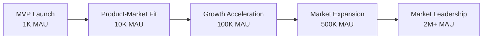
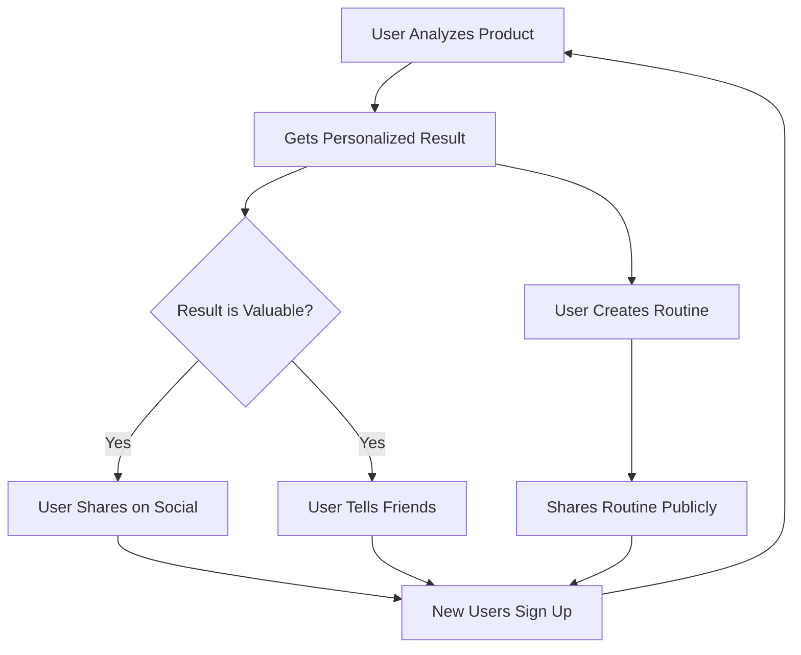

# Scaling Strategy & Growth Plan
## SkinLytix - From MVP to Market Leader

**Document Version:** 1.0  
**Last Updated:** October 6, 2025  
**Status:** Active - Year 1 Execution  
**Owner:** Growth & Operations Teams

---

## Table of Contents

1. [Executive Summary](#executive-summary)
2. [Growth Framework](#growth-framework)
3. [Phase 1: Product-Market Fit (Months 1-6)](#phase-1-product-market-fit-months-1-6)
4. [Phase 2: Growth Acceleration (Months 7-12)](#phase-2-growth-acceleration-months-7-12)
5. [Phase 3: Market Expansion (Year 2)](#phase-3-market-expansion-year-2)
6. [Phase 4: Market Leadership (Year 3+)](#phase-4-market-leadership-year-3)
7. [Technical Scaling](#technical-scaling)
8. [Team Scaling](#team-scaling)
9. [Financial Projections](#financial-projections)
10. [Risk Management](#risk-management)

---

## Executive Summary

### Vision

**"Become the global standard for skincare ingredient transparency and personalized product recommendations by 2028"**

### 3-Year Growth Trajectory



### Key Milestones

| Phase | Timeline | Users | Revenue | Market Position |
|-------|----------|-------|---------|-----------------|
| **MVP Launch** | Month 1 | 1K MAU | $0 | Beta product |
| **Product-Market Fit** | Month 6 | 10K MAU | $0 | Validated concept |
| **Growth Acceleration** | Month 12 | 50K MAU | $120K ARR | Rising startup |
| **Market Expansion** | Year 2 | 350K MAU | $1.2M ARR | Category player |
| **Market Leadership** | Year 3+ | 2M+ MAU | $5M+ ARR | Industry leader |

### Growth Levers

1. **Viral Product Design:** Built-in sharing, referral incentives, social proof
2. **Content Marketing:** SEO-optimized skincare guides, ingredient education
3. **Influencer Partnerships:** Micro-influencers, dermatologists, beauty creators
4. **Community Network Effects:** User-generated product database, routine sharing
5. **Product Expansion:** Mobile apps, new features, international markets
6. **Monetization:** Freemium model, affiliate partnerships, enterprise API

---

## Growth Framework

### North Star Metric

**Weekly Active Users (WAU) performing 1+ product analysis**

Why this metric?
- ✅ Directly measures core product usage
- ✅ Leading indicator of retention and engagement
- ✅ Correlates with revenue potential (future premium conversions)
- ✅ Reflects product value delivery

### Supporting Metrics

**Acquisition:**
- New user signups per week
- Conversion rate (visitor → signup)
- Organic vs. paid user split
- Referral rate (new users from referrals)

**Activation:**
- % users who complete profile onboarding
- % users who complete first analysis within 24h
- Time to first analysis

**Engagement:**
- Analyses per active user per week
- Routines created per user
- Optimization requests per routine
- Feedback submission rate

**Retention:**
- Day 1, Day 7, Day 30 retention rates
- Weekly retention cohorts
- Churn rate
- Resurrection rate (reactivated users)

**Revenue (Future):**
- Monthly Recurring Revenue (MRR)
- Freemium conversion rate
- Average Revenue Per User (ARPU)
- Customer Lifetime Value (LTV)
- Customer Acquisition Cost (CAC)

---

### Growth Model

**Viral Loop Design:**



**Target Viral Coefficient: 0.3+** (Each user brings 0.3 new users)

**Formula:**
```
Viral Coefficient (K) = Invitation Rate × Conversion Rate
Target: 50% share × 60% conversion = 0.3
```

If K = 0.3:
- 1,000 users → 300 new users → 90 more → 27 more = 1,417 total
- Exponential growth over multiple cycles

---

## Phase 1: Product-Market Fit (Months 1-6)

### Objective

**Validate core value proposition and achieve 10,000 MAU with 40%+ 30-day retention**

### Target Metrics

| Metric | Month 1 | Month 3 | Month 6 |
|--------|---------|---------|---------|
| MAU | 1,000 | 5,000 | 10,000 |
| New Signups/Week | 200 | 500 | 1,000 |
| 30-Day Retention | 50% | 45% | 40% |
| Analyses/User/Month | 3 | 4 | 5 |
| Avg Satisfaction Rating | 4.0 | 4.2 | 4.5 |

### Growth Strategies

#### 1. Pre-Launch Waitlist Campaign

**Goal:** 1,000+ signups before launch

**Tactics:**
- Landing page with clear value prop + waitlist form
- SEO optimization (keywords: "skincare ingredient checker", "product analyzer")
- Reddit engagement (r/SkincareAddiction, r/AsianBeauty)
- Instagram/TikTok teasers (before/after analysis examples)
- Micro-influencer outreach (5-10 influencers with 10K-50K followers)
- Product Hunt scheduled launch

**Budget:** $0-500 (organic + micro-influencer gifting)

**Timeline:** Weeks 1-4 before launch

---

#### 2. Soft Launch (First 100 Users)

**Goal:** Validate product, collect feedback, fix critical bugs

**Tactics:**
- Invite top 100 waitlist users (most engaged)
- Personal onboarding emails with video tutorial
- Daily monitoring of analytics and feedback
- Weekly user interviews (5-10 users)
- Bug bounty program (free lifetime premium for bug reports)

**Budget:** $0 (time investment only)

**Timeline:** Week 1-2 post-launch

**Success Criteria:**
- 70%+ signup-to-active conversion
- 4.0+ average satisfaction rating
- Zero critical bugs
- 3+ analyses per user in first week

---

#### 3. Public Launch (Months 1-2)

**Goal:** Scale to 2,500 MAU with strong retention

**Tactics:**

**Content Marketing:**
- Publish 2-3 blog posts per week (ingredient guides, skincare myths, product comparisons)
- SEO targeting long-tail keywords ("is niacinamide good for oily skin")
- Guest posts on beauty blogs (Byrdie, Into The Gloss, The Strategist)

**Social Media:**
- Daily Instagram posts (ingredient breakdowns, before/after analyses)
- TikTok educational series ("Ingredient of the Day")
- User-generated content campaign (#MyEpiQScore)
- Engage in skincare Reddit communities (provide value, not spam)

**Influencer Partnerships:**
- Partner with 10-15 micro-influencers (10K-100K followers)
- Provide early access, exclusive features
- Co-create content (Instagram stories, YouTube tutorials)
- Affiliate tracking for attribution

**PR & Media:**
- Press release to beauty and tech publications
- Pitch to TechCrunch, The Verge, Allure, Vogue Beauty
- Founder interviews on skincare podcasts

**Budget:** $2,000-5,000/month (influencer partnerships, content creation)

---

#### 4. Referral Program (Month 3+)

**Goal:** Achieve 0.3+ viral coefficient

**Mechanics:**
- Each user gets unique referral link
- Referrer: 10 free analyses (future premium perk)
- Referee: Skip onboarding waitlist, instant access
- Leaderboard for top referrers (gamification)

**In-App Prompts:**
- After first analysis: "Love your EpiQ Score? Share it with friends!"
- After routine optimization: "Your friends need this too!"
- Persistent "Invite Friends" button in nav

**Tracking:**
- UTM parameters in referral links
- Database tracking (referrer_user_id in signups table)
- Weekly referral leaderboard

**Target:** 20% of new users from referrals by Month 6

---

#### 5. Community Building (Month 4+)

**Goal:** Create engaged community for feedback and retention

**Tactics:**

**Private Beta Community:**
- Slack or Discord server for beta users
- Channels: #feedback, #feature-requests, #skincare-chat
- Weekly AMA with founders
- Early access to new features

**User-Generated Content:**
- "Routine of the Week" feature on Instagram
- User testimonials and success stories
- Screenshot sharing of EpiQ Scores

**Events:**
- Monthly virtual skincare Q&A with dermatologist
- Live product analysis sessions
- Routine makeover contests

**Budget:** $500-1,000/month (community manager, dermatologist fees)

---

### Month 6 Milestone: Product-Market Fit

**Validation Criteria:**
- ✅ 10,000+ MAU with 40%+ 30-day retention
- ✅ 4.5+ average satisfaction rating
- ✅ 15%+ organic growth rate (month-over-month)
- ✅ 3+ analyses per user per month
- ✅ 20%+ of new users from referrals
- ✅ Waitlist for new features (demand exceeds supply)

**Red Flags (Pivot Required):**
- ❌ < 5,000 MAU after 6 months
- ❌ < 30% retention
- ❌ < 3.5 satisfaction rating
- ❌ < 5% organic growth rate

---

## Phase 2: Growth Acceleration (Months 7-12)

### Objective

**Scale to 50,000 MAU, launch monetization, and achieve $120K ARR**

### Target Metrics

| Metric | Month 9 | Month 12 |
|--------|---------|----------|
| MAU | 25,000 | 50,000 |
| New Signups/Week | 2,000 | 4,000 |
| 30-Day Retention | 40% | 40% |
| Analyses/User/Month | 6 | 7 |
| MRR | $5K | $10K |
| Premium Conversion | 4% | 5% |

### Growth Strategies

#### 1. Mobile App Launch (Months 7-9)

**Goal:** Expand platform reach, enable camera-first experience

**Why Mobile?**
- 75%+ of skincare shopping happens on mobile
- Camera-first UX is faster than web upload
- Push notifications drive re-engagement
- App Store discovery (top charts, search)

**iOS App Features:**
- Native camera integration (photo + barcode scanning)
- Offline mode (cached analyses)
- Push notifications (routine reminders, new product alerts)
- iOS widgets (quick access to recent analyses)
- Apple Health integration (future)

**Android App Features:**
- Same as iOS
- Google Assistant integration (voice commands)

**Development Timeline:**
- Months 7-8: Design + development
- Month 9: Beta testing with 500 users
- Month 9: Public launch on App Store + Google Play

**Launch Strategy:**
- App Store Optimization (ASO): keywords, screenshots, reviews
- PR push: "SkinLytix launches mobile app"
- Influencer campaign: "Try the new app!"
- Cross-promotion: In-app banner on web version

**Target:** 30% of new users from mobile by Month 12

---

#### 2. Freemium Monetization (Month 10+)

**Goal:** Generate $10K MRR by Month 12

**Pricing Tiers:**

| Feature | Free | Premium ($7.99/mo) |
|---------|------|-------------------|
| Product Analyses | 5/month | Unlimited |
| Routines | 1 | Unlimited |
| Routine Optimization | 1/month | Unlimited |
| Product Comparison | ❌ | ✅ |
| Priority Support | ❌ | ✅ |
| Ad-Free Experience | ❌ | ✅ |
| Early Access to New Features | ❌ | ✅ |

**Conversion Tactics:**

**Paywall Triggers:**
- User hits 5 analyses in a month → Paywall modal
- User tries to create 2nd routine → Upgrade prompt
- User requests 2nd optimization → Upgrade prompt

**Value Messaging:**
- "Unlock unlimited analyses for just $0.26/day"
- "Premium users save $300/year on skincare"
- "Join 5,000+ premium members"

**Discount Campaigns:**
- 50% off first month (limited-time offer)
- Annual plan: $79.99/year (17% savings)
- Referral bonus: 1 month free for each referral

**Payment Processing:**
- Stripe Checkout for web
- In-App Purchases for iOS/Android

**Target Conversion Rate:** 5% of MAU (2,500 premium users @ $7.99 = $20K MRR by Month 12)

**Revised Target:** $10K MRR (accounting for ramp-up)

---

#### 3. Content Marketing at Scale (Months 7-12)

**Goal:** Become #1 SEO authority for skincare ingredients

**Content Strategy:**

**Ingredient Encyclopedia (200+ Pages):**
- One page per popular ingredient (e.g., "What is Hyaluronic Acid?")
- Benefits, side effects, skin types, usage tips
- Internal linking to product analyses

**Product Category Guides:**
- "Best Moisturizers for Oily Skin"
- "Retinol vs. Retinoids: Complete Guide"
- "The Science of Vitamin C Serums"

**Comparison Content:**
- "CeraVe vs. Cetaphil: Which is Better for You?"
- "Affordable Alternatives to Expensive Skincare"
- "Drugstore vs. Luxury: Does Price Matter?"

**Video Content (YouTube):**
- Weekly ingredient breakdown videos
- Product analysis tutorials
- User routine makeovers
- Dermatologist interviews

**SEO Targets:**
- 100,000+ organic visitors/month by Month 12
- Top 3 rankings for 50+ target keywords
- Domain Authority (DA) 40+

**Budget:** $5,000-8,000/month (content writers, video production, SEO tools)

---

#### 4. Paid Acquisition (Month 10+)

**Goal:** Accelerate growth while maintaining CAC < $15

**Channels:**

**Google Ads:**
- Target: "skincare ingredient checker", "is [ingredient] safe"
- Landing pages: Specific to search intent
- Budget: $2,000-3,000/month
- Target CPA: $10-12

**Facebook/Instagram Ads:**
- Audience: 25-45, female, interests in skincare/beauty
- Ad creative: Before/after analysis examples, testimonials
- Budget: $3,000-5,000/month
- Target CPA: $12-15

**TikTok Ads:**
- Audience: 18-35, skincare enthusiasts
- Ad format: Native video ads (educational, not salesy)
- Budget: $1,000-2,000/month
- Target CPA: $8-10 (cheaper, younger audience)

**Retargeting:**
- Pixel website visitors who didn't sign up
- Retarget app installers who didn't complete profile
- Budget: $500-1,000/month

**Total Paid Budget:** $6,500-11,000/month

**Target:** 30-40% of new users from paid channels by Month 12

---

#### 5. Partnership & Affiliate Strategy (Month 8+)

**Goal:** Generate 10% of new users through partnerships

**Beauty Retailer Partnerships:**
- Integrate SkinLytix widget on product pages (Sephora, Ulta)
- "Analyze this product with SkinLytix" button
- Revenue share: 5% of premium conversions from their traffic

**Affiliate Program:**
- Beauty bloggers and influencers earn 20% commission on premium referrals
- Provide affiliate dashboard with tracking
- Monthly payouts via PayPal or Stripe

**Dermatology Clinic Partnerships:**
- Offer SkinLytix as patient education tool
- White-label option for large clinics
- Monthly licensing fee: $500-1,000/clinic

**Target:** 5-10 partnerships by Month 12

---

### Month 12 Milestone: Growth Inflection

**Success Criteria:**
- ✅ 50,000+ MAU with 40%+ retention
- ✅ $10K+ MRR with 5% freemium conversion
- ✅ Mobile app: 30% of active users
- ✅ 100,000+ organic visitors/month (SEO)
- ✅ 20-30% new users from paid channels
- ✅ 5+ active partnerships

---

## Phase 3: Market Expansion (Year 2)

### Objective

**Scale to 350,000 MAU, achieve $1.2M ARR, and expand internationally**

### Target Metrics

| Metric | Q1 Y2 | Q2 Y2 | Q3 Y2 | Q4 Y2 |
|--------|-------|-------|-------|-------|
| MAU | 75K | 125K | 200K | 350K |
| MRR | $25K | $50K | $80K | $100K |
| Premium Users | 4K | 7.5K | 12K | 18K |
| Countries | 1 (US) | 2 | 4 | 6 |

### Growth Strategies

#### 1. International Expansion

**Target Markets (Priority Order):**

1. **Canada** (Month 13-15)
   - English-speaking, similar skincare culture
   - Launch: Q1 Year 2
   - Marketing: Influencer partnerships, Google Ads

2. **United Kingdom** (Month 16-18)
   - Large skincare market (£1.2B)
   - Launch: Q2 Year 2
   - Marketing: SEO content (UK spelling), local influencers

3. **Australia** (Month 16-18)
   - High skincare spend per capita
   - Launch: Q2 Year 2
   - Marketing: Sun protection angle (SPF analysis)

4. **France & Germany** (Month 19-24)
   - Requires multi-language support
   - Launch: Q3-Q4 Year 2
   - Marketing: Localized content, regional product databases

**Localization Requirements:**
- Multi-language support (FR, DE, ES)
- Region-specific product databases
- Currency localization
- Local payment methods (SEPA, iDEAL)

**Target:** 30% of MAU from international markets by end of Year 2

---

#### 2. Product Feature Expansion

**Q1-Q2: Social & Discovery Features**
- Public routine sharing
- Routine discovery feed ("Trending Routines")
- User profiles and followers
- Upvoting and commenting on routines
- "Routine of the Week" featured section

**Q2-Q3: AI Recommendations**
- "Products You'll Love" personalized feed
- Proactive product suggestions based on routine gaps
- Price comparison across retailers
- "Better Alternative" suggestions (cheaper, same actives)

**Q3-Q4: Expert Network**
- Verified dermatologist profiles
- "Derm-Approved" routine templates
- Expert Q&A feature
- Consultation booking integration

**Target:** 60% of users engage with 1+ new feature by end of Year 2

---

#### 3. Enterprise & B2B Revenue

**Brand Dashboard (Q2-Q3):**
- Product performance analytics for beauty brands
- Consumer feedback aggregation
- Competitive benchmarking
- Ingredient trend reports
- Pricing: $500-2,000/month per brand

**Retailer API (Q3-Q4):**
- Real-time product availability integration
- Dynamic pricing updates
- Affiliate partnership program
- White-label analysis widgets for e-commerce sites
- Pricing: $1,000-5,000/month per retailer

**Target:** $200K ARR from B2B by end of Year 2 (not included in $1.2M consumer ARR)

---

#### 4. Advanced Monetization

**Premium Plus Tier ($14.99/mo):**
- All Premium features
- 1:1 dermatologist consultation per month
- Custom routine design by expert
- Early access to beta features

**In-App Purchases:**
- One-time routine optimization: $4.99
- Detailed ingredient report: $2.99
- Product comparison (3+ products): $3.99

**Affiliate Revenue:**
- Partner with Amazon, Sephora, Ulta for product links
- Earn 5-10% commission on purchases
- Target: $50K/year affiliate revenue by end of Year 2

---

### End of Year 2 Milestone: Market Leader

**Success Criteria:**
- ✅ 350,000+ MAU across 6+ countries
- ✅ $1.2M+ ARR (consumer) + $200K B2B = $1.4M total
- ✅ 18,000+ premium subscribers
- ✅ Top 10 in App Store (Health & Fitness category)
- ✅ 5+ brand partnerships, 3+ retailer integrations
- ✅ 200,000+ products in database

---

## Phase 4: Market Leadership (Year 3+)

### Objective

**Become the global standard for skincare transparency with 2M+ MAU and $5M+ ARR**

### Long-Term Vision

**Category Expansion:**
- Haircare product analysis
- Makeup ingredient analysis
- Wellness supplements analysis
- Pet care product analysis

**Platform Evolution:**
- AI skincare consultant (conversational AI)
- Augmented Reality (AR) product try-on
- Personalized product formulation (custom skincare)
- Health data integration (Apple Health, genetic data)

**Market Position:**
- #1 skincare app globally (App Store + Google Play)
- Trusted by 50+ dermatology clinics
- Partnerships with all major beauty retailers
- Featured in Vogue, Allure, Byrdie as #1 tool

---

## Technical Scaling

### Infrastructure Scaling

**Current State (MVP):**
- Lovable Cloud / Supabase (PostgreSQL 15.x)
- Auto-scaling up to 500 concurrent edge functions
- Database: ~100K records (products + analyses)

**Year 1 Scaling (10K-50K MAU):**
- Database: 1M+ records
- Edge functions: 1,000+ concurrent executions
- Implement query optimization and indexing
- Add read replicas for database (Supabase managed)

**Year 2 Scaling (350K MAU):**
- Database: 10M+ records
- Edge functions: 5,000+ concurrent executions
- Implement Redis caching layer
- CDN for static assets (Cloudflare)
- Database partitioning for large tables

**Year 3+ Scaling (2M+ MAU):**
- Multi-region deployment (US, EU, APAC)
- Microservices architecture (optional, if needed)
- Dedicated database cluster
- Real-time analytics pipeline (BigQuery, Snowflake)

---

### Performance Targets

| Metric | Year 1 | Year 2 | Year 3 |
|--------|--------|--------|--------|
| Page Load Time (p95) | < 2s | < 1.5s | < 1s |
| Analysis Time (p95) | < 15s | < 10s | < 5s |
| Database Query (p95) | < 500ms | < 300ms | < 200ms |
| Uptime | 99.5% | 99.8% | 99.9% |

---

### Cost Optimization

**Caching Strategy:**
- Product cache: 30-day TTL → 60%+ hit rate
- Ingredient cache: 90-day TTL → 80%+ hit rate
- Analysis cache: 7-day TTL (same product + same user)
- Target: 70% cache hit rate by Year 2

**API Cost Reduction:**
- Batch PubChem requests (5 ingredients per request)
- Negotiate bulk pricing with Open Beauty Facts
- Build proprietary ingredient database (long-term)

**AI Cost Management:**
- Switch to cheaper models for simple tasks (Gemini Flash Lite)
- Implement prompt caching (reduce token usage)
- A/B test AI vs. rule-based analysis (simpler cases)

---

## Team Scaling

### Year 1 Team (Months 1-12)

**Core Team (3-5 people):**
- CEO / Founder (Product + Growth)
- CTO / Technical Co-Founder (Engineering + Infrastructure)
- Designer (UI/UX + Brand)
- Growth Marketer (part-time or contractor)
- Community Manager (part-time, Month 4+)

**Budget:** $200K-300K total (founders may defer salary)

---

### Year 2 Team (13-24 Months)

**Expanded Team (8-12 people):**

**Product & Engineering (5-6):**
- Head of Product
- Senior Engineer (Backend)
- Senior Engineer (Frontend)
- Mobile Engineer (iOS/Android)
- QA Engineer
- DevOps Engineer (optional)

**Growth & Marketing (3-4):**
- Head of Growth
- Content Marketing Manager
- Performance Marketing Manager
- Community Manager

**Operations (2):**
- Customer Support Lead
- Data Analyst

**Budget:** $800K-1.2M total

---

### Year 3+ Team (25+ Months)

**Scale Team (20-30 people):**

**Additional Hires:**
- VP of Product
- VP of Engineering (manage team of 8-10)
- Sales Lead (B2B partnerships)
- Account Managers (enterprise clients)
- International Growth Managers (per region)
- Content Creators (video, blog)
- Dermatology Advisor (part-time consultant)

**Budget:** $2M-3M total

---

## Financial Projections

### Revenue Projections (3 Years)

| Metric | Year 1 | Year 2 | Year 3 |
|--------|--------|--------|--------|
| MAU | 50,000 | 350,000 | 2,000,000 |
| Premium Conversion | 5% | 5% | 6% |
| Premium Users | 2,500 | 17,500 | 120,000 |
| ARPU (Premium) | $7.99 | $8.99 | $9.99 |
| **Consumer MRR** | **$20K** | **$157K** | **$1.2M** |
| **Consumer ARR** | **$240K** | **$1.88M** | **$14.4M** |
| B2B ARR | $0 | $200K | $1M |
| Affiliate Revenue | $0 | $50K | $300K |
| **Total ARR** | **$240K** | **$2.13M** | **$15.7M** |

---

### Cost Projections (3 Years)

| Category | Year 1 | Year 2 | Year 3 |
|----------|--------|--------|--------|
| **Team Salaries** | $300K | $1.2M | $2.5M |
| **Infrastructure** | $20K | $100K | $300K |
| **Marketing** | $80K | $400K | $1.5M |
| **Tools & Software** | $10K | $30K | $80K |
| **Legal & Accounting** | $15K | $40K | $100K |
| **Office & Misc** | $10K | $50K | $150K |
| **Total Costs** | **$435K** | **$1.82M** | **$4.63M** |

---

### Profitability Timeline

| Metric | Year 1 | Year 2 | Year 3 |
|--------|--------|--------|--------|
| Total Revenue | $240K | $2.13M | $15.7M |
| Total Costs | $435K | $1.82M | $4.63M |
| **Net Profit/Loss** | **-$195K** | **+$310K** | **+$11.07M** |
| **Profit Margin** | **-81%** | **+15%** | **+70%** |

**Break-Even:** Month 18-20 (Year 2, Q2)

---

### Fundraising Strategy

**Bootstrapped (Months 1-6):**
- Self-funded or friends/family round ($50K-100K)
- Focus: MVP launch, product-market fit validation

**Pre-Seed Round (Month 6-12):**
- Raise: $500K-750K
- Valuation: $3M-5M
- Use: Team expansion, mobile app, marketing

**Seed Round (Month 12-18):**
- Raise: $2M-3M
- Valuation: $12M-18M
- Use: International expansion, B2B product, scale marketing

**Series A (Year 2-3):**
- Raise: $10M-15M
- Valuation: $50M-80M
- Use: Enterprise sales, category expansion, team scaling

---

## Risk Management

### Growth Risks

**Risk 1: User Acquisition Slows**
- **Mitigation:** Diversify channels, optimize conversion funnels, increase referral incentives
- **Contingency:** Pivot to B2B focus (brands + retailers), reduce burn rate

**Risk 2: Competitor Copies Product**
- **Mitigation:** Build defensible moats (data network effects, community, brand trust)
- **Contingency:** Double down on unique features (routine optimization, AI recommendations)

**Risk 3: Freemium Conversion Underperforms**
- **Mitigation:** A/B test pricing, add more premium value, optimize paywall triggers
- **Contingency:** Explore alternative revenue (ads, affiliate, enterprise)

---

### Technical Risks

**Risk 1: Database Performance Degrades**
- **Mitigation:** Proactive monitoring, query optimization, read replicas, caching
- **Contingency:** Migrate to dedicated database cluster

**Risk 2: AI Costs Exceed Budget**
- **Mitigation:** Optimize prompts, cache results, use cheaper models for simple tasks
- **Contingency:** Build rule-based analysis for common cases, reduce AI usage

**Risk 3: App Store Rejection or Removal**
- **Mitigation:** Follow platform guidelines strictly, have legal review
- **Contingency:** Web-first strategy, Progressive Web App (PWA)

---

### Market Risks

**Risk 1: Regulatory Changes (FDA, GDPR)**
- **Mitigation:** Legal counsel, clear disclaimers, GDPR compliance
- **Contingency:** Adjust product claims, implement required changes

**Risk 2: Economic Downturn**
- **Mitigation:** Emphasize cost-saving features, maintain lean operations
- **Contingency:** Delay hiring, reduce marketing spend, focus on retention

---

## Conclusion

SkinLytix has a clear path from MVP to market leadership:

1. **Year 1:** Validate product-market fit, achieve 50K MAU, launch monetization
2. **Year 2:** Scale to 350K MAU, expand internationally, build B2B revenue
3. **Year 3+:** Reach 2M+ MAU, dominate category, achieve $15M+ ARR

**Key Success Factors:**
- ✅ Strong product-market fit (retention, engagement, satisfaction)
- ✅ Viral growth loops (referrals, community, content)
- ✅ Diversified acquisition channels (organic, paid, partnerships)
- ✅ Defensible competitive moats (data, personalization, trust)
- ✅ Efficient monetization (freemium, B2B, affiliate)

---

**End of Document**

*For questions or updates to this scaling strategy, contact the Growth Team.*
