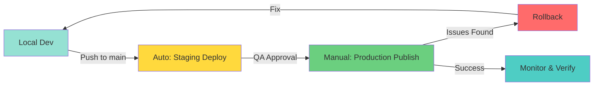
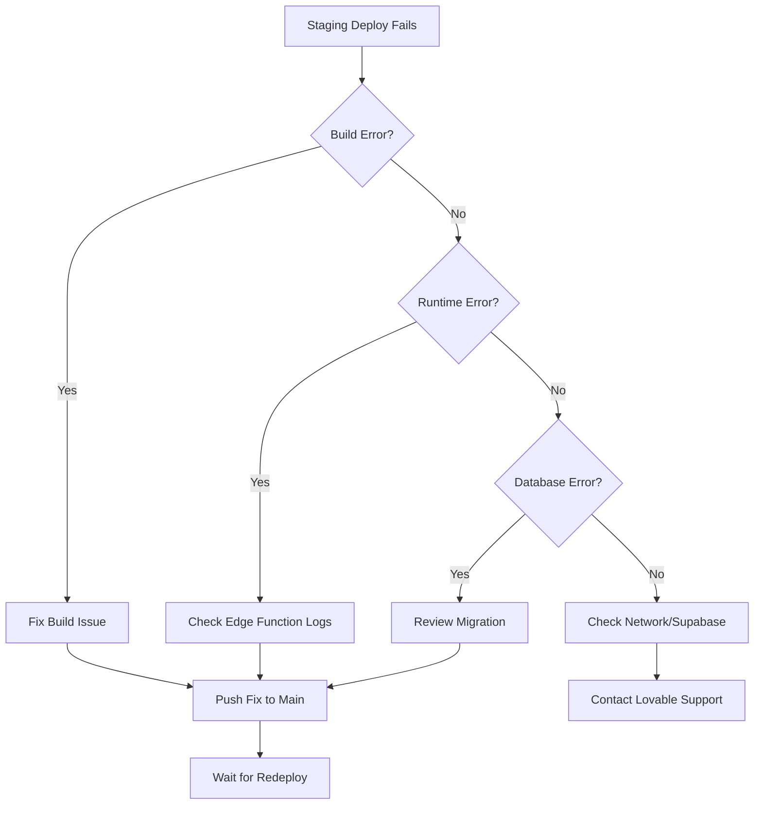
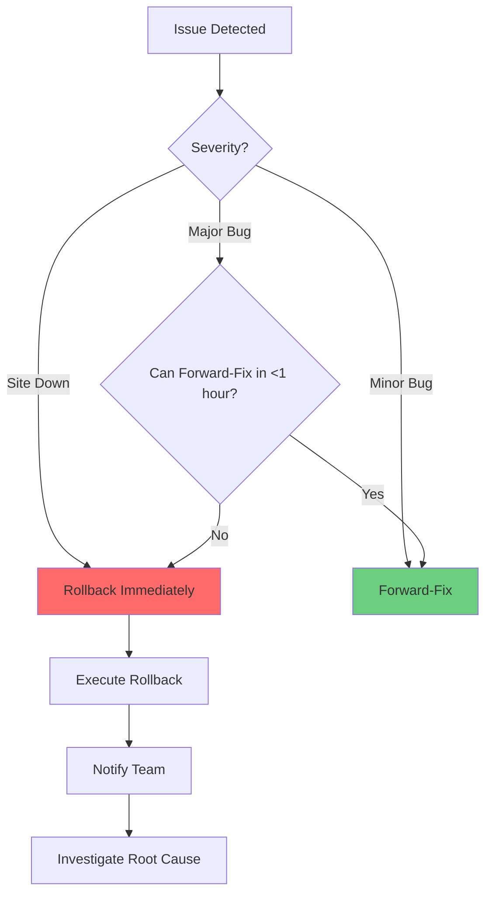
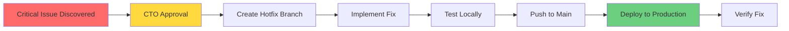

# Deployment Runbook

**Document Version:** 1.0  
**Last Updated:** November 11, 2025  
**Owner:** Engineering & Operations Team  
**Status:** Active

---

## Table of Contents

1. [Deployment Overview](#deployment-overview)
2. [Pre-Deployment Checklist](#pre-deployment-checklist)
3. [Staging Deployment](#staging-deployment)
4. [Production Deployment](#production-deployment)
5. [Post-Deployment Verification](#post-deployment-verification)
6. [Rollback Procedures](#rollback-procedures)
7. [Emergency Hotfix Process](#emergency-hotfix-process)
8. [Deployment Schedule](#deployment-schedule)

---

## Deployment Overview

### Deployment Pipeline



### Deployment Types

| Type | Trigger | Review | Downtime | Frequency |
|------|---------|--------|----------|-----------|
| **Feature Release** | Manual publish | Full QA + PM approval | None | Weekly |
| **Bug Fix** | Manual publish | QA smoke test | None | As needed |
| **Hotfix** | Expedited publish | CTO approval only | <5 min | Rare |
| **Database Migration** | Migration tool approval | Engineering review | None* | As needed |

*Database migrations execute immediately on approval, affecting all environments.

### Environments

| Environment | URL | Purpose | Deploy Method |
|-------------|-----|---------|---------------|
| **Local** | http://localhost:8080 | Development | `bun run dev` |
| **Staging** | staging.skinlytix.lovable.app | Pre-production testing | Auto on merge to `main` |
| **Production** | skinlytix.lovable.app | Live user traffic | Manual publish via Lovable |

---

## Pre-Deployment Checklist

### General Readiness

**Complete 1 day before production deploy:**

#### Code Quality
- [ ] All PRs merged to `main` branch
- [ ] Code reviewed and approved by at least 1 team member
- [ ] No `console.log` statements in production code
- [ ] TypeScript compilation succeeds with no errors
- [ ] ESLint passes with no errors
- [ ] No hardcoded environment variables or secrets

#### Testing
- [ ] All QA regression tests passing
- [ ] Core user flows verified in staging
- [ ] Cross-browser testing complete (Chrome, Safari, Firefox)
- [ ] Mobile responsive testing complete (iOS, Android)
- [ ] Performance testing passed (Lighthouse score >90)
- [ ] No P0 or P1 bugs in staging environment

#### Database
- [ ] Database migrations tested in staging
- [ ] RLS policies verified working
- [ ] No risky schema changes (column drops, constraint changes)
- [ ] Backup verified (auto-backup via Lovable Cloud)
- [ ] Migration rollback plan documented (if applicable)

#### Documentation
- [ ] Release notes drafted
- [ ] Changelog updated
- [ ] Known issues documented
- [ ] User-facing changes documented for support team

#### Stakeholders
- [ ] Product Manager approval obtained
- [ ] CTO approval obtained (for major releases)
- [ ] Customer support team briefed on changes
- [ ] Marketing team notified (if user-facing features)

#### Monitoring
- [ ] Analytics tracking events verified
- [ ] Error tracking confirmed working
- [ ] Performance monitoring active
- [ ] Alert thresholds reviewed

---

## Staging Deployment

### Auto-Deployment Trigger

Staging deploys **automatically** when code is merged to `main` branch:

```bash
# Staging deployment triggered by:
git checkout main
git merge feature/new-feature
git push origin main

# Within 3-5 minutes:
# ✓ Frontend built
# ✓ Edge functions deployed
# ✓ Database migrations executed (if any)
```

### What Gets Deployed

**Frontend:**
- React application built with Vite
- Static assets optimized
- Service worker updated
- Environment variables injected

**Backend:**
- All edge functions in `supabase/functions/`
- Database migrations in `supabase/migrations/`
- Updated RLS policies
- New database views/functions

**Configuration:**
- `supabase/config.toml` settings applied
- Secrets synced from Lovable Cloud

### Staging Verification

**Immediately after staging deploy:**

1. **Verify Deployment Success**
   ```bash
   # Check staging URL loads
   curl -I https://staging.skinlytix.lovable.app
   # Should return: HTTP/2 200
   ```

2. **Check Console for Errors**
   - Open staging URL in browser
   - Open DevTools Console (F12)
   - Verify no red errors
   - Look for Supabase connection success

3. **Test Core Flows (5-10 minutes)**
   - [ ] Homepage loads
   - [ ] Demo analysis works
   - [ ] Sign up / Login works
   - [ ] Product upload and analysis works
   - [ ] Routine creation works (if premium features)

4. **Check Edge Function Logs**
   - Lovable Cloud → Functions → View logs
   - Verify no deployment errors
   - Check for any 500 errors in recent invocations

5. **Verify Database Changes**
   - Lovable Cloud → Database → Tables
   - Confirm new tables/columns present
   - Check RLS policies active

### Staging Issues Resolution

**If staging deployment fails:**



**Common Issues:**

| Issue | Symptom | Solution |
|-------|---------|----------|
| **Build failure** | Staging doesn't update | Check TypeScript errors, fix and push |
| **Edge function error** | 500 errors in logs | Review function code, check secrets |
| **Database migration failure** | Migration not applied | Review SQL syntax, check for conflicts |
| **Environment variable missing** | Undefined env vars | Verify `.env` contains required variables |

---

## Production Deployment

### Deployment Window

**Recommended Times (PST):**

| Day | Window | Reason |
|-----|--------|--------|
| **Mon-Thu** | 10 AM - 2 PM | Peak team availability, low user traffic |
| **Friday** | ❌ Avoid | Risk of weekend incident |
| **Weekend** | ❌ Avoid | Limited support availability |
| **Holidays** | ❌ Avoid | No team availability |

**Exception:** Hotfixes can be deployed anytime with CTO approval.

### Production Deployment Process

#### Step 1: Final Checks

**30 minutes before deploy:**

- [ ] Staging verified stable for at least 24 hours
- [ ] All stakeholder approvals obtained
- [ ] Team notified in Slack (#engineering channel)
- [ ] Customer support briefed on changes
- [ ] Monitoring dashboard open and ready

#### Step 2: Create Production Publish

**In Lovable Editor:**

1. **Open Project**
   - Navigate to SkinLytix project in Lovable

2. **Click Publish Button**
   - Located top-right corner (desktop)
   - Or bottom-right in Preview mode (mobile)

3. **Review Changes**
   - Lovable shows diff of changes since last publish
   - Review:
     - [ ] File changes expected
     - [ ] No unexpected deletions
     - [ ] Database migrations included (if any)

4. **Publish to Production**
   - Click "Update" button
   - Confirm publication

5. **Monitor Deployment**
   - Watch deployment progress (2-5 minutes)
   - Note deployment completion time

#### Step 3: Initial Verification (First 5 Minutes)

**Critical checks immediately after deploy:**

1. **Homepage Loads**
   ```bash
   curl -I https://skinlytix.lovable.app
   # Should return: HTTP/2 200
   ```

2. **No JavaScript Errors**
   - Open production URL
   - Check console (F12)
   - Should be clean (no red errors)

3. **Authentication Works**
   - Test login with known account
   - Verify JWT token present in localStorage
   - Confirm user redirected to correct page

4. **Database Queries Working**
   - View any page that fetches data
   - Check Network tab for successful API calls
   - Verify data displays correctly

**If any checks fail → Proceed to [Rollback](#rollback-procedures) immediately.**

---

## Post-Deployment Verification

### Comprehensive Testing (15-30 Minutes)

**After initial verification passes, perform full test:**

#### 1. Core User Flows

**Landing Page & Demo:**
- [ ] Homepage loads in <3 seconds
- [ ] Hero section displays correctly
- [ ] "Try Demo Analysis" button works
- [ ] Demo analysis auto-loads successfully
- [ ] Demo results display correctly
- [ ] "Sign Up to Save" CTA appears

**Authentication:**
- [ ] Sign up creates new account
- [ ] Login with existing account works
- [ ] Logout clears session
- [ ] Password reset email sends (check spam)

**Product Analysis:**
- [ ] Upload page displays
- [ ] Can upload image (drag-drop or file picker)
- [ ] OCR processes image successfully
- [ ] Analysis completes in <30 seconds
- [ ] Results display (score, recommendations, red flags)
- [ ] Product saved to analysis history

**Routine Management (Premium):**
- [ ] Can create new routine
- [ ] Can add products to routine
- [ ] Routine appears in routines list
- [ ] Routine optimization works (if 2+ products)
- [ ] Optimization results display correctly

**Analytics Dashboard (Admin):**
- [ ] `/analytics` accessible for admin users
- [ ] Non-admin users redirected to homepage
- [ ] All charts load data
- [ ] No console errors related to admin checks

#### 2. Performance Verification

**Run Lighthouse Audit:**

```bash
# In Chrome DevTools (Incognito mode):
# 1. Open DevTools (F12)
# 2. Lighthouse tab
# 3. Select "Performance" + "Mobile"
# 4. Click "Generate report"

# Target scores:
Performance: >90
Accessibility: >95
Best Practices: >95
SEO: >90
```

**Key Metrics Verification:**

| Metric | Target | Check |
|--------|--------|-------|
| First Contentful Paint | <1.5s | ✓ |
| Largest Contentful Paint | <2.5s | ✓ |
| Time to Interactive | <3.5s | ✓ |
| Total Blocking Time | <200ms | ✓ |
| Cumulative Layout Shift | <0.1 | ✓ |

#### 3. Error Monitoring

**Check for Error Spikes:**

- **Browser Console:** No critical errors
- **Edge Function Logs:**
  - Lovable Cloud → Functions
  - Check each function for errors
  - Verify invocation success rate >95%
- **Database Logs:**
  - Lovable Cloud → Database → Logs
  - Check for query errors
  - Verify connection pool healthy

#### 4. Analytics Verification

**Confirm Tracking Active:**

1. **Perform Test Actions:**
   - View homepage (should track `page_viewed`)
   - Click demo CTA (should track `demo_cta_clicked`)
   - Complete analysis (should track `product_analysis_completed`)

2. **Verify in Database:**
   ```sql
   -- Check recent events (via Lovable Cloud SQL Editor)
   SELECT event_name, event_category, created_at
   FROM user_events
   WHERE created_at > NOW() - INTERVAL '10 minutes'
   ORDER BY created_at DESC
   LIMIT 10;
   ```

3. **Check Analytics Dashboard:**
   - Log in as admin
   - Navigate to `/analytics`
   - Verify data updating (may take 5-10 minutes to reflect)

### Deployment Success Announcement

**Once all verifications pass, announce in Slack:**

```markdown
🚀 **Production Deployment Complete**

**Version:** [Version number or release name]
**Deployed at:** [Timestamp]
**Changes:**
- [Feature 1]
- [Feature 2]
- [Bug fix 1]

**Verification Status:**
✅ All core flows passing
✅ Performance metrics within targets
✅ No error spikes detected
✅ Analytics tracking active

**Known Issues:**
[None / List any acceptable known issues]

**Rollback Plan:**
If issues arise, rollback available via Lovable History → [last stable version]
```

---

## Rollback Procedures

### When to Rollback

**Immediate rollback if:**
- Site completely down (500 errors for all users)
- Critical authentication failure (users can't log in)
- Data corruption detected
- Security vulnerability introduced
- Performance degradation >50% (page load times doubled)

**Consider rollback if:**
- P0 bug affecting >50% of users with no immediate fix
- Major feature completely broken with no workaround
- User-facing error rate spikes >5%

**Do NOT rollback for:**
- P2/P3 bugs with workarounds (forward-fix instead)
- Cosmetic issues
- Edge case bugs affecting <5% of users
- Minor performance regressions (<20%)

### Rollback Decision Tree



### Frontend Rollback Process

**Via Lovable History:**

1. **Open Lovable Project**
   - Navigate to SkinLytix in Lovable

2. **Access History**
   - Click project name (top-left)
   - Select "History" from dropdown

3. **Find Last Stable Version**
   - Review history entries
   - Identify version before problematic deploy
   - Look for timestamp/description matching last known-good state

4. **Restore Version**
   - Click "Restore" on selected version
   - Confirm restoration

5. **Publish Rollback**
   - Click "Publish" button
   - Click "Update" to publish to production
   - **Note:** This is a new deployment, not an instant rollback

6. **Verify Rollback Success**
   - Test homepage loads
   - Test core user flows
   - Check error logs cleared

**Rollback Time:** 5-10 minutes total

### Database Rollback

⚠️ **Database migrations cannot be automatically rolled back.**

**Forward-Fix Approach:**

1. **Assess Database Changes**
   - Review migration that ran in problematic deploy
   - Identify schema changes (new columns, constraints, etc.)

2. **Create Reverse Migration**
   ```sql
   -- Example: If migration added NOT NULL constraint
   -- Reverse it:
   
   ALTER TABLE profiles 
   ALTER COLUMN new_column DROP NOT NULL;
   
   -- Or if migration added a column causing issues:
   -- DON'T drop immediately (data loss risk)
   -- Instead, make it nullable or set default:
   
   ALTER TABLE profiles 
   ALTER COLUMN problematic_column SET DEFAULT 'safe_default';
   ```

3. **Test Reverse Migration Locally**
   - Run on local database first
   - Verify no errors
   - Check that application works with changes

4. **Apply to Production**
   - Use migration tool to execute reverse migration
   - Monitor for errors

5. **Verify Fix**
   - Test affected features
   - Check error logs

**Important:** Never drop columns or tables during rollback. Data loss is worse than a bug.

### Edge Function Rollback

**Edge functions deploy from code, so rollback via code revert:**

1. **Identify Problematic Function**
   - Check edge function logs for errors
   - Identify which function is failing

2. **Revert Code**
   ```bash
   # Option A: Revert specific commit
   git revert <commit-hash>
   git push origin main
   
   # Option B: Restore file from previous commit
   git checkout <previous-commit> -- supabase/functions/function-name/index.ts
   git commit -m "Rollback function-name to working version"
   git push origin main
   ```

3. **Wait for Redeploy**
   - Staging auto-deploys in 3-5 minutes
   - Verify fix in staging
   - Publish to production

**Rollback Time:** 10-15 minutes total

### Post-Rollback Actions

**After successful rollback:**

1. **Announce Rollback**
   ```markdown
   🔄 **Production Rollback Executed**
   
   **Issue:** [Brief description]
   **Rolled back to:** [Version/timestamp]
   **Current Status:** Stable
   **Next Steps:** Root cause analysis + fix
   ```

2. **Create Incident Post-Mortem**
   - Document what went wrong
   - Why it wasn't caught in staging
   - How to prevent in future
   - (See [Incident Response Guide](./Incident-Response.md))

3. **Schedule Fix**
   - Create bug ticket with root cause
   - Prioritize as P0
   - Assign to engineer
   - Re-deploy once fixed and tested

---

## Emergency Hotfix Process

### What Qualifies as Hotfix

**Emergency hotfixes for:**
- Security vulnerabilities discovered in production
- Critical data loss or corruption
- Site completely down (500 errors)
- Payment processing broken (if applicable)

### Expedited Hotfix Workflow



**Timeline:** <2 hours from discovery to production fix

### Hotfix Process Steps

1. **Alert CTO**
   - Slack DM + call
   - Describe issue severity
   - Get approval to proceed with hotfix

2. **Create Hotfix Branch**
   ```bash
   git checkout main
   git pull origin main
   git checkout -b hotfix/critical-issue-description
   ```

3. **Implement Fix**
   - Make minimal changes needed to resolve issue
   - Do NOT include unrelated changes
   - Add comments explaining the fix

4. **Test Locally**
   - Verify fix resolves issue
   - Test affected user flows
   - Ensure no new issues introduced

5. **Expedited Code Review**
   - Open PR to `main`
   - Tag CTO for immediate review
   - If CTO unavailable, merge with 1 approval (document decision)

6. **Merge to Main**
   ```bash
   git checkout main
   git merge hotfix/critical-issue-description
   git push origin main
   ```

7. **Wait for Staging Deploy**
   - Verify fix in staging (quick smoke test)

8. **Publish to Production**
   - Use Lovable Publish button
   - Monitor closely during deploy

9. **Verify Fix in Production**
   - Test critical issue resolved
   - Check error logs
   - Monitor for 30 minutes

10. **Post-Hotfix Documentation**
    - Update incident report
    - Document fix applied
    - Schedule proper fix (if hotfix is temporary)

### Hotfix Approval Matrix

| Issue Severity | Approval Required | Testing | Deploy Window |
|----------------|-------------------|---------|---------------|
| **Site Down** | CTO verbal approval | Minimal (local test) | Immediate |
| **Security Vulnerability** | CTO + Security review | Staging verification | Within 1 hour |
| **Data Loss Risk** | CTO + Database review | Full staging test | Within 2 hours |
| **Payment Broken** | CTO + Finance review | Staging + payment test | Within 2 hours |

---

## Deployment Schedule

### Regular Release Cadence

**Recommended Schedule:**

| Release Type | Frequency | Day | Time (PST) |
|--------------|-----------|-----|------------|
| **Feature Release** | Weekly | Tuesday | 10 AM |
| **Bug Fixes** | As needed | Mon-Thu | 10 AM - 2 PM |
| **Hotfix** | Emergency only | Anytime | Immediate |
| **Major Release** | Monthly | First Tuesday | 10 AM |

**Freeze Periods:**
- Week before major release: Feature freeze (bug fixes only)
- Friday-Sunday: No non-emergency deploys
- Major holidays: No deploys 2 days before or after

### Release Calendar (Example)

```
Week 1:
- Monday: Planning, QA testing
- Tuesday: Feature release to production
- Wed-Thu: Monitor, iterate
- Friday: Bug fixes if needed

Week 2-3:
- Continue feature development
- Deploy bug fixes as needed

Week 4:
- Major release preparation
- Feature freeze (Mon-Tue)
- Major release (Tuesday)
- Monitor and stabilize (Wed-Fri)
```

### Pre-Release Communication

**1 day before major release:**
- [ ] Announce in Slack (#general, #engineering)
- [ ] Brief customer support team
- [ ] Prepare release notes for users (if applicable)
- [ ] Update changelog
- [ ] Schedule monitoring time with team

---

## Troubleshooting Common Deployment Issues

### Issue: Staging Deploy Hangs

**Symptom:** Staging doesn't update after merge to main

**Diagnosis:**
1. Check Lovable build status (project dashboard)
2. Review recent commits for syntax errors
3. Check for TypeScript compilation errors

**Solution:**
```bash
# Run local build to identify errors
bun run build

# If build succeeds locally but not in staging:
# - Check for environment variable differences
# - Verify no uncommitted files causing issues
```

### Issue: Edge Function 500 Errors

**Symptom:** Edge function returns 500 errors after deploy

**Diagnosis:**
1. Check function logs (Lovable Cloud → Functions)
2. Look for error messages
3. Verify secrets are configured

**Common Causes:**
- Missing environment variable (e.g., `LOVABLE_API_KEY`)
- Syntax error in function code
- Database connection failure
- Rate limit exceeded on external API

**Solution:**
- Fix code error and redeploy
- Add missing secret via Lovable Cloud
- Check database connectivity

### Issue: Database Migration Failed

**Symptom:** Migration doesn't apply or causes errors

**Diagnosis:**
1. Check migration SQL syntax
2. Verify no conflicts with existing schema
3. Check for foreign key constraint violations

**Solution:**
```sql
-- If migration partially applied, check what exists:
SELECT table_name FROM information_schema.tables 
WHERE table_schema = 'public';

-- Then adjust migration to be idempotent:
ALTER TABLE profiles 
ADD COLUMN IF NOT EXISTS new_column TEXT;
```

---

## Document Version History

| Version | Date | Author | Changes |
|---------|------|--------|---------|
| 1.0 | Nov 11, 2025 | Engineering Team | Initial comprehensive deployment runbook |

---

**For Questions or Updates:**  
Contact: CTO or Engineering Lead  
Slack Channel: #engineering

**Related Documentation:**
- [Engineering SOPs](../technical/Engineering-SOPs.md)
- [Incident Response Guide](./Incident-Response.md)
- [Database Migration Guide](../technical/Database-Migration-Guide.md)

---

**End of Deployment Runbook**
