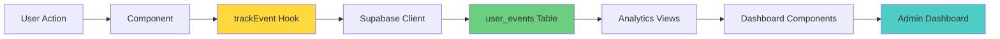
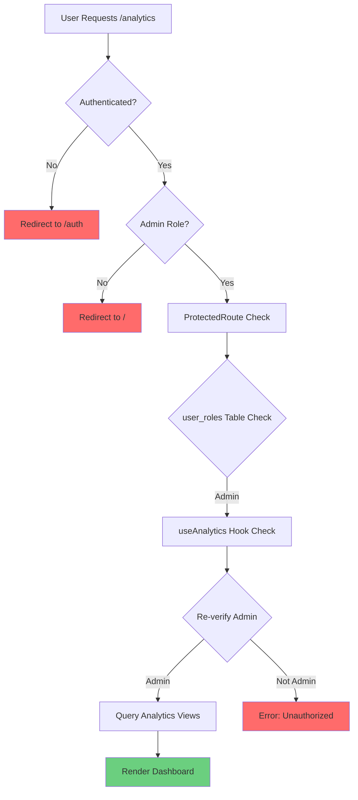

# Analytics Implementation Guide

**Document Version:** 1.0  
**Last Updated:** November 11, 2025  
**Owner:** Product & Engineering Team  
**Status:** Active

---

## Table of Contents

1. [Event Tracking Strategy](#event-tracking-strategy)
2. [User Events Table](#user-events-table)
3. [Analytics Dashboard](#analytics-dashboard)
4. [How to Add New Events](#how-to-add-new-events)
5. [Event Taxonomy Reference](#event-taxonomy-reference)
6. [A/B Testing Framework (Future)](#ab-testing-framework-future)
7. [Privacy & Compliance](#privacy--compliance)
8. [Exporting Data](#exporting-data)

---

## Event Tracking Strategy

### Why Track Events?

**Goals:**
- Understand user behavior and product usage
- Measure feature adoption and engagement
- Identify friction points and drop-off rates
- Validate product decisions with data
- Optimize conversion funnels

**Philosophy:**
- Track actions, not pageviews (action-based analytics)
- Capture user intent (why are they clicking?)
- Minimize tracking code (use hooks, not inline tracking)
- Respect user privacy (GDPR/CCPA compliant)

### Event Tracking Architecture



### Event Categories

| Category | Purpose | Examples |
|----------|---------|----------|
| **Navigation** | Page views, route changes | `page_viewed`, `ig_landing_viewed` |
| **Engagement** | User interactions, feature usage | `demo_cta_clicked`, `product_uploaded` |
| **Conversion** | Signup, onboarding completion | `signup_cta_clicked`, `onboarding_completed` |
| **Feature Adoption** | Core feature usage | `product_analysis_completed`, `routine_created` |
| **Feedback** | User feedback, ratings | `feedback_submitted`, `nps_score_submitted` |

---

## User Events Table

### Schema

```sql
CREATE TABLE public.user_events (
  id UUID PRIMARY KEY DEFAULT gen_random_uuid(),
  user_id UUID REFERENCES auth.users(id), -- Nullable for anonymous events
  event_name TEXT NOT NULL,
  event_category TEXT NOT NULL,
  event_properties JSONB DEFAULT '{}'::jsonb,
  page_url TEXT,
  referrer TEXT,
  user_agent TEXT,
  created_at TIMESTAMPTZ NOT NULL DEFAULT now()
);

-- Indexes for performance
CREATE INDEX idx_user_events_user_id ON public.user_events(user_id);
CREATE INDEX idx_user_events_event_name ON public.user_events(event_name);
CREATE INDEX idx_user_events_created_at ON public.user_events(created_at DESC);
CREATE INDEX idx_user_events_event_category ON public.user_events(event_category);

-- GIN index for JSONB querying
CREATE INDEX idx_user_events_properties_gin ON public.user_events USING gin(event_properties);
```

### Column Definitions

| Column | Type | Description | Example |
|--------|------|-------------|---------|
| `id` | UUID | Unique event identifier | `a1b2c3d4-...` |
| `user_id` | UUID | User who triggered event (null if anonymous) | `user-uuid` |
| `event_name` | TEXT | Specific event name | `demo_cta_clicked` |
| `event_category` | TEXT | Event category | `engagement` |
| `event_properties` | JSONB | Additional event metadata | `{"location": "hero"}` |
| `page_url` | TEXT | URL where event occurred | `/upload` |
| `referrer` | TEXT | Previous page URL | `https://instagram.com` |
| `user_agent` | TEXT | Browser/device info | `Mozilla/5.0...` |
| `created_at` | TIMESTAMPTZ | Timestamp of event | `2025-11-11T10:30:00Z` |

### RLS Policies

```sql
-- Enable RLS
ALTER TABLE public.user_events ENABLE ROW LEVEL SECURITY;

-- Users can insert their own events
CREATE POLICY "Users can insert their own events"
ON public.user_events FOR INSERT
WITH CHECK (auth.uid() = user_id);

-- Users can view their own events
CREATE POLICY "Users can view their own events"
ON public.user_events FOR SELECT
USING (auth.uid() = user_id);

-- No updates or deletes allowed
-- (events are immutable)
```

### Sample Event Data

```json
{
  "id": "a1b2c3d4-e5f6-7890-abcd-ef1234567890",
  "user_id": "user-uuid-1234",
  "event_name": "demo_cta_clicked",
  "event_category": "engagement",
  "event_properties": {
    "location": "hero",
    "cta_text": "Try Demo Analysis - No Sign-Up",
    "device_type": "desktop"
  },
  "page_url": "/",
  "referrer": "https://instagram.com/p/xyz",
  "user_agent": "Mozilla/5.0 (Macintosh; Intel Mac OS X 10_15_7)...",
  "created_at": "2025-11-11T10:30:45.123Z"
}
```

---

## Analytics Dashboard

### Security Model

**Multi-Layered Security:**



**Layer 1: Frontend Route Protection**

```typescript
// src/App.tsx
import { ProtectedRoute } from '@/components/ProtectedRoute';

<Route path="/analytics" element={
  <ProtectedRoute>
    <Analytics />
  </ProtectedRoute>
} />
```

**Layer 2: ProtectedRoute Component**

```typescript
// src/components/ProtectedRoute.tsx
export const ProtectedRoute = ({ children }: { children: React.ReactNode }) => {
  const [isAdmin, setIsAdmin] = useState<boolean | null>(null);
  const [loading, setLoading] = useState(true);

  useEffect(() => {
    checkAdminStatus();
  }, []);

  const checkAdminStatus = async () => {
    const { data: { user } } = await supabase.auth.getUser();
    
    if (!user) {
      setIsAdmin(false);
      setLoading(false);
      return;
    }

    const { data: roles } = await supabase
      .from('user_roles')
      .select('role')
      .eq('user_id', user.id)
      .eq('role', 'admin')
      .maybeSingle();

    setIsAdmin(!!roles);
    setLoading(false);
  };

  if (loading) return <Loader />;
  if (!isAdmin) return <Navigate to="/" replace />;
  
  return <>{children}</>;
};
```

**Layer 3: Hook-Level Validation**

```typescript
// src/hooks/useAnalytics.ts
export const useCTAPerformance = () => {
  return useQuery({
    queryKey: ['cta-performance'],
    queryFn: async () => {
      // Verify admin access before querying
      const { data: { user } } = await supabase.auth.getUser();
      if (!user) throw new Error('Not authenticated');
      
      const { data: roles } = await supabase
        .from('user_roles')
        .select('role')
        .eq('user_id', user.id)
        .eq('role', 'admin')
        .maybeSingle();
      
      if (!roles) throw new Error('Unauthorized: Admin access required');
      
      // Query analytics view
      const { data, error } = await supabase
        .from('cta_performance_metrics')
        .select('*')
        .order('date', { ascending: false });
      
      if (error) throw error;
      return data;
    },
    refetchInterval: 30000, // Refresh every 30s
  });
};
```

**Layer 4: Database Permissions**

```sql
-- Revoke public access
REVOKE ALL ON cta_performance_metrics FROM PUBLIC;
REVOKE ALL ON conversion_funnel_metrics FROM PUBLIC;
REVOKE ALL ON user_journey_analysis FROM PUBLIC;
REVOKE ALL ON engagement_metrics_summary FROM PUBLIC;

-- Grant SELECT only to authenticated users
GRANT SELECT ON cta_performance_metrics TO authenticated;
GRANT SELECT ON conversion_funnel_metrics TO authenticated;
GRANT SELECT ON user_journey_analysis TO authenticated;
GRANT SELECT ON engagement_metrics_summary TO authenticated;
```

### Dashboard Components

#### 1. CTA Performance Chart

**Location:** `src/components/analytics/CTAPerformanceChart.tsx`

**Purpose:** Visualize demo vs. signup CTA clicks over time

```typescript
import { useCTAPerformance } from '@/hooks/useAnalytics';
import { LineChart, Line, XAxis, YAxis, CartesianGrid, Tooltip, Legend } from 'recharts';

export const CTAPerformanceChart = () => {
  const { data, isLoading, error } = useCTAPerformance();

  if (isLoading) return <Skeleton />;
  if (error) return <Alert>Error loading data</Alert>;

  // Aggregate data by date
  const chartData = aggregateByDate(data);

  return (
    <LineChart data={chartData}>
      <XAxis dataKey="date" />
      <YAxis />
      <CartesianGrid strokeDasharray="3 3" />
      <Tooltip />
      <Legend />
      <Line 
        type="monotone" 
        dataKey="demo_clicks" 
        stroke="hsl(var(--primary))" 
        name="Demo CTA Clicks"
      />
      <Line 
        type="monotone" 
        dataKey="signup_clicks" 
        stroke="hsl(var(--secondary))" 
        name="Sign Up CTA Clicks"
      />
    </LineChart>
  );
};
```

#### 2. Conversion Funnel Chart

**Location:** `src/components/analytics/ConversionFunnelChart.tsx`

**Purpose:** Show drop-off rates through conversion funnel

```typescript
import { useConversionFunnel } from '@/hooks/useAnalytics';

export const ConversionFunnelChart = () => {
  const { data } = useConversionFunnel();

  // Calculate funnel steps
  const funnelSteps = [
    { stage: 'Homepage Views', count: data.homepage_views },
    { stage: 'Demo Clicks', count: data.demo_clicks },
    { stage: 'Signup Clicks', count: data.signup_clicks },
    { stage: 'Onboarding Complete', count: data.completed_onboarding },
    { stage: 'First Analysis', count: data.first_analysis }
  ];

  return (
    <div className="funnel-chart">
      {funnelSteps.map((step, index) => (
        <div key={step.stage} className="funnel-step">
          <div className="stage-name">{step.stage}</div>
          <div className="stage-count">{step.count.toLocaleString()}</div>
          {index > 0 && (
            <div className="conversion-rate">
              {((step.count / funnelSteps[index - 1].count) * 100).toFixed(1)}%
            </div>
          )}
        </div>
      ))}
    </div>
  );
};
```

#### 3. User Journey Metrics

**Location:** `src/pages/Analytics.tsx` (section)

**Purpose:** High-level user journey overview

```typescript
import { useUserJourney } from '@/hooks/useAnalytics';

export const UserJourneySection = () => {
  const { data } = useUserJourney();

  return (
    <div className="metrics-grid">
      <MetricCard 
        title="Total Users"
        value={data.total_users}
        icon={<Users />}
      />
      <MetricCard 
        title="Viewed Homepage"
        value={data.viewed_homepage}
        percentage={data.homepage_to_demo_rate}
        trend="up"
      />
      <MetricCard 
        title="Clicked Demo"
        value={data.clicked_demo}
        percentage={data.homepage_to_demo_rate}
      />
      <MetricCard 
        title="Signed Up"
        value={data.clicked_signup}
        percentage={data.homepage_to_signup_rate}
      />
    </div>
  );
};
```

#### 4. Engagement Metrics

**Location:** `src/pages/Analytics.tsx` (section)

**Purpose:** Daily engagement summary

```typescript
import { useEngagementMetrics } from '@/hooks/useAnalytics';

export const EngagementMetricsSection = () => {
  const { data } = useEngagementMetrics();

  return (
    <div className="engagement-table">
      <table>
        <thead>
          <tr>
            <th>Date</th>
            <th>DAU</th>
            <th>Analyses</th>
            <th>Routines Created</th>
            <th>Avg Engagement/User</th>
          </tr>
        </thead>
        <tbody>
          {data?.map(row => (
            <tr key={row.date}>
              <td>{row.date}</td>
              <td>{row.daily_active_users}</td>
              <td>{row.analyses}</td>
              <td>{row.routines_created}</td>
              <td>{row.avg_engagement_per_user}</td>
            </tr>
          ))}
        </tbody>
      </table>
    </div>
  );
};
```

---

## How to Add New Events

### Step 1: Define Event

**Choose event name and category:**

```typescript
// Event taxonomy
Event Name: describe_the_action_taken (snake_case)
Event Category: navigation | engagement | conversion | feature_adoption | feedback

Example:
Event Name: "product_shared"
Event Category: "engagement"
```

### Step 2: Add Tracking Call

**Option A: Use `trackEvent` Directly**

```typescript
import { trackEvent } from '@/hooks/useTracking';

const handleShare = async () => {
  // Perform action
  const shareUrl = generateShareUrl(analysisId);
  await navigator.share({ url: shareUrl });
  
  // Track event
  await trackEvent({
    eventName: 'product_shared',
    eventCategory: 'engagement',
    eventProperties: {
      analysis_id: analysisId,
      share_method: 'native_share',
      product_name: productName
    }
  });
};
```

**Option B: Use `useTracking` Hook**

```typescript
import { useTracking } from '@/hooks/useTracking';

const MyComponent = () => {
  const { trackEvent } = useTracking('Product Detail Page');
  
  const handleFavorite = async () => {
    await addToFavorites(productId);
    
    trackEvent({
      eventName: 'product_favorited',
      eventCategory: 'engagement',
      eventProperties: {
        product_id: productId,
        from_page: 'analysis_results'
      }
    });
  };
  
  return <Button onClick={handleFavorite}>Favorite</Button>;
};
```

**Option C: Create Pre-Defined Tracking Function**

```typescript
// src/hooks/useTracking.ts

// Add to existing file:
export const trackProductShared = (productName: string, method: string) => {
  trackEvent({
    eventName: 'product_shared',
    eventCategory: 'engagement',
    eventProperties: { product_name: productName, share_method: method }
  });
};

// Usage in component:
import { trackProductShared } from '@/hooks/useTracking';

const handleShare = () => {
  // ... share logic
  trackProductShared(productName, 'native_share');
};
```

### Step 3: Verify Tracking

**Check Database:**

```sql
-- View recent events
SELECT 
  event_name,
  event_category,
  event_properties,
  created_at
FROM public.user_events
WHERE event_name = 'product_shared'
ORDER BY created_at DESC
LIMIT 10;
```

**Check Browser Console (Dev Mode):**

```javascript
// useTracking.ts logs to console in development
console.debug('Tracking event:', {
  eventName: 'product_shared',
  eventProperties: { ... }
});
```

### Step 4: Add to Analytics Views (If Needed)

**If you want to track this event in dashboard:**

```sql
-- Option 1: Add to existing view
CREATE OR REPLACE VIEW public.engagement_metrics_summary AS
SELECT 
  DATE(created_at) as date,
  -- ... existing metrics
  COUNT(*) FILTER (WHERE event_name = 'product_shared') as products_shared -- NEW
FROM public.user_events
GROUP BY DATE(created_at);

-- Option 2: Create new dedicated view
CREATE OR REPLACE VIEW public.product_sharing_metrics AS
SELECT 
  DATE(created_at) as date,
  COUNT(*) as total_shares,
  COUNT(DISTINCT user_id) as unique_sharers,
  event_properties->>'share_method' as share_method
FROM public.user_events
WHERE event_name = 'product_shared'
GROUP BY DATE(created_at), share_method
ORDER BY date DESC;

-- Grant access
GRANT SELECT ON public.product_sharing_metrics TO authenticated;
```

### Step 5: Add to Dashboard (If Needed)

```typescript
// Create hook
export const useProductSharingMetrics = () => {
  return useQuery({
    queryKey: ['product-sharing-metrics'],
    queryFn: async () => {
      // Admin check (same pattern as other hooks)
      const { data: { user } } = await supabase.auth.getUser();
      if (!user) throw new Error('Not authenticated');
      
      const { data: roles } = await supabase
        .from('user_roles')
        .select('role')
        .eq('user_id', user.id)
        .eq('role', 'admin')
        .maybeSingle();
      
      if (!roles) throw new Error('Unauthorized');
      
      const { data, error } = await supabase
        .from('product_sharing_metrics')
        .select('*')
        .order('date', { ascending: false });
      
      if (error) throw error;
      return data;
    },
    refetchInterval: 30000,
  });
};

// Add to Analytics page
<section>
  <h2>Product Sharing</h2>
  <ProductSharingChart />
</section>
```

---

## Event Taxonomy Reference

### Navigation Events

| Event Name | Category | Properties | When to Track |
|------------|----------|------------|---------------|
| `page_viewed` | navigation | `page_name`, `path` | Every page load |
| `ig_landing_viewed` | navigation | `referrer` | Instagram landing page visit |
| `external_link_clicked` | navigation | `destination_url`, `link_text` | User clicks external link |

### Engagement Events

| Event Name | Category | Properties | When to Track |
|------------|----------|------------|---------------|
| `demo_cta_clicked` | engagement | `location`, `cta_text` | Demo CTA clicked |
| `signup_cta_clicked` | engagement | `location`, `cta_text` | Signup CTA clicked |
| `product_uploaded` | engagement | `upload_method` | Image uploaded |
| `routine_tab_switched` | engagement | `from_tab`, `to_tab` | Tab change in routine view |
| `feedback_widget_opened` | engagement | `page_url` | Feedback widget opened |
| `exit_intent_triggered` | engagement | `page` | Exit intent popup shown |

### Conversion Events

| Event Name | Category | Properties | When to Track |
|------------|----------|------------|---------------|
| `signup_completed` | conversion | `signup_method` | User account created |
| `onboarding_started` | conversion | - | Onboarding flow started |
| `onboarding_completed` | conversion | `skin_type`, `concerns` | Onboarding finished |
| `waitlist_joined` | conversion | `skin_type` | Waitlist form submitted |

### Feature Adoption Events

| Event Name | Category | Properties | When to Track |
|------------|----------|------------|---------------|
| `product_analysis_completed` | feature_adoption | `epiq_score`, `category` | Analysis finishes |
| `routine_created` | feature_adoption | `routine_type`, `product_count` | Routine saved |
| `routine_optimized` | feature_adoption | `routine_id`, `savings` | Optimization completed |
| `product_compared` | feature_adoption | `product_count` | Comparison viewed |

### Feedback Events

| Event Name | Category | Properties | When to Track |
|------------|----------|------------|---------------|
| `feedback_submitted` | feedback | `rating`, `feedback_type` | Feedback sent |
| `post_analysis_feedback_submitted` | feedback | `helpful`, `message` | Post-analysis feedback |
| `nps_score_submitted` | feedback | `score`, `comment` | NPS survey completed |

### Common Event Properties

**Standard Properties (Auto-Captured):**
- `page_url`: Current page URL
- `referrer`: Previous page URL
- `user_agent`: Browser/device info
- `created_at`: Timestamp

**Custom Properties (Context-Specific):**
- `location`: Where on page event occurred (e.g., "hero", "footer")
- `cta_text`: Button text clicked
- `product_name`: Product being analyzed/viewed
- `routine_type`: Type of routine (face/body/hair)
- `epiq_score`: Analysis score
- `device_type`: Desktop/mobile/tablet (inferred from user_agent)

---

## A/B Testing Framework (Future)

**Status:** Not yet implemented  
**Planned for:** Month 6+

### Feature Flags

```typescript
// Future implementation
interface FeatureFlags {
  enable_product_comparison: boolean;
  enable_ai_chatbot: boolean;
  show_exit_intent_popup: boolean;
  hero_cta_variant: 'A' | 'B' | 'C';
}

// Fetch flags
const { data: flags } = await supabase
  .from('feature_flags')
  .select('*')
  .eq('user_id', userId)
  .single();

// Track variant exposure
trackEvent({
  eventName: 'ab_test_exposure',
  eventCategory: 'experiment',
  eventProperties: {
    experiment_name: 'hero_cta_test',
    variant: flags.hero_cta_variant
  }
});
```

### Cohort Assignment

```sql
-- Future table
CREATE TABLE public.ab_test_cohorts (
  id UUID PRIMARY KEY DEFAULT gen_random_uuid(),
  user_id UUID REFERENCES auth.users(id),
  experiment_name TEXT NOT NULL,
  variant TEXT NOT NULL,
  assigned_at TIMESTAMPTZ DEFAULT now()
);
```

### Statistical Significance Testing

```typescript
// Future: Analyze experiment results
const analyzeExperiment = async (experimentName: string) => {
  const { data } = await supabase.rpc('analyze_ab_test', {
    experiment: experimentName
  });
  
  // Returns:
  // - Conversion rate per variant
  // - Statistical significance (p-value)
  // - Confidence interval
  // - Sample size
};
```

---

## Privacy & Compliance

### GDPR Compliance

**Data We Collect:**
- User actions (event tracking)
- Page views
- Device information (user agent)
- IP address (via referrer)

**User Rights:**
- Right to access: Users can view their events via `/profile/data`
- Right to deletion: Delete all events when account deleted
- Right to opt-out: Disable tracking (future)

**Implementation:**

```sql
-- Delete user events when account deleted
CREATE OR REPLACE FUNCTION delete_user_events()
RETURNS TRIGGER AS $$
BEGIN
  DELETE FROM public.user_events WHERE user_id = OLD.id;
  RETURN OLD;
END;
$$ LANGUAGE plpgsql;

CREATE TRIGGER on_user_deleted
BEFORE DELETE ON auth.users
FOR EACH ROW EXECUTE FUNCTION delete_user_events();
```

### CCPA Compliance

**Do Not Sell My Personal Information:**
- We don't sell user data
- We don't share user data with third parties
- Analytics data is internal only

**User Data Download:**

```typescript
// Future: Allow users to download their data
const exportUserData = async (userId: string) => {
  const { data: events } = await supabase
    .from('user_events')
    .select('*')
    .eq('user_id', userId);
  
  const { data: analyses } = await supabase
    .from('user_analyses')
    .select('*')
    .eq('user_id', userId);
  
  return {
    events,
    analyses,
    exported_at: new Date().toISOString()
  };
};
```

### Anonymous Tracking

**Anonymous events (user_id = null):**
- Demo analysis (before signup)
- Landing page views
- Exit intent interactions

**Transition to authenticated:**
```typescript
// When user signs up, associate anonymous events
const associateAnonymousEvents = async (userId: string, sessionId: string) => {
  await supabase
    .from('user_events')
    .update({ user_id: userId })
    .is('user_id', null)
    .eq('session_id', sessionId); // Future: Add session_id tracking
};
```

---

## Exporting Data

### CSV Export from Dashboard

**Future: Add export button to analytics dashboard**

```typescript
const exportToCSV = (data: any[], filename: string) => {
  const csv = [
    Object.keys(data[0]).join(','), // Header
    ...data.map(row => Object.values(row).join(',')) // Rows
  ].join('\n');
  
  const blob = new Blob([csv], { type: 'text/csv' });
  const url = URL.createObjectURL(blob);
  const link = document.createElement('a');
  link.href = url;
  link.download = filename;
  link.click();
};

// Usage
<Button onClick={() => exportToCSV(ctaData, 'cta-performance.csv')}>
  Export to CSV
</Button>
```

### Raw SQL Queries for Custom Reports

**Via Lovable Cloud SQL Editor:**

```sql
-- Example: Weekly active users
SELECT 
  DATE_TRUNC('week', created_at) as week,
  COUNT(DISTINCT user_id) as weekly_active_users
FROM public.user_events
GROUP BY week
ORDER BY week DESC;

-- Example: Feature adoption funnel
SELECT 
  COUNT(DISTINCT user_id) FILTER (WHERE event_name = 'product_analysis_completed') as analyzed_product,
  COUNT(DISTINCT user_id) FILTER (WHERE event_name = 'routine_created') as created_routine,
  COUNT(DISTINCT user_id) FILTER (WHERE event_name = 'routine_optimized') as optimized_routine
FROM public.user_events;

-- Example: Time to conversion
SELECT 
  user_id,
  MIN(created_at) FILTER (WHERE event_name = 'page_viewed') as first_visit,
  MIN(created_at) FILTER (WHERE event_name = 'signup_completed') as signup_at,
  EXTRACT(EPOCH FROM (
    MIN(created_at) FILTER (WHERE event_name = 'signup_completed') - 
    MIN(created_at) FILTER (WHERE event_name = 'page_viewed')
  )) / 60 as minutes_to_signup
FROM public.user_events
GROUP BY user_id
HAVING MIN(created_at) FILTER (WHERE event_name = 'signup_completed') IS NOT NULL;
```

### Integration with BI Tools (Future)

**Potential integrations:**
- Metabase (open-source BI)
- Tableau
- Looker
- Google Data Studio

**Setup:** Direct Supabase connection with read-only credentials

---

## Document Version History

| Version | Date | Author | Changes |
|---------|------|--------|---------|
| 1.0 | Nov 11, 2025 | Product & Engineering | Initial comprehensive analytics implementation guide |

---

**For Questions or Updates:**  
Contact: Product Manager or Analytics Lead  
Slack Channel: #analytics

**Related Documentation:**
- [User Flows](./User-Flows.md)
- [Data Models](../technical/Data-Models.md)
- [Database Migration Guide](../technical/Database-Migration-Guide.md)
- [PRD](../business/PRD.md)

---

**End of Analytics Implementation Guide**
