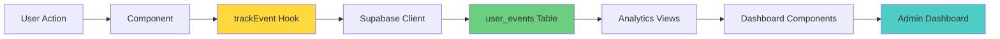
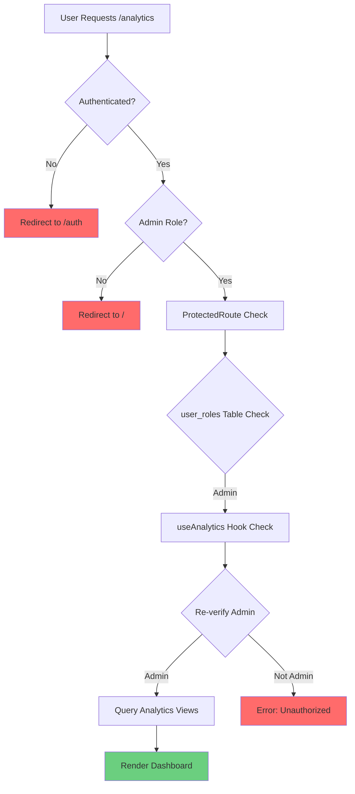

# Analytics Implementation Guide

**Document Version:** 2.0  
**Last Updated:** December 31, 2025  
**Owner:** Product & Engineering Team  
**Status:** Active

---

## Table of Contents

1. [Event Tracking Strategy](#event-tracking-strategy)
2. [User Events Table](#user-events-table)
3. [Analytics Views](#analytics-views)
4. [Analytics Dashboard](#analytics-dashboard)
5. [How to Add New Events](#how-to-add-new-events)
6. [Event Taxonomy Reference](#event-taxonomy-reference)
7. [Key Metrics & Insights](#key-metrics--insights)
8. [Privacy & Compliance](#privacy--compliance)

---

## Event Tracking Strategy

### Why Track Events?

**Goals:**
- Understand user behavior and product usage
- Measure feature adoption and engagement
- Identify friction points and drop-off rates
- Validate product decisions with data
- Optimize conversion funnels
- Track subscription upgrades

**Philosophy:**
- Track actions, not pageviews (action-based analytics)
- Capture user intent (why are they clicking?)
- Minimize tracking code (use hooks, not inline tracking)
- Respect user privacy (GDPR/CCPA compliant)

### Event Tracking Architecture



### Event Categories

| Category | Purpose | Examples |
|----------|---------|----------|
| **navigation** | Page views, route changes | `page_viewed`, `ig_landing_viewed` |
| **engagement** | User interactions, feature usage | `demo_cta_clicked`, `product_uploaded` |
| **conversion** | Signup, subscription | `signup_cta_clicked`, `subscription_upgraded` |
| **feature_adoption** | Core feature usage | `product_analysis_completed`, `routine_created` |
| **feedback** | User feedback, ratings | `feedback_submitted`, `nps_score_submitted` |
| **subscription** | Tier changes, trials | `trial_started`, `paywall_viewed` |

---

## User Events Table

### Schema

```sql
CREATE TABLE public.user_events (
  id UUID PRIMARY KEY DEFAULT gen_random_uuid(),
  user_id UUID REFERENCES auth.users(id), -- Nullable for anonymous events
  event_name TEXT NOT NULL,
  event_category TEXT NOT NULL,
  event_properties JSONB DEFAULT '{}'::jsonb,
  page_url TEXT,
  referrer TEXT,
  user_agent TEXT,
  created_at TIMESTAMPTZ NOT NULL DEFAULT now()
);

-- Indexes for performance
CREATE INDEX idx_user_events_user_id ON public.user_events(user_id);
CREATE INDEX idx_user_events_event_name ON public.user_events(event_name);
CREATE INDEX idx_user_events_created_at ON public.user_events(created_at DESC);
CREATE INDEX idx_user_events_event_category ON public.user_events(event_category);
CREATE INDEX idx_user_events_properties_gin ON public.user_events USING gin(event_properties);
```

### Column Definitions

| Column | Type | Description | Example |
|--------|------|-------------|---------|
| `id` | UUID | Unique event identifier | `a1b2c3d4-...` |
| `user_id` | UUID | User who triggered event (null if anonymous) | `user-uuid` |
| `event_name` | TEXT | Specific event name | `demo_cta_clicked` |
| `event_category` | TEXT | Event category | `engagement` |
| `event_properties` | JSONB | Additional event metadata | `{"location": "hero"}` |
| `page_url` | TEXT | URL where event occurred | `/upload` |
| `referrer` | TEXT | Previous page URL | `https://instagram.com` |
| `user_agent` | TEXT | Browser/device info | `Mozilla/5.0...` |
| `created_at` | TIMESTAMPTZ | Timestamp of event | `2025-12-31T10:30:00Z` |

### RLS Policies

```sql
-- Enable RLS
ALTER TABLE public.user_events ENABLE ROW LEVEL SECURITY;

-- Users can insert their own events
CREATE POLICY "Users can insert their own events"
ON public.user_events FOR INSERT
WITH CHECK (auth.uid() = user_id);

-- Users can view their own events
CREATE POLICY "Users can view their own events"
ON public.user_events FOR SELECT
USING (auth.uid() = user_id);

-- No updates or deletes (events are immutable)
```

---

## Analytics Views

### analytics_daily_active_users

**Purpose:** Track daily active user count.

```sql
CREATE VIEW analytics_daily_active_users AS
SELECT 
  DATE(created_at) as date,
  COUNT(DISTINCT user_id) as active_users
FROM user_events
WHERE user_id IS NOT NULL
GROUP BY DATE(created_at)
ORDER BY date DESC;
```

### analytics_feature_adoption

**Purpose:** Track feature usage patterns.

```sql
CREATE VIEW analytics_feature_adoption AS
SELECT 
  event_category,
  event_name,
  COUNT(*) as event_count,
  COUNT(DISTINCT user_id) as unique_users
FROM user_events
WHERE created_at > NOW() - INTERVAL '30 days'
GROUP BY event_category, event_name
ORDER BY event_count DESC;
```

### conversion_funnel_metrics

**Purpose:** Track conversion funnel by date.

```sql
CREATE VIEW conversion_funnel_metrics AS
SELECT 
  DATE(created_at) as date,
  COUNT(*) FILTER (WHERE event_name = 'page_viewed' AND page_url = '/') as homepage_views,
  COUNT(*) FILTER (WHERE event_name = 'demo_cta_clicked') as demo_clicks,
  COUNT(*) FILTER (WHERE event_name = 'signup_cta_clicked') as signup_clicks,
  COUNT(*) FILTER (WHERE event_name = 'onboarding_completed') as completed_onboarding,
  COUNT(*) FILTER (WHERE event_name = 'product_analysis_completed') as first_analysis,
  ROUND(COUNT(*) FILTER (WHERE event_name = 'demo_cta_clicked')::NUMERIC / 
        NULLIF(COUNT(*) FILTER (WHERE event_name = 'page_viewed' AND page_url = '/'), 0) * 100, 2) as demo_ctr,
  ROUND(COUNT(*) FILTER (WHERE event_name = 'signup_cta_clicked')::NUMERIC / 
        NULLIF(COUNT(*) FILTER (WHERE event_name = 'page_viewed' AND page_url = '/'), 0) * 100, 2) as signup_ctr
FROM user_events
GROUP BY DATE(created_at)
ORDER BY date DESC;
```

### cta_performance_metrics

**Purpose:** Track CTA button performance.

```sql
CREATE VIEW cta_performance_metrics AS
SELECT 
  DATE(created_at) as date,
  event_name,
  event_properties->>'cta_text' as cta_text,
  event_properties->>'location' as location,
  COUNT(*) as total_clicks,
  COUNT(DISTINCT user_id) as unique_users
FROM user_events
WHERE event_name LIKE '%_cta_clicked'
GROUP BY DATE(created_at), event_name, event_properties->>'cta_text', event_properties->>'location'
ORDER BY date DESC, total_clicks DESC;
```

### engagement_metrics_summary

**Purpose:** Daily engagement summary.

```sql
CREATE VIEW engagement_metrics_summary AS
SELECT 
  DATE(created_at) as date,
  COUNT(DISTINCT user_id) as daily_active_users,
  COUNT(*) FILTER (WHERE event_category = 'engagement') as engagement_events,
  COUNT(*) FILTER (WHERE event_category = 'conversion') as conversion_events,
  COUNT(*) FILTER (WHERE event_name = 'product_analysis_completed') as analyses,
  COUNT(*) FILTER (WHERE event_name = 'routine_created') as routines_created,
  COUNT(*) FILTER (WHERE event_name = 'routine_optimized') as routines_optimized,
  ROUND(COUNT(*) FILTER (WHERE event_category = 'engagement')::NUMERIC / 
        NULLIF(COUNT(DISTINCT user_id), 0), 2) as avg_engagement_per_user,
  ROUND(COUNT(*) FILTER (WHERE event_category = 'conversion')::NUMERIC / 
        NULLIF(COUNT(DISTINCT user_id), 0), 2) as avg_conversions_per_user
FROM user_events
WHERE user_id IS NOT NULL
GROUP BY DATE(created_at)
ORDER BY date DESC;
```

### user_journey_analysis

**Purpose:** Full user journey funnel analysis.

```sql
CREATE VIEW user_journey_analysis AS
SELECT 
  COUNT(DISTINCT user_id) as total_users,
  COUNT(DISTINCT user_id) FILTER (WHERE event_name = 'page_viewed' AND page_url = '/') as viewed_homepage,
  COUNT(DISTINCT user_id) FILTER (WHERE event_name = 'demo_cta_clicked') as clicked_demo,
  COUNT(DISTINCT user_id) FILTER (WHERE event_name = 'signup_cta_clicked') as clicked_signup,
  COUNT(DISTINCT user_id) FILTER (WHERE event_name = 'onboarding_completed') as completed_onboarding,
  COUNT(DISTINCT user_id) FILTER (WHERE event_name = 'product_analysis_completed') as completed_first_analysis,
  -- Conversion rates
  ROUND(COUNT(DISTINCT user_id) FILTER (WHERE event_name = 'demo_cta_clicked')::NUMERIC / 
        NULLIF(COUNT(DISTINCT user_id) FILTER (WHERE event_name = 'page_viewed'), 0) * 100, 2) as homepage_to_demo_rate,
  ROUND(COUNT(DISTINCT user_id) FILTER (WHERE event_name = 'signup_cta_clicked')::NUMERIC / 
        NULLIF(COUNT(DISTINCT user_id) FILTER (WHERE event_name = 'page_viewed'), 0) * 100, 2) as homepage_to_signup_rate
FROM user_events
WHERE user_id IS NOT NULL;
```

### rate_limit_abuse_alerts

**Purpose:** Identify potential rate limit abuse.

```sql
CREATE VIEW rate_limit_abuse_alerts AS
SELECT 
  endpoint,
  identifier as ip_address,
  COUNT(*) as total_requests,
  COUNT(*) FILTER (WHERE created_at > NOW() - INTERVAL '5 minutes') as requests_last_5min,
  MIN(created_at) as first_request,
  MAX(created_at) as last_request
FROM rate_limit_log
GROUP BY endpoint, identifier
HAVING COUNT(*) > 100
ORDER BY total_requests DESC;
```

---

## Analytics Dashboard

### Security Model

**Multi-Layered Security (Admin-Only Access):**



**Layer 1: ProtectedRoute Component**

```typescript
// src/components/ProtectedRoute.tsx
export const ProtectedRoute = ({ children }: { children: React.ReactNode }) => {
  const [isAdmin, setIsAdmin] = useState<boolean | null>(null);
  const [loading, setLoading] = useState(true);

  useEffect(() => {
    checkAdminStatus();
  }, []);

  const checkAdminStatus = async () => {
    const { data: { user } } = await supabase.auth.getUser();
    
    if (!user) {
      setIsAdmin(false);
      setLoading(false);
      return;
    }

    // Check user_roles table
    const { data: roles } = await supabase
      .from('user_roles')
      .select('role')
      .eq('user_id', user.id)
      .eq('role', 'admin')
      .maybeSingle();

    setIsAdmin(!!roles);
    setLoading(false);
  };

  if (loading) return <Loader />;
  if (!isAdmin) return <Navigate to="/" replace />;
  
  return <>{children}</>;
};
```

**Layer 2: Hook-Level Validation**

```typescript
// src/hooks/useAnalytics.ts
export const useCTAPerformance = () => {
  return useQuery({
    queryKey: ['cta-performance'],
    queryFn: async () => {
      // Re-verify admin access before querying
      const { data: { user } } = await supabase.auth.getUser();
      if (!user) throw new Error('Not authenticated');
      
      const { data: roles } = await supabase
        .from('user_roles')
        .select('role')
        .eq('user_id', user.id)
        .eq('role', 'admin')
        .maybeSingle();
      
      if (!roles) throw new Error('Unauthorized: Admin access required');
      
      // Query analytics view
      const { data, error } = await supabase
        .from('cta_performance_metrics')
        .select('*')
        .order('date', { ascending: false });
      
      if (error) throw error;
      return data;
    },
    refetchInterval: 30000, // Refresh every 30s
  });
};
```

### Dashboard Components

**Location:** `src/pages/Analytics.tsx`

**Available Charts:**
- CTA Performance (line chart)
- Conversion Funnel (bar chart)
- User Journey Metrics (metric cards)
- Engagement Summary (table)
- Daily Active Users (line chart)

---

## How to Add New Events

### Step 1: Define Event

```typescript
// Choose event name and category
Event Name: describe_the_action_taken (snake_case)
Event Category: navigation | engagement | conversion | feature_adoption | feedback | subscription

// Example:
Event Name: "paywall_upgrade_clicked"
Event Category: "subscription"
```

### Step 2: Add Tracking Call

**Option A: Use `trackEvent` Directly**

```typescript
import { trackEvent } from '@/hooks/useTracking';

const handleUpgrade = async () => {
  // Track event
  await trackEvent({
    eventName: 'paywall_upgrade_clicked',
    eventCategory: 'subscription',
    eventProperties: {
      current_tier: 'free',
      target_tier: 'premium',
      billing_cycle: 'monthly',
      location: 'analysis_page'
    }
  });
  
  // Perform action
  openCheckout();
};
```

**Option B: Use `useTracking` Hook**

```typescript
import { useTracking } from '@/hooks/useTracking';

const MyComponent = () => {
  const { trackEvent } = useTracking('Product Detail Page');
  
  const handleShare = async () => {
    trackEvent({
      eventName: 'product_shared',
      eventCategory: 'engagement',
      eventProperties: {
        analysis_id: analysisId,
        share_method: 'native_share'
      }
    });
  };
};
```

### Step 3: Verify Event

1. Trigger the event in the app
2. Check user_events table:
```sql
SELECT * FROM user_events 
WHERE event_name = 'paywall_upgrade_clicked'
ORDER BY created_at DESC
LIMIT 10;
```

---

## Event Taxonomy Reference

### Navigation Events

| Event Name | When Triggered | Properties |
|------------|----------------|------------|
| `page_viewed` | Page load | `page_url`, `referrer` |
| `ig_landing_viewed` | Instagram landing page | `campaign_id` |

### Engagement Events

| Event Name | When Triggered | Properties |
|------------|----------------|------------|
| `demo_cta_clicked` | Demo button click | `location`, `cta_text` |
| `product_uploaded` | Image uploaded | `file_type`, `file_size` |
| `product_analysis_completed` | Analysis finished | `epiq_score`, `product_name` |
| `chat_message_sent` | SkinLytixGPT message | `analysis_id`, `message_count` |
| `routine_created` | New routine | `routine_type`, `product_count` |
| `routine_optimized` | Optimization run | `routine_id`, `savings` |
| `dupe_saved` | Dupe saved to favorites | `source_product`, `dupe_name` |

### Conversion Events

| Event Name | When Triggered | Properties |
|------------|----------------|------------|
| `signup_cta_clicked` | Signup button click | `location`, `cta_text` |
| `signup_completed` | User registered | `signup_method` |
| `onboarding_completed` | Profile finished | `skin_type`, `concerns` |

### Subscription Events

| Event Name | When Triggered | Properties |
|------------|----------------|------------|
| `paywall_viewed` | Paywall modal opened | `feature`, `required_tier` |
| `paywall_upgrade_clicked` | Upgrade button clicked | `current_tier`, `target_tier` |
| `trial_started` | Trial began | `trial_end_date` |
| `subscription_upgraded` | Payment succeeded | `new_tier`, `billing_cycle` |
| `subscription_cancelled` | Subscription ended | `tier`, `reason` |

### Feedback Events

| Event Name | When Triggered | Properties |
|------------|----------------|------------|
| `feedback_submitted` | Feedback form sent | `rating`, `feedback_type` |
| `beta_feedback_submitted` | Beta survey sent | `pmf_score` |

---

## Key Metrics & Insights

### Critical KPIs

| Metric | Target | How to Calculate |
|--------|--------|------------------|
| Demo CTR | 15%+ | `demo_clicks / homepage_views` |
| Signup CTR | 10%+ | `signup_clicks / homepage_views` |
| Onboarding Completion | 85%+ | `completed_onboarding / signups` |
| Trial → Paid | 30%+ | `subscribed / trial_started` |
| D7 Retention | 50%+ | Users active Day 7 / Day 0 signups |

### Current Insights (from analytics data)

Based on recent analytics:
- **Device split**: ~55% mobile, ~40% desktop, ~5% tablet
- **Top browser**: Safari (iOS), Chrome (Android)
- **Drop-off point**: 50% between onboarding and first analysis
- **High engagement feature**: Routine optimization (87% engagement once routine created)
- **Underutilized**: SkinLytixGPT chat (low adoption, needs promotion)

### Recommended Focus Areas

1. **Reduce onboarding-to-analysis drop-off** (50% → 30%)
2. **Increase chat feature adoption** (current: very low)
3. **Mobile-optimize checkout flow**
4. **A/B test paywall copy**

---

## Privacy & Compliance

### Data Minimization

- Only track necessary events
- No PII in event_properties (no emails, names)
- User IDs are pseudonymized

### Retention

- Event data retained for 365 days
- Aggregated views kept indefinitely
- User can request data deletion

### GDPR/CCPA Compliance

- Consent captured at signup
- Data export available on request
- Right to deletion implemented
- No third-party analytics sharing
