# User Flows & Journey Maps

**Document Version:** 2.0  
**Last Updated:** December 31, 2025  
**Owner:** Product Team  
**Status:** Active

---

## Table of Contents

1. [User Personas](#user-personas)
2. [Onboarding Flow](#onboarding-flow)
3. [Product Analysis Flow](#product-analysis-flow)
4. [Routine Building Flow](#routine-building-flow)
5. [Subscription & Upgrade Flow](#subscription--upgrade-flow)
6. [Chat & AI Interaction Flow](#chat--ai-interaction-flow)
7. [Dupe Discovery Flow](#dupe-discovery-flow)
8. [Conversion Funnels](#conversion-funnels)
9. [Drop-off Points & Mitigation](#drop-off-points--mitigation)

---

## User Personas

### Primary Personas

#### 1. Emma - The Skincare Enthusiast (24, Student)

**Demographics:**
- Age: 24
- Location: Los Angeles, CA
- Occupation: Graduate student
- Income: $20k/year (part-time + student loans)

**Behaviors:**
- Spends 30+ min daily on skincare routine
- Active on r/SkincareAddiction, TikTok #SkincareTok
- Reads ingredient lists but doesn't fully understand them
- Owns 15+ skincare products
- Budget-conscious but willing to invest in "good" products

**Pain Points:**
- "I don't know if this product is actually good for my skin"
- "I see conflicting information online about ingredients"
- "I've wasted money on products that broke me out"
- "My routine is getting too expensive"

**Goals:**
- Understand what's really in her products
- Build an evidence-based routine
- Avoid ingredients that cause breakouts
- Save money without sacrificing quality

**How SkinLytix Helps:**
- Instant ingredient analysis → Confidence in purchases
- EpiQ Score → Simple quality metric
- Routine optimization → Cost savings
- Dupe Discovery → Affordable alternatives
- SkinLytixGPT Chat → Personalized advice

---

## Onboarding Flow

### Entry Points

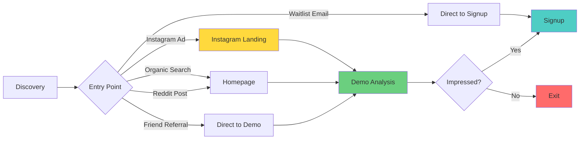

### Complete Onboarding Flow

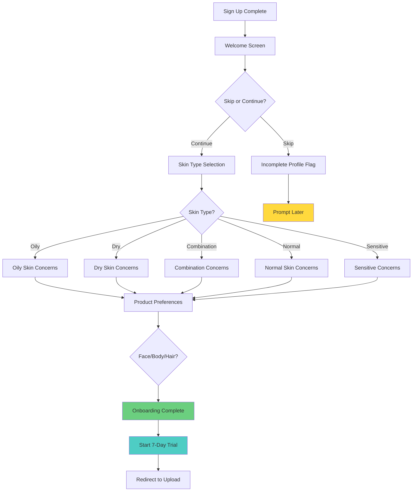

---

## Product Analysis Flow

### Upload Methods & User Paths

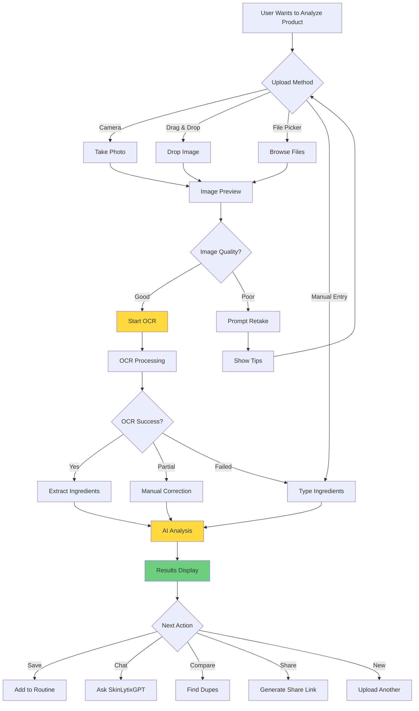

### Analysis Results Actions

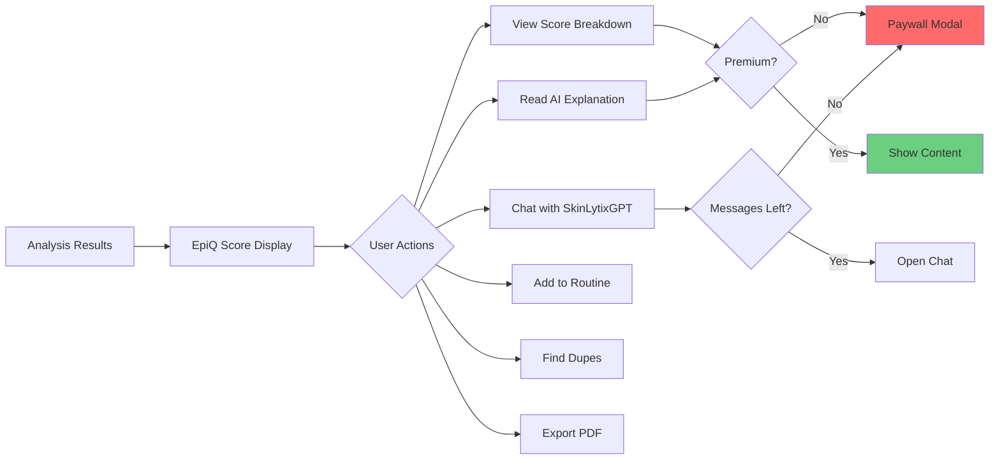

---

## Routine Building Flow

### Create Routine Flow

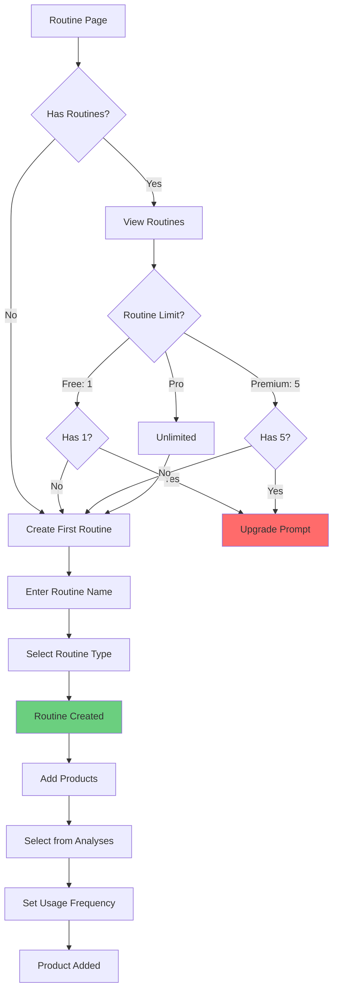

### Routine Optimization Flow

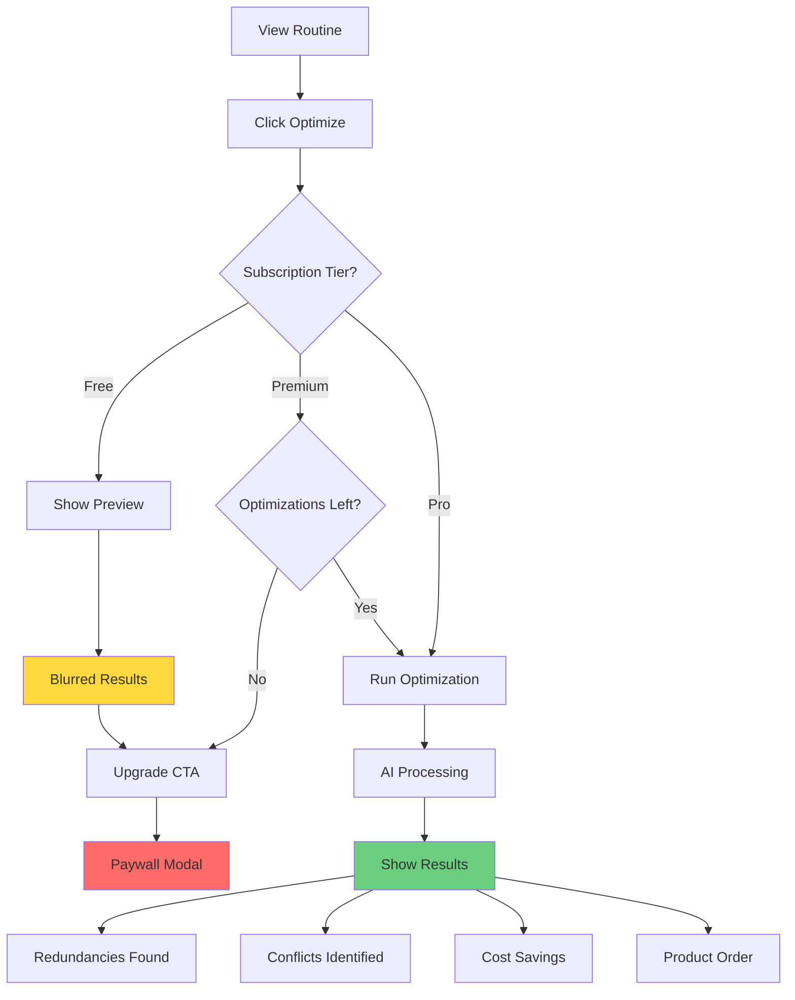

---

## Subscription & Upgrade Flow

### Upgrade Journey

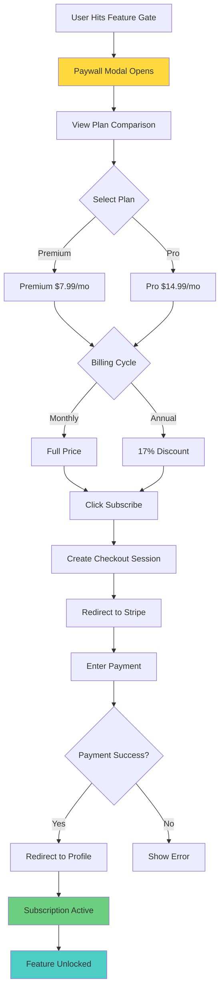

### Trial Flow

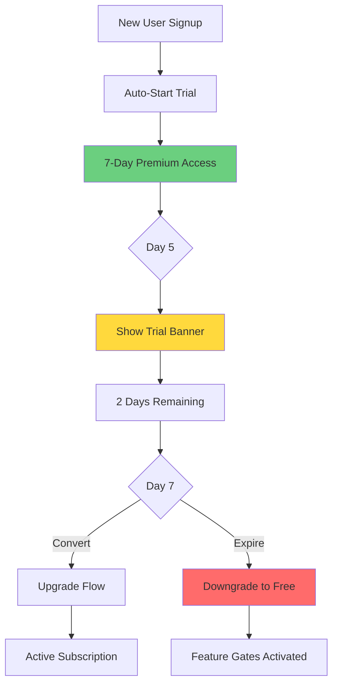

---

## Chat & AI Interaction Flow

### SkinLytixGPT Chat Flow

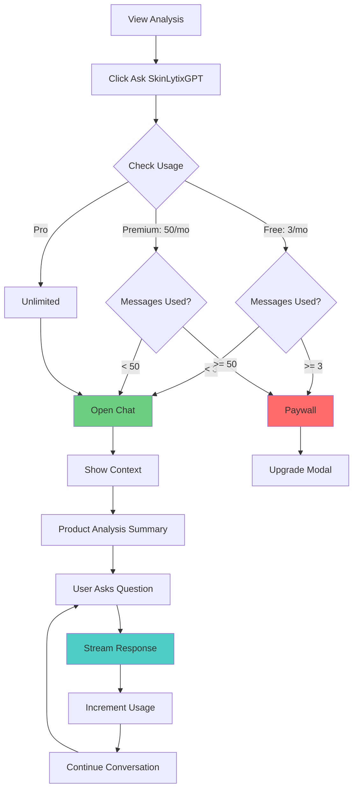

### Chat Context

```
┌─────────────────────────────────────┐
│ Chatting about: CeraVe Moisturizer  │
│ EpiQ Score: 87/100                  │
├─────────────────────────────────────┤
│                                     │
│ User: Is this good for oily skin?   │
│                                     │
│ SkinLytixGPT: Based on your oily    │
│ skin profile, this product has...   │
│                                     │
│ [Usage: 2 of 3 messages]            │
│                                     │
│ [Type your question...]             │
└─────────────────────────────────────┘
```

---

## Dupe Discovery Flow

### Find Dupes Flow

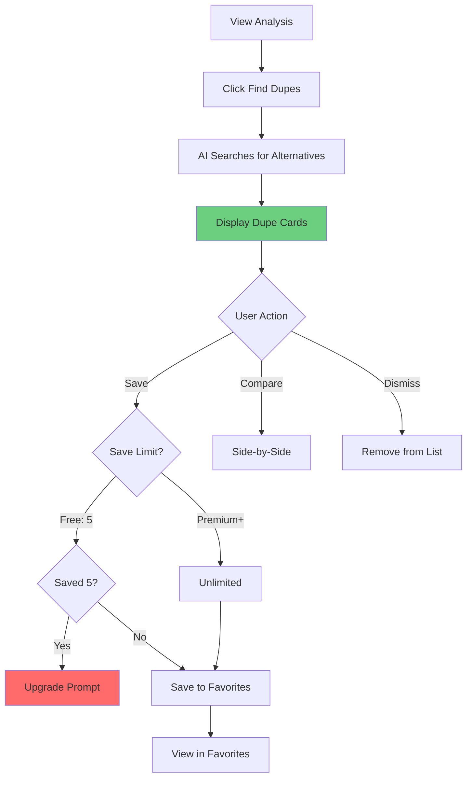

### Dupe Card Display

```
┌─────────────────────────────────────┐
│ [Product Image]                     │
│                                     │
│ The Ordinary Moisturizing Factors   │
│ Brand: The Ordinary                 │
│ Est. Price: $12-15                  │
│                                     │
│ Why it's a dupe:                    │
│ • Similar ceramide formula          │
│ • Contains hyaluronic acid          │
│ • Same humectant base               │
│                                     │
│ [Save Dupe] [Compare] [Dismiss]     │
└─────────────────────────────────────┘
```

---

## Conversion Funnels

### Primary Conversion Funnel

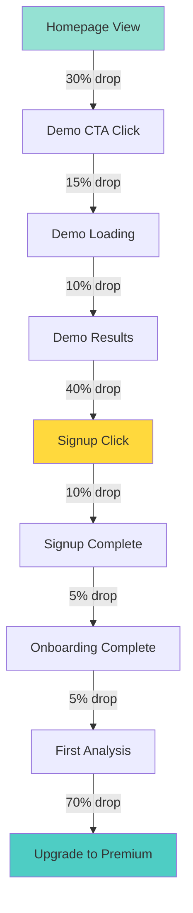

### Upgrade Funnel

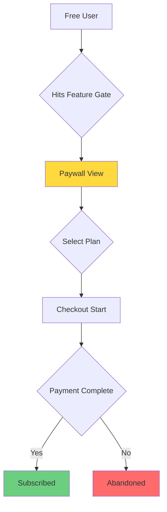

---

## Drop-off Points & Mitigation

### Risk Point 1: Homepage → Demo (30% drop)

**Why:** Not convinced of value, overwhelmed

**Mitigation:**
- Clear value proposition above fold
- Social proof (user count, ratings)
- Video demonstration
- Single primary CTA
- Trust signals (expert validation badge)

### Risk Point 2: Demo Results → Signup (40% drop)

**Why:** Got their answer, don't see account value

**Mitigation:**
- Highlight locked features (grayed buttons)
- "Save this analysis" prompt
- Exit-intent popup
- One-click social signup
- Show what they'll lose without account

### Risk Point 3: Free → Premium (70% drop)

**Why:** Price objection, unsure of value

**Mitigation:**
- 7-day free trial (auto-enrolled)
- Usage counter showing limits
- Blurred preview of premium content
- Annual discount (17% savings)
- Social proof in paywall
- Feature comparison table

### Risk Point 4: Trial → Paid (estimated 50% drop)

**Why:** Forgot, didn't use enough, price

**Mitigation:**
- Day 5 trial reminder banner
- Email reminders (Day 3, 5, 7)
- Show usage summary in trial
- Downgrade loss notification
- Easy upgrade flow (1-click)

---

## A/B Testing Opportunities

### High-Impact Tests

1. **Hero CTA Copy**
   - "Try Demo" vs "Analyze Your Product Free"
   - Expected lift: 10-20%

2. **Paywall Design**
   - Feature list vs comparison table
   - Monthly-first vs Annual-first
   - Expected lift: 15-25%

3. **Trial Duration**
   - 7 days vs 14 days
   - Expected lift: 5-15% conversion

4. **Usage Counter Visibility**
   - Always visible vs only when low
   - Expected lift: 10-20% upgrades

5. **Social Proof Placement**
   - Hero section vs above CTA
   - Expected lift: 5-10%
