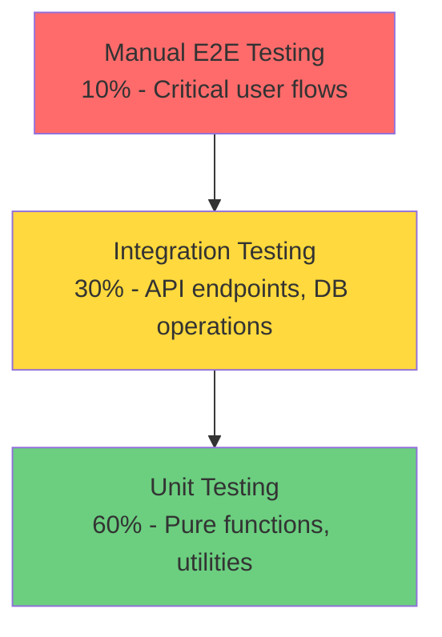
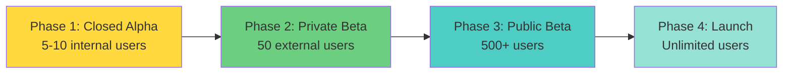
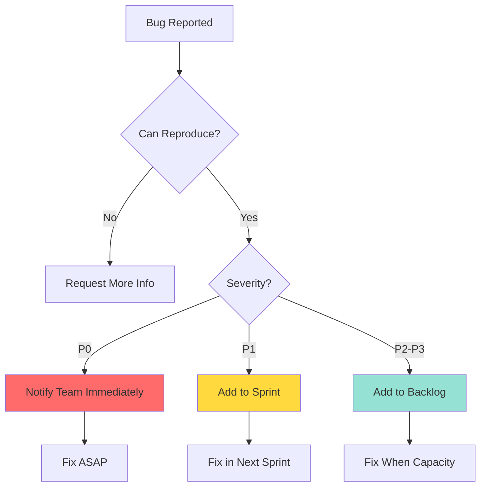

# QA & Testing Standard Operating Procedures

**Document Version:** 1.0  
**Last Updated:** November 11, 2025  
**Owner:** QA & Product Team  
**Status:** Active

---

## Table of Contents

1. [Testing Strategy Overview](#testing-strategy-overview)
2. [Test Data Management](#test-data-management)
3. [Beta Testing Procedures](#beta-testing-procedures)
4. [Regression Testing](#regression-testing)
5. [AI Model Validation](#ai-model-validation)
6. [Feedback Loop Process](#feedback-loop-process)
7. [Bug Reporting & Triage](#bug-reporting--triage)
8. [Release Sign-Off Criteria](#release-sign-off-criteria)

---

## Testing Strategy Overview

### Testing Pyramid



### Testing Phases

| Phase | When | Scope | Owner | Duration |
|-------|------|-------|-------|----------|
| **Unit Tests** | During development | Individual functions/components | Developer | Continuous |
| **Integration Tests** | Before PR merge | API endpoints, database | Developer + QA | 30 min |
| **Smoke Tests** | After staging deploy | Core user flows | QA | 15 min |
| **Regression Tests** | Before production | Full application | QA | 2 hours |
| **Beta Testing** | Pre-launch / Major features | Real user scenarios | Beta users + Product | 1-2 weeks |

### Test Environments

| Environment | Purpose | Data | Access |
|-------------|---------|------|--------|
| **Local** | Developer testing | Synthetic test data | All developers |
| **Staging** | Pre-production testing | Production-like data | Team + Beta users |
| **Production** | Live user traffic | Real user data | Public |

---

## Test Data Management

### Test Product Images

**Location:** `test-data/product-images/`

#### Image Categories

**1. Ideal Images (Should Always Work)**
```
✓ test-moisturizer-perfect.jpg
  - Clear lighting, flat surface
  - Ingredient list fully visible
  - No glare or shadows
  - Sharp focus

✓ test-serum-optimal.jpg
  - Standardized INCI format
  - Black text on white background
  - Straight-on angle
```

**2. Challenging Images (Edge Cases)**
```
⚠ test-sunscreen-curved.jpg
  - Curved bottle surface
  - Partial text distortion
  - Expected: OCR may miss 10-15% of ingredients

⚠ test-cream-glossy.jpg
  - Glossy packaging with glare
  - Reflective surface
  - Expected: OCR accuracy 70-80%

⚠ test-cleanser-angled.jpg
  - 45-degree camera angle
  - Perspective distortion
  - Expected: OCR accuracy 60-70%
```

**3. Failure Cases (Should Handle Gracefully)**
```
✗ test-product-blurry.jpg
  - Motion blur, out of focus
  - Expected: Show "Image too blurry" error

✗ test-product-low-light.jpg
  - Underexposed, hard to read
  - Expected: Prompt to retake with better lighting

✗ test-product-no-ingredients.jpg
  - Front of package only
  - Expected: "No ingredient list detected"
```

### Test Ingredient Lists

**Test Ingredient Strings:**

```typescript
// Standard ingredient list (common actives)
const STANDARD_INGREDIENTS = `
Water (Aqua), Glycerin, Niacinamide, Butylene Glycol, 
Caprylic/Capric Triglyceride, Cetearyl Alcohol, 
Dimethicone, Sodium Hyaluronate, Tocopheryl Acetate, 
Allantoin, Panthenol, Fragrance (Parfum)
`;

// Complex ingredient list (scientific names)
const COMPLEX_INGREDIENTS = `
Aqua, Glycerin, Pentylene Glycol, Propanediol, 
1,2-Hexanediol, Niacinamide, Ascorbyl Glucoside, 
Sodium Hyaluronate, Acetyl Hexapeptide-8, 
Palmitoyl Tripeptide-1, Ceramide NP, Cholesterol, 
Phytosphingosine, Alpha-Arbutin, Kojic Acid
`;

// Problematic ingredients (allergens + irritants)
const PROBLEMATIC_INGREDIENTS = `
Water, Sodium Lauryl Sulfate, Alcohol Denat, 
Methylisothiazolinone, Methylchloroisothiazolinone, 
Fragrance, Benzyl Alcohol, Linalool, Limonene, 
Formaldehyde, Retinol, BHA, BHT
`;

// Natural/Clean beauty ingredients
const CLEAN_INGREDIENTS = `
Aloe Barbadensis Leaf Juice, Coconut Oil, Shea Butter, 
Jojoba Oil, Vitamin E, Green Tea Extract, Chamomile Extract, 
Rosehip Oil, Argan Oil, Hyaluronic Acid, Squalane
`;

// Vegan ingredient list (should not flag animal-derived)
const VEGAN_INGREDIENTS = `
Aqua, Glycerin, Squalane (Plant-Derived), 
Tocopherol, Ascorbic Acid, Niacinamide, 
Panthenol, Allantoin, Sodium Hyaluronate
`;

// Non-vegan ingredients (should flag)
const NON_VEGAN_INGREDIENTS = `
Water, Beeswax, Lanolin, Carmine, Collagen, 
Keratin, Honey, Milk Protein, Silk Amino Acids
`;
```

### Test User Profiles

**Profile Archetypes:**

```typescript
// Oily, Acne-Prone (Age 18-25)
const PROFILE_OILY = {
  skin_type: 'oily',
  skin_concerns: ['acne', 'blackheads', 'large_pores'],
  product_preferences: { face: true, body: false, hair: false }
};

// Dry, Sensitive (Age 35-50)
const PROFILE_DRY_SENSITIVE = {
  skin_type: 'dry',
  skin_concerns: ['sensitivity', 'redness', 'dryness'],
  product_preferences: { face: true, body: true, hair: false }
};

// Combination, Anti-Aging (Age 40-60)
const PROFILE_COMBINATION = {
  skin_type: 'combination',
  skin_concerns: ['fine_lines', 'hyperpigmentation', 'uneven_texture'],
  product_preferences: { face: true, body: false, hair: true }
};

// Normal, Minimal Concerns (Age 20-30)
const PROFILE_NORMAL = {
  skin_type: 'normal',
  skin_concerns: ['prevention', 'hydration'],
  product_preferences: { face: true, body: false, hair: false }
};
```

### Mock API Responses

**Successful Analysis Response:**

```json
{
  "epiq_score": 82,
  "recommendations_json": {
    "overall_assessment": "Good choice for dry skin",
    "key_actives": [
      {
        "name": "Niacinamide",
        "function": "Brightening, pore-refining",
        "concentration": "5%",
        "benefits": ["Reduces hyperpigmentation", "Strengthens skin barrier"]
      }
    ],
    "red_flags": [],
    "suitable_for": ["dry", "combination"],
    "avoid_if": ["extremely_oily"],
    "routine_placement": "Morning and evening after cleansing"
  },
  "product_name": "Test Moisturizer",
  "brand": "Test Brand",
  "category": "Moisturizer",
  "analyzed_at": "2025-11-11T10:00:00Z"
}
```

**Error Responses:**

```json
// Rate limit error
{
  "error": "Rate limit exceeded. Please try again later.",
  "retry_after_seconds": 3600
}

// Invalid ingredients
{
  "error": "Could not parse ingredient list. Please check image quality.",
  "suggestions": [
    "Ensure ingredient list is in focus",
    "Use good lighting",
    "Hold camera straight"
  ]
}
```

---

## Beta Testing Procedures

### Beta User Recruitment

**Target Beta Users:**

1. **Skincare Enthusiasts (40%)**
   - Active on r/SkincareAddiction, skincare YouTube/TikTok
   - Own 5+ skincare products
   - Read ingredient lists regularly

2. **Skincare Professionals (30%)**
   - Licensed estheticians
   - Dermatology residents
   - Cosmetic chemists

3. **General Consumers (30%)**
   - Interested in clean beauty
   - Have skin concerns (acne, sensitivity, aging)
   - First-time ingredient analyzers

**Recruitment Channels:**
- Reddit r/SkincareAddiction post
- Instagram skincare community outreach
- Referrals from early waitlist users
- Partnership with beauty influencers

**Target Beta Cohort Size:** 50-100 users per testing round

### Beta Testing Phases



#### Phase 1: Closed Alpha (Week 1-2)
- Internal team + 5 trusted testers
- Focus: Core functionality, critical bugs
- Feedback: Daily standup + Slack

#### Phase 2: Private Beta (Week 3-6)
- 50 handpicked beta users
- Focus: User experience, edge cases, performance
- Feedback: In-app + weekly survey

#### Phase 3: Public Beta (Week 7-10)
- Open to waitlist (500+ users)
- Focus: Scale testing, diverse use cases
- Feedback: In-app + community Discord

#### Phase 4: Launch (Week 11+)
- Public release
- Continued monitoring and iteration

### Beta Feedback Collection

#### In-App Feedback Widget

**Implementation:** `src/components/FeedbackWidget.tsx`

```typescript
// Feedback widget appears on every page
<FeedbackWidget />

// Triggers:
// - After product analysis completion
// - After routine optimization
// - On exit intent (if user is leaving without engaging)
```

**Feedback Types:**
1. **Rating (1-5 stars)** - Quick sentiment capture
2. **Open text** - Detailed feedback
3. **Bug report** - Structured issue reporting
4. **Feature request** - User suggestions

#### Post-Analysis Feedback

**Implementation:** `src/components/PostAnalysisFeedback.tsx`

Appears immediately after analysis completion:
- "Was this analysis helpful?" (Yes/No)
- "Any ingredients we missed or misidentified?"
- "What would make this more useful?"

#### Weekly Beta Survey

**Cadence:** Every Friday during beta period

**Survey Questions:**
1. How many products did you analyze this week? (0 / 1-2 / 3-5 / 6+)
2. On a scale of 1-5, how accurate were the analyses?
3. Did you encounter any bugs or errors? (Yes/No + details)
4. What feature would you want most? (Open-ended)
5. Would you recommend SkinLytix to a friend? (NPS score)

**Tool:** Typeform / Google Forms with automatic Slack notifications

---

## Regression Testing

### Core User Flows Checklist

**Run before every production deployment:**

#### 1. Landing Page & Demo Flow
- [ ] Landing page loads in <3 seconds
- [ ] "Try Demo Analysis" button triggers demo modal
- [ ] Demo analysis auto-loads and completes successfully
- [ ] Demo results display correctly (score, recommendations, red flags)
- [ ] "Sign Up to Save Results" CTA appears
- [ ] No console errors during demo flow

#### 2. Authentication Flow
- [ ] Sign up form validation works (email format, password strength)
- [ ] Sign up creates account successfully
- [ ] Verification email sent (check spam folder)
- [ ] Auto-confirm enabled (user logged in immediately)
- [ ] Login with correct credentials succeeds
- [ ] Login with incorrect credentials shows error
- [ ] "Forgot password" flow sends reset email
- [ ] Logout clears session and redirects to homepage

#### 3. Onboarding Flow
- [ ] New user redirected to onboarding after signup
- [ ] Skin type selection saves to profile
- [ ] Skin concerns multi-select works (can select multiple)
- [ ] "Skip" button allows bypassing onboarding
- [ ] Profile completion flag set after onboarding
- [ ] User redirected to upload page after completion

#### 4. Product Analysis Flow
- [ ] Upload page displays drag-drop area
- [ ] File picker opens on click
- [ ] Image preview displays after selection
- [ ] OCR loading tips appear during processing
- [ ] Analysis completes in <30 seconds
- [ ] Results page shows:
  - [ ] EpiQ Score (0-100)
  - [ ] Overall assessment
  - [ ] Key actives section
  - [ ] Red flags (if any)
  - [ ] Suitability for user's skin type
- [ ] "Add to Routine" button appears (premium users)
- [ ] "Analyze Another Product" returns to upload
- [ ] Product saved to user's analysis history

#### 5. Routine Creation Flow (Premium)
- [ ] "Create Routine" button accessible from navigation
- [ ] Routine name input validates (1-100 chars)
- [ ] Routine type selector works (face/body/hair)
- [ ] "Add Product" opens product selection modal
- [ ] Previously analyzed products appear in list
- [ ] Can add products with usage frequency (AM/PM/Weekly)
- [ ] Routine saves successfully
- [ ] Routine appears in routines list

#### 6. Routine Optimization Flow (Premium)
- [ ] "Optimize Routine" button appears for routines with 2+ products
- [ ] Optimization loading shows progress indicator
- [ ] Optimization completes in <45 seconds
- [ ] Results show:
  - [ ] Cost analysis (total spent, potential savings)
  - [ ] Product redundancies identified
  - [ ] Recommendations for better alternatives
  - [ ] Routine order suggestions
- [ ] Can save optimization results
- [ ] Can share optimization report (future)

#### 7. Analytics Dashboard (Admin Only)
- [ ] `/analytics` route redirects non-admins to homepage
- [ ] Admin users can access dashboard
- [ ] CTA Performance Chart displays data
- [ ] Conversion Funnel Chart displays data
- [ ] User Journey metrics display
- [ ] Engagement metrics display
- [ ] No console errors related to admin checks

### Cross-Browser Testing

**Test on:**

| Browser | Versions | Platform | Priority |
|---------|----------|----------|----------|
| Chrome | Latest, Latest-1 | Windows, Mac, Android | P0 |
| Safari | Latest, Latest-1 | Mac, iOS | P0 |
| Firefox | Latest | Windows, Mac | P1 |
| Edge | Latest | Windows | P1 |
| Samsung Internet | Latest | Android | P2 |

**Focus Areas:**
- File upload/camera access
- OCR processing (Tesseract.js compatibility)
- CSS rendering (Tailwind compatibility)
- Auth flows (cookies/localStorage)

### Device Testing Matrix

**Desktop:**
- [ ] 1920x1080 (Full HD)
- [ ] 1366x768 (Laptop)
- [ ] 2560x1440 (2K)

**Tablet:**
- [ ] iPad Pro (1024x1366)
- [ ] iPad Air (820x1180)
- [ ] Android Tablet (800x1280)

**Mobile:**
- [ ] iPhone 14 Pro (393x852)
- [ ] iPhone SE (375x667)
- [ ] Samsung Galaxy S23 (360x800)
- [ ] Pixel 7 (412x915)

**Responsive Breakpoints:**
```css
/* Verify these breakpoints work correctly */
sm: 640px  /* Mobile landscape */
md: 768px  /* Tablet portrait */
lg: 1024px /* Tablet landscape / small desktop */
xl: 1280px /* Desktop */
2xl: 1536px /* Large desktop */
```

### Performance Testing

**Lighthouse Audit Targets:**

Run Lighthouse in Chrome DevTools (Incognito mode):

```bash
# Performance metrics targets
Performance: >90
Accessibility: >95
Best Practices: >95
SEO: >90
```

**Key Metrics:**

| Metric | Target | Measurement |
|--------|--------|-------------|
| **First Contentful Paint (FCP)** | <1.5s | Time to first text/image |
| **Largest Contentful Paint (LCP)** | <2.5s | Time to largest element |
| **Time to Interactive (TTI)** | <3.5s | Time until page is fully interactive |
| **Total Blocking Time (TBT)** | <200ms | Time main thread is blocked |
| **Cumulative Layout Shift (CLS)** | <0.1 | Visual stability score |

**OCR Performance:**
- Test with 10 different images
- Target: 90% complete in <20 seconds
- Maximum acceptable: 30 seconds

**AI Analysis Performance:**
- Test with 10 different ingredient lists
- Target: 90% complete in <25 seconds
- Maximum acceptable: 40 seconds

---

## AI Model Validation

### EpiQ Score Accuracy Testing

**Goal:** Ensure EpiQ scores are consistent, explainable, and align with skincare science.

#### Test Cases

**1. Known Products (Ground Truth)**

Maintain a reference list of products with expert-validated scores:

```typescript
const REFERENCE_PRODUCTS = [
  {
    name: "CeraVe Moisturizing Cream",
    ingredients: "Aqua, Glycerin, Cetearyl Alcohol...",
    expected_score: 85, // Expert-validated
    tolerance: ±5,
    reasoning: "Simple, effective, well-formulated"
  },
  {
    name: "St. Ives Apricot Scrub",
    ingredients: "Water, Juglans Regia Shell Powder...",
    expected_score: 45, // Expert-validated
    tolerance: ±5,
    reasoning: "Physical exfoliant too harsh"
  }
];
```

**Validation Process:**
1. Run analysis on reference products
2. Compare AI score to expected score
3. If difference > tolerance:
   - Review AI reasoning
   - Determine if AI improved or regressed
   - Update reference or adjust model prompt

**Frequency:** Weekly during beta, monthly post-launch

#### 2. Consistency Testing

**Same product, multiple analyses should return similar scores:**

```typescript
const testConsistency = async () => {
  const product = {
    name: "Test Serum",
    ingredients: "Water, Niacinamide, Glycerin..."
  };

  const scores = [];
  for (let i = 0; i < 5; i++) {
    const result = await analyzeProduct(product);
    scores.push(result.epiq_score);
  }

  const mean = scores.reduce((a, b) => a + b) / scores.length;
  const variance = scores.map(s => Math.pow(s - mean, 2)).reduce((a, b) => a + b) / scores.length;
  const stdDev = Math.sqrt(variance);

  console.assert(stdDev < 5, `Score variance too high: ${stdDev}`);
};
```

**Acceptance Criteria:** Standard deviation <5 points

#### 3. Edge Case Testing

**Test AI handling of unusual inputs:**

```typescript
const EDGE_CASES = [
  // Very short ingredient list
  { ingredients: "Water, Glycerin", expected: "Should not fail" },
  
  // Very long ingredient list (50+ ingredients)
  { ingredients: "Water, Glycerin, Niacinamide, [...]", expected: "Should parse all" },
  
  // All natural ingredients
  { ingredients: "Aloe Vera, Coconut Oil, Shea Butter", expected: "High score" },
  
  // All synthetic ingredients
  { ingredients: "Dimethicone, Cyclopentasiloxane, Amodimethicone", expected: "Neutral score" },
  
  // Contradictory ingredients (hydrating + drying)
  { ingredients: "Hyaluronic Acid, Alcohol Denat", expected: "Flag contradiction" },
  
  // Misspelled ingredients
  { ingredients: "Watter, Glycerine, Nyacinamide", expected: "Handle gracefully" }
];
```

### Ingredient Identification Validation

**Goal:** Ensure OCR + AI correctly identifies ingredients.

#### Manual Verification Process

**Sample 20 products per week:**

1. Run analysis
2. Manually compare detected ingredients to actual label
3. Calculate accuracy: `(correct_ingredients / total_ingredients) * 100`
4. Flag misidentified ingredients for AI training data

**Accuracy Targets:**
- **Perfect images (clear, flat, well-lit):** >95% accuracy
- **Good images (slight glare, curved):** >85% accuracy
- **Poor images (blurry, angled):** >60% accuracy (with user prompt to retake)

#### Common Misidentification Patterns

Track and address:
- **OCR fails to separate ingredients:** "WaterGlycerin" → Should be "Water, Glycerin"
- **Misreads similar characters:** "CI 77491" → "C1 77491"
- **Drops parenthetical names:** "Vitamin E (Tocopherol)" → "Vitamin E"
- **Confuses ingredient order:** Incorrect parsing of commas

**Resolution:** Improve OCR preprocessing, add post-processing validation

### Handling Mislabeled Ingredients

**User Reports Issue:**

1. **User submits feedback:** "Ingredient X was misidentified as Y"
2. **QA verifies issue:**
   - Check product image
   - Compare to official ingredient list (if available)
   - Confirm misidentification
3. **Log issue in bug tracker:**
   - Product name
   - Expected ingredient
   - Detected ingredient
   - Image URL (if available)
4. **Engineering investigates:**
   - OCR issue? → Improve preprocessing
   - AI hallucination? → Update model prompt
   - Database cache issue? → Clear cache
5. **Re-analyze and notify user** once fixed

**Feedback Loop:** Monthly review of ingredient misidentification patterns

---

## Feedback Loop Process

### Feedback Categorization

**All feedback tagged with:**

| Category | Description | Priority |
|----------|-------------|----------|
| **Bug** | Something broken or not working | P0-P2 |
| **Feature Request** | User wants new functionality | Backlog |
| **UX Improvement** | Existing feature is confusing/clunky | P1-P3 |
| **Content Accuracy** | AI analysis is incorrect/misleading | P0-P1 |
| **Positive Feedback** | User loves something (keep it!) | Archive |

### Prioritization Matrix

```
┌─────────────────┬─────────────────┐
│ High Impact     │ High Impact     │
│ Low Effort      │ High Effort     │
│ DO FIRST (P0)   │ PLAN (P1)       │
├─────────────────┼─────────────────┤
│ Low Impact      │ Low Impact      │
│ Low Effort      │ High Effort     │
│ FILL-IN (P2)    │ AVOID (P3)      │
└─────────────────┴─────────────────┘
```

### Feedback-to-Roadmap Integration

**Weekly Feedback Review (Friday 2 PM):**

1. **Export all feedback from database:**
   ```sql
   SELECT * FROM feedback 
   WHERE created_at > NOW() - INTERVAL '7 days'
   ORDER BY rating ASC;
   ```

2. **Categorize and prioritize**
3. **Add high-priority items to roadmap** (Notion/Linear)
4. **Notify engineering team** of P0 bugs
5. **Respond to users** who left contact info

**Monthly Feedback Analysis:**
- Calculate NPS score (Net Promoter Score)
- Identify top 3 pain points
- Identify top 3 feature requests
- Update product roadmap based on patterns

### User Response SLAs

| Feedback Type | Response Time | Resolution Time |
|---------------|--------------|-----------------|
| **P0 Bug** | 2 hours | 1 day |
| **P1 Bug** | 1 day | 1 week |
| **Feature Request** | 3 days | Added to backlog |
| **Positive Feedback** | 1 week | Thank you note |

---

## Bug Reporting & Triage

### Bug Report Template

**Required Fields:**

```markdown
## Bug Title
[Short, descriptive title]

## Severity
- [ ] P0 - Critical (blocks core functionality, affects all users)
- [ ] P1 - High (major feature broken, affects many users)
- [ ] P2 - Medium (minor feature broken, workaround exists)
- [ ] P3 - Low (cosmetic issue, edge case)

## Environment
- Device: [iPhone 14, MacBook Pro, etc.]
- Browser: [Chrome 119, Safari 17, etc.]
- OS: [iOS 17, macOS Sonoma, etc.]
- User ID: [if logged in]

## Steps to Reproduce
1. Go to...
2. Click on...
3. Enter...
4. Observe...

## Expected Behavior
[What should happen]

## Actual Behavior
[What actually happens]

## Screenshots
[Attach screenshots or screen recording]

## Console Errors
[Copy any errors from browser console]

## Additional Context
[Any other relevant info]
```

### Bug Triage Process



### Bug Severity Definitions

**P0 - Critical (Fix Immediately)**
- Application down or inaccessible
- Data loss or corruption
- Security vulnerability
- Authentication completely broken
- Core feature (product analysis) not working for anyone

**P1 - High (Fix in 1-3 Days)**
- Major feature broken (routine optimization fails)
- Significant performance degradation
- Affects >50% of users
- Workaround is difficult/unintuitive

**P2 - Medium (Fix in 1 Week)**
- Minor feature broken (feedback widget doesn't submit)
- Affects <50% of users
- Workaround exists
- UI/UX issue that confuses users

**P3 - Low (Fix When Time Allows)**
- Cosmetic issues (misaligned text)
- Edge case bugs (only happens in rare scenarios)
- Typos in copy
- Minor performance optimization

---

## Release Sign-Off Criteria

### Pre-Production Checklist

**Must be completed before publishing to production:**

#### Functional Requirements
- [ ] All planned features work as specified
- [ ] No P0 or P1 bugs in staging
- [ ] Core user flows tested and passing
- [ ] Edge cases handled gracefully
- [ ] Error states show user-friendly messages

#### Performance Requirements
- [ ] Lighthouse Performance score >90
- [ ] All pages load in <3 seconds (3G connection)
- [ ] No memory leaks detected
- [ ] OCR completes in <30 seconds
- [ ] AI analysis completes in <40 seconds

#### Security Requirements
- [ ] No exposed API keys or secrets
- [ ] RLS policies tested and working
- [ ] Authentication flows secure
- [ ] Admin access restricted to admins only
- [ ] Input validation in place

#### Content Requirements
- [ ] All copy proofread (no typos)
- [ ] Legal pages updated (Privacy Policy, Terms)
- [ ] Marketing assets prepared (if launch)
- [ ] Help documentation available

#### Testing Requirements
- [ ] QA regression test suite passing
- [ ] Cross-browser testing complete
- [ ] Mobile device testing complete
- [ ] Beta user feedback reviewed and addressed

#### Business Requirements
- [ ] Product Manager sign-off
- [ ] CTO sign-off
- [ ] Stakeholders notified of launch
- [ ] Customer support briefed on new features
- [ ] Analytics tracking verified

### Release Sign-Off Approval

**Approval Required From:**

| Role | Approves | When |
|------|----------|------|
| **QA Lead** | Testing completion, bug status | Before staging |
| **Product Manager** | Feature completeness, UX quality | Before staging |
| **Engineering Lead** | Code quality, security, performance | Before production |
| **CTO** | Overall readiness, risk assessment | Before production |

**Sign-Off Form:**

```markdown
## Release Sign-Off: [Version Number]

**Release Date:** [Date]
**Release Type:** [Major/Minor/Patch/Hotfix]

### Approvals

- [ ] QA Lead: [Name] - [Date]
- [ ] Product Manager: [Name] - [Date]
- [ ] Engineering Lead: [Name] - [Date]
- [ ] CTO: [Name] - [Date]

### Release Notes
[Link to release notes document]

### Known Issues
[Any known issues that are acceptable for this release]

### Rollback Plan
[How to rollback if issues arise]
```

---

## Document Version History

| Version | Date | Author | Changes |
|---------|------|--------|---------|
| 1.0 | Nov 11, 2025 | QA & Product Team | Initial comprehensive QA SOPs |

---

**For Questions or Updates:**  
Contact: QA Lead or Product Manager  
Slack Channel: #qa-testing

**Related Documentation:**
- [Engineering SOPs](../technical/Engineering-SOPs.md)
- [Deployment Runbook](../operations/Deployment-Runbook.md)
- [Incident Response Guide](../operations/Incident-Response.md)
- [User Flows](../product/User-Flows.md)

---

**End of QA & Testing SOPs**
