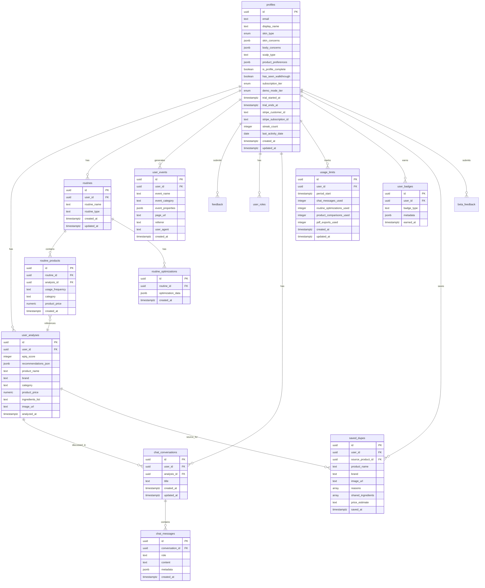

# Data Models & JSON Schemas

**Document Version:** 2.0  
**Last Updated:** December 31, 2025  
**Owner:** Engineering Team  
**Status:** Active

---

## Table of Contents

1. [Database Schema Overview](#database-schema-overview)
2. [Core Tables](#core-tables)
3. [Subscription & Monetization Tables](#subscription--monetization-tables)
4. [Chat System Tables](#chat-system-tables)
5. [Gamification & Engagement Tables](#gamification--engagement-tables)
6. [Analytics Views](#analytics-views)
7. [Cache Tables](#cache-tables)
8. [JSON Schemas](#json-schemas)
9. [API Request/Response Payloads](#api-requestresponse-payloads)

---

## Database Schema Overview

### Entity Relationship Diagram



### Database Design Principles

1. **Normalized Design**: Minimize data redundancy
2. **UUID Primary Keys**: Globally unique, URL-safe identifiers
3. **JSONB for Flexibility**: Schema-less data in `_json` columns
4. **Timestamps**: All tables track `created_at` (and `updated_at` where applicable)
5. **Soft Deletes**: Use flags instead of hard deletes (future)
6. **Foreign Keys**: Enforce referential integrity with `ON DELETE CASCADE`
7. **RLS Enabled**: Row-Level Security on all user-data tables

---

## Core Tables

### profiles

**Purpose:** Store user account information, skin profile data, and subscription status.

**Schema:**

| Column | Type | Nullable | Default | Description |
|--------|------|----------|---------|-------------|
| `id` | UUID | No | auth.users FK | Primary key, matches auth.users.id |
| `email` | TEXT | Yes | NULL | User's email address |
| `display_name` | TEXT | Yes | NULL | User's display name |
| `skin_type` | ENUM | Yes | NULL | oily, dry, combination, normal, sensitive |
| `skin_concerns` | JSONB | Yes | `[]` | Array of concern strings |
| `body_concerns` | JSONB | Yes | `[]` | Array of body concern strings |
| `scalp_type` | TEXT | Yes | NULL | Scalp/hair type description |
| `product_preferences` | JSONB | Yes | `{"face": true, "body": false, "hair": false}` | Product category preferences |
| `is_profile_complete` | BOOLEAN | Yes | false | Has user completed onboarding? |
| `has_seen_walkthrough` | BOOLEAN | Yes | false | Has user seen product walkthrough? |
| `subscription_tier` | ENUM | Yes | 'free' | free, premium, pro |
| `demo_mode_tier` | ENUM | Yes | NULL | Admin demo mode tier override |
| `trial_started_at` | TIMESTAMPTZ | Yes | NULL | When trial began |
| `trial_ends_at` | TIMESTAMPTZ | Yes | NULL | When trial expires |
| `stripe_customer_id` | TEXT | Yes | NULL | Stripe customer ID |
| `stripe_subscription_id` | TEXT | Yes | NULL | Stripe subscription ID |
| `streak_count` | INTEGER | Yes | 0 | Current daily streak |
| `last_activity_date` | DATE | Yes | NULL | Last activity for streak tracking |
| `created_at` | TIMESTAMPTZ | Yes | now() | Account creation timestamp |
| `updated_at` | TIMESTAMPTZ | Yes | now() | Last profile update timestamp |

**RLS Policies:**
- Users can view their own profile
- Users can update their own profile
- Users can create their own profile (on signup)

**TypeScript Interface:**

```typescript
interface Profile {
  id: string;
  email: string | null;
  display_name: string | null;
  skin_type: 'oily' | 'dry' | 'combination' | 'normal' | 'sensitive' | null;
  skin_concerns: string[];
  body_concerns: string[];
  scalp_type: string | null;
  product_preferences: {
    face: boolean;
    body: boolean;
    hair: boolean;
  };
  is_profile_complete: boolean;
  has_seen_walkthrough: boolean;
  subscription_tier: 'free' | 'premium' | 'pro';
  demo_mode_tier: 'free' | 'premium' | 'pro' | null;
  trial_started_at: string | null;
  trial_ends_at: string | null;
  stripe_customer_id: string | null;
  stripe_subscription_id: string | null;
  streak_count: number;
  last_activity_date: string | null;
  created_at: string;
  updated_at: string;
}
```

---

### user_analyses

**Purpose:** Store product analysis results (EpiQ scores, AI recommendations).

**Schema:**

| Column | Type | Nullable | Default | Description |
|--------|------|----------|---------|-------------|
| `id` | UUID | No | gen_random_uuid() | Primary key |
| `user_id` | UUID | No | - | Foreign key to profiles |
| `epiq_score` | INTEGER | Yes | NULL | 0-100 quality score |
| `recommendations_json` | JSONB | Yes | NULL | AI analysis results |
| `product_name` | TEXT | No | - | Product name |
| `brand` | TEXT | Yes | NULL | Brand name |
| `category` | TEXT | Yes | NULL | Product category |
| `product_price` | NUMERIC | Yes | NULL | Product price (USD) |
| `ingredients_list` | TEXT | No | - | Comma-separated ingredients |
| `image_url` | TEXT | Yes | NULL | User-uploaded product image |
| `analyzed_at` | TIMESTAMPTZ | Yes | now() | Analysis timestamp |

**RLS Policies:**
- Users can view their own analyses
- Users can create their own analyses

**TypeScript Interface:**

```typescript
interface UserAnalysis {
  id: string;
  user_id: string;
  epiq_score: number | null;
  recommendations_json: {
    overall_assessment: string;
    sub_scores: {
      ingredient_safety: number;
      skin_compatibility: number;
      active_quality: number;
      preservative_safety: number;
    };
    product_metadata: {
      product_type: string;
      product_type_label: string;
      brand: string;
      category: string;
    };
    enriched_ingredients: Array<{
      name: string;
      role: string;
      explanation: string;
      molecular_weight: number | null;
      safety_profile: string;
      risk_score: number;
      category: 'safe' | 'beneficial' | 'problematic' | 'unverified';
    }>;
    key_actives: Array<{
      name: string;
      function: string;
      concentration?: string;
      benefits: string[];
    }>;
    red_flags: Array<{
      ingredient: string;
      concern: string;
      severity: 'low' | 'medium' | 'high';
    }>;
    suitable_for: string[];
    avoid_if: string[];
    routine_placement: string;
    better_alternatives?: Array<{
      name: string;
      reason: string;
      price_difference: number;
    }>;
    ai_explanation: {
      answer_markdown: string;
      summary_one_liner: string;
      safety_level: 'low' | 'moderate' | 'high' | 'unknown';
      professional_referral: {
        needed: boolean;
        reason: string;
        suggested_professional_type: 'none' | 'dermatologist' | 'esthetician' | 'either';
      };
    };
  } | null;
  product_name: string;
  brand: string | null;
  category: string | null;
  product_price: number | null;
  ingredients_list: string;
  image_url: string | null;
  analyzed_at: string;
}
```

---

### routines

**Purpose:** Store user's skincare routines.

**Schema:**

| Column | Type | Nullable | Default | Description |
|--------|------|----------|---------|-------------|
| `id` | UUID | No | gen_random_uuid() | Primary key |
| `user_id` | UUID | No | - | Foreign key to auth.users |
| `routine_name` | TEXT | No | - | User-defined routine name |
| `routine_type` | TEXT | Yes | 'face' | face, body, hair |
| `created_at` | TIMESTAMPTZ | No | now() | Creation timestamp |
| `updated_at` | TIMESTAMPTZ | No | now() | Last update timestamp |

**RLS Policies:**
- Users can view their own routines
- Users can create their own routines
- Users can update their own routines
- Users can delete their own routines

---

### routine_products

**Purpose:** Link products (analyses) to routines with usage frequency.

**Schema:**

| Column | Type | Nullable | Default | Description |
|--------|------|----------|---------|-------------|
| `id` | UUID | No | gen_random_uuid() | Primary key |
| `routine_id` | UUID | No | - | Foreign key to routines |
| `analysis_id` | UUID | No | - | Foreign key to user_analyses |
| `usage_frequency` | TEXT | No | - | "AM", "PM", "AM/PM", "Weekly" |
| `category` | TEXT | Yes | NULL | Product category |
| `product_price` | NUMERIC | Yes | NULL | Product price (cached) |
| `created_at` | TIMESTAMPTZ | No | now() | Added to routine timestamp |

**RLS Policies:**
- Users can view products in their routines
- Users can add products to their routines
- Users can update products in their routines
- Users can delete products from their routines

---

### routine_optimizations

**Purpose:** Store routine optimization results.

**Schema:**

| Column | Type | Nullable | Default | Description |
|--------|------|----------|---------|-------------|
| `id` | UUID | No | gen_random_uuid() | Primary key |
| `routine_id` | UUID | No | - | Foreign key to routines |
| `optimization_data` | JSONB | No | - | Optimization insights |
| `created_at` | TIMESTAMPTZ | No | now() | Optimization timestamp |

**RLS Policies:**
- Users can view optimizations for their routines
- Users can create optimizations for their routines

---

## Subscription & Monetization Tables

### usage_limits

**Purpose:** Track free tier usage quotas per billing period.

**Schema:**

| Column | Type | Nullable | Default | Description |
|--------|------|----------|---------|-------------|
| `id` | UUID | No | gen_random_uuid() | Primary key |
| `user_id` | UUID | No | - | Foreign key to auth.users |
| `period_start` | TIMESTAMPTZ | No | date_trunc('month', now()) | Billing period start |
| `chat_messages_used` | INTEGER | Yes | 0 | Chat messages used this period |
| `routine_optimizations_used` | INTEGER | Yes | 0 | Optimizations used this period |
| `product_comparisons_used` | INTEGER | Yes | 0 | Comparisons used this period |
| `pdf_exports_used` | INTEGER | Yes | 0 | PDF exports used this period |
| `created_at` | TIMESTAMPTZ | Yes | now() | Record creation timestamp |
| `updated_at` | TIMESTAMPTZ | Yes | now() | Last update timestamp |

**RLS Policies:**
- Users can view their own usage limits
- Users can insert their own usage limits
- Users can update their own usage limits

**Usage Limits by Tier:**

| Feature | Free | Premium | Pro |
|---------|------|---------|-----|
| Chat Messages | 3/month | 50/month | Unlimited |
| Routine Optimizations | 0 | 3/month | Unlimited |
| Product Comparisons | 0 | 5/month | Unlimited |
| PDF Exports | 0 | 5/month | Unlimited |

---

## Chat System Tables

### chat_conversations

**Purpose:** Store chat conversation metadata.

**Schema:**

| Column | Type | Nullable | Default | Description |
|--------|------|----------|---------|-------------|
| `id` | UUID | No | gen_random_uuid() | Primary key |
| `user_id` | UUID | No | - | Foreign key to auth.users |
| `analysis_id` | UUID | No | - | Foreign key to user_analyses |
| `title` | TEXT | Yes | NULL | Conversation title |
| `created_at` | TIMESTAMPTZ | No | now() | Creation timestamp |
| `updated_at` | TIMESTAMPTZ | No | now() | Last update timestamp |

**RLS Policies:**
- Users can view their own conversations
- Users can create their own conversations
- Users can update their own conversations

---

### chat_messages

**Purpose:** Store individual chat messages.

**Schema:**

| Column | Type | Nullable | Default | Description |
|--------|------|----------|---------|-------------|
| `id` | UUID | No | gen_random_uuid() | Primary key |
| `conversation_id` | UUID | No | - | Foreign key to chat_conversations |
| `role` | TEXT | No | - | "user" or "assistant" |
| `content` | TEXT | No | - | Message content |
| `metadata` | JSONB | Yes | `{}` | Additional message metadata |
| `created_at` | TIMESTAMPTZ | No | now() | Message timestamp |

**RLS Policies:**
- Users can view messages from their conversations
- Users can create messages in their conversations

---

## Gamification & Engagement Tables

### user_badges

**Purpose:** Store user achievement badges.

**Schema:**

| Column | Type | Nullable | Default | Description |
|--------|------|----------|---------|-------------|
| `id` | UUID | No | gen_random_uuid() | Primary key |
| `user_id` | UUID | No | - | Foreign key to auth.users |
| `badge_type` | TEXT | No | - | Badge identifier |
| `metadata` | JSONB | Yes | `{}` | Additional badge data |
| `earned_at` | TIMESTAMPTZ | Yes | now() | When badge was earned |

**Badge Types:**
- `first_analysis` - Completed first product analysis
- `routine_builder` - Created first routine
- `streak_7` - 7-day usage streak
- `streak_30` - 30-day usage streak
- `power_user` - 50+ analyses

**RLS Policies:**
- Users can view their own badges
- Users can earn badges

---

### saved_dupes

**Purpose:** Store user's saved product dupes/alternatives.

**Schema:**

| Column | Type | Nullable | Default | Description |
|--------|------|----------|---------|-------------|
| `id` | UUID | No | gen_random_uuid() | Primary key |
| `user_id` | UUID | No | - | Foreign key to auth.users |
| `source_product_id` | UUID | Yes | - | FK to user_analyses |
| `product_name` | TEXT | No | - | Dupe product name |
| `brand` | TEXT | Yes | NULL | Dupe brand |
| `image_url` | TEXT | Yes | NULL | Dupe image URL |
| `reasons` | TEXT[] | Yes | NULL | Why it's a dupe |
| `shared_ingredients` | TEXT[] | Yes | NULL | Common ingredients |
| `price_estimate` | TEXT | Yes | NULL | Price range |
| `saved_at` | TIMESTAMPTZ | Yes | now() | Save timestamp |

**RLS Policies:**
- Users can view their own saved dupes
- Users can save dupes
- Users can unsave dupes

---

## Feedback & Analytics Tables

### feedback

**Purpose:** Store user feedback and ratings.

**Schema:**

| Column | Type | Nullable | Default | Description |
|--------|------|----------|---------|-------------|
| `id` | UUID | No | gen_random_uuid() | Primary key |
| `user_id` | UUID | Yes | NULL | Foreign key (optional) |
| `feedback_type` | TEXT | No | - | Type of feedback |
| `message` | TEXT | No | - | Feedback content |
| `rating` | INTEGER | Yes | NULL | 1-5 star rating |
| `context_type` | TEXT | Yes | NULL | Context type |
| `context_id` | UUID | Yes | NULL | Related entity ID |
| `page_url` | TEXT | Yes | NULL | Page where submitted |
| `created_at` | TIMESTAMPTZ | No | now() | Submission timestamp |

---

### beta_feedback

**Purpose:** Store detailed beta tester feedback for product-market fit analysis.

**Schema:**

| Column | Type | Nullable | Default | Description |
|--------|------|----------|---------|-------------|
| `id` | UUID | No | gen_random_uuid() | Primary key |
| `user_id` | UUID | Yes | NULL | Foreign key |
| `email` | TEXT | Yes | NULL | Contact email |
| `motivation` | TEXT | Yes | NULL | Why they use SkinLytix |
| `report_clarity` | TEXT | Yes | NULL | Analysis clarity rating |
| `most_helpful_feature` | TEXT | Yes | NULL | Most valuable feature |
| `frustrations` | TEXT | Yes | NULL | Pain points |
| `perceived_accuracy` | TEXT | Yes | NULL | Accuracy rating |
| `missing_feature` | TEXT | Yes | NULL | Feature requests |
| `pmf_disappointment` | TEXT | Yes | NULL | PMF survey: disappointment level |
| `pmf_substitute` | TEXT | Yes | NULL | PMF survey: alternatives |
| `pmf_core_value` | TEXT | Yes | NULL | PMF survey: main benefit |
| `pmf_willing_to_pay` | TEXT | Yes | NULL | PMF survey: price sensitivity |
| `pmf_price_expectation` | TEXT | Yes | NULL | PMF survey: expected price |
| `wants_session` | BOOLEAN | Yes | NULL | Open to user interview |
| `created_at` | TIMESTAMPTZ | Yes | now() | Submission timestamp |

---

### user_events

**Purpose:** Track user analytics events.

**Schema:**

| Column | Type | Nullable | Default | Description |
|--------|------|----------|---------|-------------|
| `id` | UUID | No | gen_random_uuid() | Primary key |
| `user_id` | UUID | Yes | NULL | Foreign key |
| `event_name` | TEXT | No | - | Event identifier |
| `event_category` | TEXT | No | - | Event category |
| `event_properties` | JSONB | Yes | `{}` | Event metadata |
| `page_url` | TEXT | Yes | NULL | Page URL |
| `referrer` | TEXT | Yes | NULL | Referrer URL |
| `user_agent` | TEXT | Yes | NULL | Browser user agent |
| `created_at` | TIMESTAMPTZ | No | now() | Event timestamp |

---

### user_roles

**Purpose:** Store user role assignments for authorization.

**Schema:**

| Column | Type | Nullable | Default | Description |
|--------|------|----------|---------|-------------|
| `id` | UUID | No | gen_random_uuid() | Primary key |
| `user_id` | UUID | No | - | Foreign key to auth.users |
| `role` | ENUM | No | - | admin, moderator, user |
| `created_at` | TIMESTAMPTZ | Yes | now() | Assignment timestamp |

**RLS Policies:**
- Users can view their own roles
- Admins can manage all roles

---

## Rate Limiting Tables

### rate_limit_log

**Purpose:** Track API request rate limiting.

**Schema:**

| Column | Type | Nullable | Default | Description |
|--------|------|----------|---------|-------------|
| `id` | UUID | No | gen_random_uuid() | Primary key |
| `endpoint` | TEXT | No | - | API endpoint |
| `identifier` | TEXT | No | - | User ID or IP |
| `created_at` | TIMESTAMPTZ | Yes | now() | Request timestamp |

---

## Cache Tables

### product_cache

**Purpose:** Cache Open Beauty Facts API responses.

**Schema:**

| Column | Type | Nullable | Default | Description |
|--------|------|----------|---------|-------------|
| `id` | UUID | No | gen_random_uuid() | Primary key |
| `barcode` | TEXT | No | - | Product barcode |
| `obf_data_json` | JSONB | No | - | Cached API response |
| `cached_at` | TIMESTAMPTZ | Yes | now() | Cache timestamp |

**Cache TTL:** 30 days

---

### ingredient_cache

**Purpose:** Cache PubChem ingredient data.

**Schema:**

| Column | Type | Nullable | Default | Description |
|--------|------|----------|---------|-------------|
| `id` | UUID | No | gen_random_uuid() | Primary key |
| `ingredient_name` | TEXT | No | - | Ingredient name |
| `pubchem_cid` | TEXT | Yes | NULL | PubChem compound ID |
| `molecular_weight` | NUMERIC | Yes | NULL | Molecular weight |
| `properties_json` | JSONB | Yes | NULL | Cached properties |
| `cached_at` | TIMESTAMPTZ | Yes | now() | Cache timestamp |

**Cache TTL:** 90 days

---

## Analytics Views

### analytics_daily_active_users

**Purpose:** Track daily active users.

**Columns:**
- `date` - Calendar date
- `active_users` - Count of unique users

---

### analytics_feature_adoption

**Purpose:** Track feature usage patterns.

**Columns:**
- `event_category` - Feature category
- `event_name` - Specific event
- `event_count` - Total events
- `unique_users` - Unique users

---

### conversion_funnel_metrics

**Purpose:** Track conversion funnel performance.

**Columns:**
- `date` - Calendar date
- `homepage_views` - Homepage view count
- `demo_clicks` - Demo CTA clicks
- `signup_clicks` - Signup CTA clicks
- `completed_onboarding` - Onboarding completions
- `first_analysis` - First analysis count
- `demo_ctr` - Demo click-through rate
- `signup_ctr` - Signup click-through rate
- `onboarding_completion_rate` - Onboarding completion rate

---

### cta_performance_metrics

**Purpose:** Track CTA button performance.

**Columns:**
- `date` - Calendar date
- `event_name` - CTA event name
- `cta_text` - Button text
- `location` - Page location
- `total_clicks` - Total clicks
- `unique_users` - Unique users

---

### engagement_metrics_summary

**Purpose:** Daily engagement summary.

**Columns:**
- `date` - Calendar date
- `daily_active_users` - DAU count
- `engagement_events` - Total engagement events
- `conversion_events` - Total conversion events
- `analyses` - Analysis count
- `routines_created` - New routines
- `routines_optimized` - Optimization count
- `avg_engagement_per_user` - Engagement ratio
- `avg_conversions_per_user` - Conversion ratio

---

### user_journey_analysis

**Purpose:** Full user journey funnel analysis.

**Columns:**
- `total_users` - Total user count
- `viewed_homepage` - Homepage viewers
- `clicked_demo` - Demo clickers
- `clicked_signup` - Signup clickers
- `completed_onboarding` - Onboarded users
- `completed_first_analysis` - First analysis users
- `homepage_to_demo_rate` - Conversion rate
- `homepage_to_signup_rate` - Conversion rate
- `signup_to_onboarding_rate` - Completion rate
- `onboarding_to_analysis_rate` - Activation rate
- `avg_minutes_to_demo` - Time to demo
- `avg_minutes_to_signup` - Time to signup
- `avg_minutes_to_complete_onboarding` - Onboarding time

---

### rate_limit_abuse_alerts

**Purpose:** Identify rate limit abuse.

**Columns:**
- `endpoint` - API endpoint
- `ip_address` - Request IP
- `total_requests` - Total request count
- `requests_last_5min` - Recent request count
- `first_request` - First request timestamp
- `last_request` - Last request timestamp

---

## Enums

### app_role

```sql
CREATE TYPE app_role AS ENUM ('admin', 'moderator', 'user');
```

### skin_type_enum

```sql
CREATE TYPE skin_type_enum AS ENUM ('oily', 'dry', 'combination', 'sensitive', 'normal');
```

### subscription_tier

```sql
CREATE TYPE subscription_tier AS ENUM ('free', 'premium', 'pro');
```

---

## Database Functions

### check_rate_limit

**Purpose:** Check if request is within rate limits.

```sql
FUNCTION check_rate_limit(
  _endpoint TEXT,
  _identifier TEXT,
  _max_requests INTEGER,
  _window_minutes INTEGER
) RETURNS JSON
```

### has_role

**Purpose:** Check if user has specific role.

```sql
FUNCTION has_role(
  _role app_role,
  _user_id UUID
) RETURNS BOOLEAN
```
