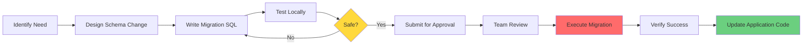

# Database Migration Guide

**Document Version:** 1.0  
**Last Updated:** November 11, 2025  
**Owner:** Engineering Team  
**Status:** Active

---

## Table of Contents

1. [Migration Philosophy](#migration-philosophy)
2. [Creating Migrations](#creating-migrations)
3. [Common Migration Patterns](#common-migration-patterns)
4. [Analytics Views Documentation](#analytics-views-documentation)
5. [Data Integrity](#data-integrity)
6. [Performance Optimization](#performance-optimization)
7. [Rollback Procedures](#rollback-procedures)
8. [Migration Checklist](#migration-checklist)

---

## Migration Philosophy

### Core Principles

**1. Always Forward-Compatible**
- Never break existing application code
- Add new optional columns instead of modifying existing ones
- Deprecate before removing (minimum 1 week notice)

**2. Idempotent Migrations**
- Use `IF NOT EXISTS` for creation statements
- Use `IF EXISTS` for deletion statements
- Migrations should be safe to run multiple times

**3. Zero-Downtime Deployments**
- Migrations execute immediately upon approval
- No application downtime during schema changes
- Applications continue using old schema during transition

**4. Data Safety First**
- Never drop columns/tables with data without backup
- Use `ALTER COLUMN` to change constraints, not drop and recreate
- Test migrations on staging data before production

### Migration Lifecycle



---

## Creating Migrations

### Lovable Cloud Auto-Migration Workflow

**Preferred Method:** Use Lovable AI migration tool

1. **Describe What You Need**
   ```
   "I need to add a column to track user's preferred notification time"
   ```

2. **AI Generates Migration**
   - AI generates SQL with best practices
   - Includes RLS policies if needed
   - Includes indexes for performance

3. **Review Generated SQL**
   - Verify correctness
   - Check for idempotency (`IF NOT EXISTS`)
   - Ensure safe defaults for new columns

4. **Approve Migration**
   - Click approval button
   - Migration executes immediately
   - Affects both staging and production

5. **Verify Execution**
   - Check Lovable Cloud → Database → Tables
   - Verify new columns/tables present
   - Check application logs for errors

### Manual Migration File Creation

**When to Use:** Complex migrations requiring custom logic

**File Naming Convention:**
```
supabase/migrations/YYYYMMDD_HHMMSS_description.sql

Example:
supabase/migrations/20251111_143022_add_user_preferences_table.sql
```

**Migration Template:**

```sql
-- Description: [What this migration does]
-- Author: [Your name]
-- Date: [YYYY-MM-DD]
-- Related: [Link to issue/PR if applicable]

-- ============================================================================
-- TABLES
-- ============================================================================

-- Create new table (idempotent)
CREATE TABLE IF NOT EXISTS public.user_preferences (
  id UUID NOT NULL DEFAULT gen_random_uuid() PRIMARY KEY,
  user_id UUID NOT NULL REFERENCES auth.users(id) ON DELETE CASCADE,
  notification_time TIME DEFAULT '09:00:00',
  email_notifications BOOLEAN DEFAULT true,
  push_notifications BOOLEAN DEFAULT false,
  created_at TIMESTAMPTZ NOT NULL DEFAULT now(),
  updated_at TIMESTAMPTZ NOT NULL DEFAULT now(),
  
  -- Constraints
  UNIQUE(user_id) -- One preference row per user
);

-- ============================================================================
-- INDEXES
-- ============================================================================

-- Create indexes for performance
CREATE INDEX IF NOT EXISTS idx_user_preferences_user_id 
ON public.user_preferences(user_id);

-- ============================================================================
-- ROW LEVEL SECURITY (RLS)
-- ============================================================================

-- Enable RLS
ALTER TABLE public.user_preferences ENABLE ROW LEVEL SECURITY;

-- Policy: Users can view their own preferences
CREATE POLICY IF NOT EXISTS "Users can view own preferences"
ON public.user_preferences FOR SELECT
USING (auth.uid() = user_id);

-- Policy: Users can update their own preferences
CREATE POLICY IF NOT EXISTS "Users can update own preferences"
ON public.user_preferences FOR UPDATE
USING (auth.uid() = user_id)
WITH CHECK (auth.uid() = user_id);

-- Policy: Users can insert their own preferences
CREATE POLICY IF NOT EXISTS "Users can insert own preferences"
ON public.user_preferences FOR INSERT
WITH CHECK (auth.uid() = user_id);

-- ============================================================================
-- TRIGGERS
-- ============================================================================

-- Auto-update updated_at timestamp
CREATE TRIGGER IF NOT EXISTS update_user_preferences_updated_at
BEFORE UPDATE ON public.user_preferences
FOR EACH ROW
EXECUTE FUNCTION public.update_updated_at_column();

-- ============================================================================
-- DATA MIGRATION (if needed)
-- ============================================================================

-- Backfill existing users with default preferences
-- (Only run if table already has data)
-- INSERT INTO public.user_preferences (user_id)
-- SELECT id FROM auth.users
-- WHERE id NOT IN (SELECT user_id FROM public.user_preferences);

-- ============================================================================
-- GRANTS (if needed)
-- ============================================================================

-- Grant access to authenticated users
GRANT SELECT, INSERT, UPDATE ON public.user_preferences TO authenticated;
```

---

## Common Migration Patterns

### 1. Adding a Column

**Simple Addition (with default):**

```sql
-- Add column with safe default
ALTER TABLE public.profiles 
ADD COLUMN IF NOT EXISTS notification_enabled BOOLEAN DEFAULT true;

-- Add column without default (nullable)
ALTER TABLE public.profiles 
ADD COLUMN IF NOT EXISTS last_login_at TIMESTAMPTZ;
```

**With Data Backfill:**

```sql
-- Step 1: Add column as nullable
ALTER TABLE public.user_analyses 
ADD COLUMN IF NOT EXISTS brand TEXT;

-- Step 2: Backfill data (if source exists)
UPDATE public.user_analyses
SET brand = 'Unknown'
WHERE brand IS NULL;

-- Step 3: Make NOT NULL after backfill (optional)
-- Wait 24 hours to ensure no issues, then:
-- ALTER TABLE public.user_analyses 
-- ALTER COLUMN brand SET NOT NULL;
```

### 2. Modifying a Column

**Change Type:**

```sql
-- Change column type (safe if compatible)
ALTER TABLE public.routines
ALTER COLUMN routine_name TYPE VARCHAR(200);

-- Change with USING for conversion
ALTER TABLE public.user_analyses
ALTER COLUMN epiq_score TYPE DECIMAL(5,2)
USING epiq_score::DECIMAL(5,2);
```

**Add/Remove Constraints:**

```sql
-- Add NOT NULL (ensure no nulls exist first)
-- Check first:
-- SELECT COUNT(*) FROM profiles WHERE display_name IS NULL;

-- If zero, then:
ALTER TABLE public.profiles
ALTER COLUMN display_name SET NOT NULL;

-- Remove NOT NULL
ALTER TABLE public.profiles
ALTER COLUMN display_name DROP NOT NULL;

-- Add unique constraint
ALTER TABLE public.profiles
ADD CONSTRAINT profiles_email_unique UNIQUE (email);

-- Remove constraint
ALTER TABLE public.profiles
DROP CONSTRAINT IF EXISTS profiles_email_unique;
```

**Change Default:**

```sql
-- Set new default value
ALTER TABLE public.routines
ALTER COLUMN routine_type SET DEFAULT 'face';

-- Remove default
ALTER TABLE public.routines
ALTER COLUMN routine_type DROP DEFAULT;
```

### 3. Removing a Column

**Safe Removal Process:**

```sql
-- DON'T DO THIS IMMEDIATELY:
-- ALTER TABLE profiles DROP COLUMN old_column;

-- INSTEAD: Three-step process

-- Step 1: Make column nullable (if NOT NULL)
ALTER TABLE public.profiles
ALTER COLUMN deprecated_column DROP NOT NULL;

-- Step 2: Wait 1 week, monitor that nothing breaks
-- (Deploy application code that no longer uses this column)

-- Step 3: After 1 week of stability, drop the column
ALTER TABLE public.profiles
DROP COLUMN IF EXISTS deprecated_column;
```

**Why Wait?**
- Allows rollback if issues arise
- Ensures application code updated first
- No data loss if column still in use

### 4. Creating a Table

**Full Table Creation Pattern:**

```sql
-- Create table
CREATE TABLE IF NOT EXISTS public.saved_products (
  id UUID NOT NULL DEFAULT gen_random_uuid() PRIMARY KEY,
  user_id UUID NOT NULL,
  analysis_id UUID NOT NULL REFERENCES public.user_analyses(id) ON DELETE CASCADE,
  saved_at TIMESTAMPTZ NOT NULL DEFAULT now(),
  notes TEXT,
  
  -- Constraints
  UNIQUE(user_id, analysis_id) -- Can't save same product twice
);

-- Create indexes
CREATE INDEX IF NOT EXISTS idx_saved_products_user_id 
ON public.saved_products(user_id);

CREATE INDEX IF NOT EXISTS idx_saved_products_analysis_id 
ON public.saved_products(analysis_id);

-- Enable RLS
ALTER TABLE public.saved_products ENABLE ROW LEVEL SECURITY;

-- RLS policies
CREATE POLICY "Users can view their saved products"
ON public.saved_products FOR SELECT
USING (auth.uid() = user_id);

CREATE POLICY "Users can save products"
ON public.saved_products FOR INSERT
WITH CHECK (auth.uid() = user_id);

CREATE POLICY "Users can delete their saved products"
ON public.saved_products FOR DELETE
USING (auth.uid() = user_id);

-- Grants
GRANT SELECT, INSERT, DELETE ON public.saved_products TO authenticated;
```

### 5. Creating Indexes

**When to Add Indexes:**

```sql
-- Index on foreign key (for joins)
CREATE INDEX IF NOT EXISTS idx_routine_products_routine_id 
ON public.routine_products(routine_id);

-- Index on frequently queried column
CREATE INDEX IF NOT EXISTS idx_user_events_event_name 
ON public.user_events(event_name);

-- Composite index (multiple columns)
CREATE INDEX IF NOT EXISTS idx_user_events_user_id_created_at 
ON public.user_events(user_id, created_at DESC);

-- Partial index (filtered)
CREATE INDEX IF NOT EXISTS idx_user_analyses_high_score 
ON public.user_analyses(epiq_score) 
WHERE epiq_score >= 80;

-- GIN index (for JSONB columns)
CREATE INDEX IF NOT EXISTS idx_profiles_skin_concerns_gin 
ON public.profiles USING gin(skin_concerns);

-- Text search index (for full-text search)
CREATE INDEX IF NOT EXISTS idx_user_analyses_product_name_text 
ON public.user_analyses USING gin(to_tsvector('english', product_name));
```

**Check Index Usage:**

```sql
-- See if index is being used
SELECT 
  schemaname,
  tablename,
  indexname,
  idx_scan as index_scans,
  idx_tup_read as tuples_read,
  idx_tup_fetch as tuples_fetched
FROM pg_stat_user_indexes
WHERE schemaname = 'public'
ORDER BY idx_scan ASC; -- Indexes with low scans may be unnecessary
```

### 6. Creating Views (Analytics)

**View Creation Pattern:**

```sql
-- Drop view if exists (for updates)
DROP VIEW IF EXISTS public.user_engagement_summary;

-- Create or replace view
CREATE OR REPLACE VIEW public.user_engagement_summary AS
SELECT 
  user_id,
  COUNT(DISTINCT DATE(created_at)) as active_days,
  COUNT(*) as total_events,
  MAX(created_at) as last_active_at
FROM public.user_events
WHERE event_category = 'engagement'
GROUP BY user_id;

-- Grant access (views don't inherit RLS)
GRANT SELECT ON public.user_engagement_summary TO authenticated;

-- Comment for documentation
COMMENT ON VIEW public.user_engagement_summary IS 
'Aggregates user engagement metrics by user_id. Used by analytics dashboard.';
```

### 7. Adding RLS Policies

**Security-First Approach:**

```sql
-- Always enable RLS on new tables
ALTER TABLE public.new_table ENABLE ROW LEVEL SECURITY;

-- Pattern 1: User can only see their own data
CREATE POLICY "Users view own data"
ON public.new_table FOR SELECT
USING (auth.uid() = user_id);

-- Pattern 2: User can only modify their own data
CREATE POLICY "Users update own data"
ON public.new_table FOR UPDATE
USING (auth.uid() = user_id)
WITH CHECK (auth.uid() = user_id);

-- Pattern 3: Admin can see all data
CREATE POLICY "Admins view all data"
ON public.new_table FOR SELECT
USING (public.has_role(auth.uid(), 'admin'));

-- Pattern 4: Public read, authenticated write
CREATE POLICY "Public read"
ON public.new_table FOR SELECT
USING (true);

CREATE POLICY "Authenticated write"
ON public.new_table FOR INSERT
WITH CHECK (auth.uid() IS NOT NULL);

-- Pattern 5: Restrict based on related table
CREATE POLICY "Users can view their routine products"
ON public.routine_products FOR SELECT
USING (
  EXISTS (
    SELECT 1 FROM public.routines
    WHERE routines.id = routine_products.routine_id
      AND routines.user_id = auth.uid()
  )
);
```

---

## Analytics Views Documentation

### Overview

SkinLytix uses **database views** for analytics aggregation. Views don't execute queries in real-time but are defined queries that run when accessed.

**Why Views?**
- ✅ Simplify complex queries
- ✅ Consistent aggregation logic
- ✅ No data duplication
- ✅ Always up-to-date

**Security Model:**
- Views don't inherit RLS from underlying tables
- Grant `SELECT` only to `authenticated` role
- Additional frontend validation via `user_roles` table and `ProtectedRoute`

### Existing Analytics Views

#### 1. `cta_performance_metrics`

**Purpose:** Track CTA click performance over time

**Schema:**
```sql
CREATE OR REPLACE VIEW public.cta_performance_metrics AS
SELECT 
  DATE(created_at) as date,
  event_name,
  event_properties->>'location' as location,
  event_properties->>'cta_text' as cta_text,
  COUNT(*) as total_clicks,
  COUNT(DISTINCT user_id) as unique_users
FROM public.user_events
WHERE event_name IN ('demo_cta_clicked', 'signup_cta_clicked')
GROUP BY DATE(created_at), event_name, location, cta_text
ORDER BY date DESC;
```

**Columns:**
- `date` (date): Day of CTA clicks
- `event_name` (text): 'demo_cta_clicked' or 'signup_cta_clicked'
- `location` (text): Where CTA was clicked (e.g., 'hero', 'footer')
- `cta_text` (text): Button text (e.g., 'Try Demo Analysis')
- `total_clicks` (bigint): Total clicks that day
- `unique_users` (bigint): Unique users who clicked

**Usage:**
```typescript
const { data } = await supabase
  .from('cta_performance_metrics')
  .select('*')
  .order('date', { ascending: false });
```

---

#### 2. `conversion_funnel_metrics`

**Purpose:** Track user progression through conversion funnel

**Schema:**
```sql
CREATE OR REPLACE VIEW public.conversion_funnel_metrics AS
SELECT 
  DATE(created_at) as date,
  COUNT(*) FILTER (WHERE event_name = 'page_viewed' AND page_name = 'homepage') as homepage_views,
  COUNT(*) FILTER (WHERE event_name = 'demo_cta_clicked') as demo_clicks,
  COUNT(*) FILTER (WHERE event_name = 'signup_cta_clicked') as signup_clicks,
  COUNT(*) FILTER (WHERE event_name = 'onboarding_completed') as completed_onboarding,
  COUNT(*) FILTER (WHERE event_name = 'product_analysis_completed') as first_analysis,
  -- Conversion rates
  ROUND(
    100.0 * COUNT(*) FILTER (WHERE event_name = 'demo_cta_clicked') / 
    NULLIF(COUNT(*) FILTER (WHERE event_name = 'page_viewed' AND page_name = 'homepage'), 0), 2
  ) as demo_ctr,
  ROUND(
    100.0 * COUNT(*) FILTER (WHERE event_name = 'signup_cta_clicked') / 
    NULLIF(COUNT(*) FILTER (WHERE event_name = 'page_viewed' AND page_name = 'homepage'), 0), 2
  ) as signup_ctr
FROM public.user_events
GROUP BY DATE(created_at)
ORDER BY date DESC;
```

**Columns:**
- `date` (date): Day of events
- `homepage_views` (bigint): Homepage page views
- `demo_clicks` (bigint): Demo CTA clicks
- `signup_clicks` (bigint): Signup CTA clicks
- `completed_onboarding` (bigint): Users who completed onboarding
- `first_analysis` (bigint): Users who completed first analysis
- `demo_ctr` (numeric): Demo click-through rate (%)
- `signup_ctr` (numeric): Signup click-through rate (%)

---

#### 3. `user_journey_analysis`

**Purpose:** Analyze overall user journey metrics

**Schema:**
```sql
CREATE OR REPLACE VIEW public.user_journey_analysis AS
SELECT 
  COUNT(DISTINCT user_id) as total_users,
  COUNT(DISTINCT user_id) FILTER (WHERE event_name = 'page_viewed' AND page_name = 'homepage') as viewed_homepage,
  COUNT(DISTINCT user_id) FILTER (WHERE event_name = 'demo_cta_clicked') as clicked_demo,
  COUNT(DISTINCT user_id) FILTER (WHERE event_name = 'signup_cta_clicked') as clicked_signup,
  COUNT(DISTINCT user_id) FILTER (WHERE event_name = 'onboarding_completed') as completed_onboarding,
  COUNT(DISTINCT user_id) FILTER (WHERE event_name = 'product_analysis_completed') as completed_first_analysis,
  -- Conversion rates
  ROUND(100.0 * COUNT(DISTINCT user_id) FILTER (WHERE event_name = 'demo_cta_clicked') / 
    NULLIF(COUNT(DISTINCT user_id) FILTER (WHERE event_name = 'page_viewed'), 0), 2) as homepage_to_demo_rate,
  ROUND(100.0 * COUNT(DISTINCT user_id) FILTER (WHERE event_name = 'signup_cta_clicked') / 
    NULLIF(COUNT(DISTINCT user_id) FILTER (WHERE event_name = 'page_viewed'), 0), 2) as homepage_to_signup_rate
FROM public.user_events;
```

**Columns:**
- `total_users` (bigint): Total unique users
- `viewed_homepage` (bigint): Users who viewed homepage
- `clicked_demo` (bigint): Users who clicked demo CTA
- `clicked_signup` (bigint): Users who clicked signup CTA
- `completed_onboarding` (bigint): Users who completed onboarding
- `completed_first_analysis` (bigint): Users who completed analysis
- `homepage_to_demo_rate` (numeric): Homepage → Demo conversion (%)
- `homepage_to_signup_rate` (numeric): Homepage → Signup conversion (%)

---

#### 4. `engagement_metrics_summary`

**Purpose:** Daily engagement metrics aggregation

**Schema:**
```sql
CREATE OR REPLACE VIEW public.engagement_metrics_summary AS
SELECT 
  DATE(created_at) as date,
  COUNT(DISTINCT user_id) as daily_active_users,
  COUNT(*) FILTER (WHERE event_category = 'engagement') as engagement_events,
  COUNT(*) FILTER (WHERE event_category = 'conversion') as conversion_events,
  COUNT(*) FILTER (WHERE event_name = 'product_analysis_completed') as analyses,
  COUNT(*) FILTER (WHERE event_name = 'routine_created') as routines_created,
  COUNT(*) FILTER (WHERE event_name = 'routine_optimized') as routines_optimized,
  ROUND(AVG(
    (SELECT COUNT(*) FROM user_events e2 
     WHERE e2.user_id = user_events.user_id 
       AND e2.event_category = 'engagement' 
       AND DATE(e2.created_at) = DATE(user_events.created_at))
  ), 2) as avg_engagement_per_user
FROM public.user_events
GROUP BY DATE(created_at)
ORDER BY date DESC;
```

**Columns:**
- `date` (date): Day of metrics
- `daily_active_users` (bigint): Unique users active that day
- `engagement_events` (bigint): Total engagement events
- `conversion_events` (bigint): Total conversion events
- `analyses` (bigint): Product analyses completed
- `routines_created` (bigint): Routines created
- `routines_optimized` (bigint): Routine optimizations run
- `avg_engagement_per_user` (numeric): Average engagement events per user

---

### Creating New Analytics Views

**Example: Product Category Analysis View**

```sql
-- Create view for product category breakdown
CREATE OR REPLACE VIEW public.product_category_analysis AS
SELECT 
  category,
  COUNT(*) as total_analyses,
  ROUND(AVG(epiq_score), 2) as avg_score,
  MIN(epiq_score) as min_score,
  MAX(epiq_score) as max_score,
  COUNT(DISTINCT user_id) as unique_users
FROM public.user_analyses
WHERE category IS NOT NULL
GROUP BY category
ORDER BY total_analyses DESC;

-- Grant access
GRANT SELECT ON public.product_category_analysis TO authenticated;

-- Document the view
COMMENT ON VIEW public.product_category_analysis IS 
'Aggregates product analysis metrics by category. Shows average EpiQ scores and usage by category.';
```

**Frontend Integration:**

```typescript
// hooks/useAnalytics.ts
export const useProductCategoryAnalysis = () => {
  return useQuery({
    queryKey: ['product-category-analysis'],
    queryFn: async () => {
      // Admin check
      const { data: { user } } = await supabase.auth.getUser();
      if (!user) throw new Error('Not authenticated');
      
      const { data: roles } = await supabase
        .from('user_roles')
        .select('role')
        .eq('user_id', user.id)
        .eq('role', 'admin')
        .maybeSingle();
      
      if (!roles) throw new Error('Unauthorized: Admin access required');
      
      // Query view
      const { data, error } = await supabase
        .from('product_category_analysis')
        .select('*')
        .order('total_analyses', { ascending: false });
      
      if (error) throw error;
      return data;
    },
    refetchInterval: 30000, // Refresh every 30 seconds
  });
};
```

---

## Data Integrity

### Foreign Key Constraints

**Always use foreign keys for referential integrity:**

```sql
-- Explicit foreign key with ON DELETE behavior
ALTER TABLE public.routine_products
ADD CONSTRAINT fk_routine_products_routine_id
FOREIGN KEY (routine_id) 
REFERENCES public.routines(id) 
ON DELETE CASCADE; -- Delete routine_products when routine is deleted

-- Different ON DELETE options:
-- CASCADE: Delete child rows when parent is deleted
-- SET NULL: Set foreign key to NULL when parent is deleted
-- RESTRICT: Prevent deletion of parent if children exist
-- NO ACTION: Same as RESTRICT (default)
```

### Unique Constraints

```sql
-- Single column unique
ALTER TABLE public.profiles
ADD CONSTRAINT profiles_email_unique 
UNIQUE (email);

-- Composite unique (multiple columns)
ALTER TABLE public.routine_products
ADD CONSTRAINT routine_products_routine_analysis_unique
UNIQUE (routine_id, analysis_id); -- Can't add same product to routine twice
```

### Check Constraints vs. Triggers

**⚠️ Avoid CHECK constraints for time-based validations:**

```sql
-- ❌ DON'T DO THIS (breaks on database restore)
ALTER TABLE subscriptions
ADD CONSTRAINT check_expire_at_future
CHECK (expire_at > now());

-- ✅ DO THIS INSTEAD (validation trigger)
CREATE OR REPLACE FUNCTION validate_expire_at()
RETURNS TRIGGER AS $$
BEGIN
  IF NEW.expire_at <= now() THEN
    RAISE EXCEPTION 'expire_at must be in the future';
  END IF;
  RETURN NEW;
END;
$$ LANGUAGE plpgsql;

CREATE TRIGGER validate_expire_at_trigger
BEFORE INSERT OR UPDATE ON subscriptions
FOR EACH ROW EXECUTE FUNCTION validate_expire_at();
```

**Why?** CHECK constraints must be immutable. `now()` changes over time, causing restore failures.

### Handling Orphaned Records

```sql
-- Find orphaned routine_products (routines deleted)
SELECT rp.*
FROM public.routine_products rp
LEFT JOIN public.routines r ON r.id = rp.routine_id
WHERE r.id IS NULL;

-- Clean up orphans
DELETE FROM public.routine_products
WHERE routine_id NOT IN (SELECT id FROM public.routines);

-- Prevent in future: Use ON DELETE CASCADE
ALTER TABLE public.routine_products
DROP CONSTRAINT IF EXISTS fk_routine_products_routine_id;

ALTER TABLE public.routine_products
ADD CONSTRAINT fk_routine_products_routine_id
FOREIGN KEY (routine_id)
REFERENCES public.routines(id)
ON DELETE CASCADE;
```

---

## Performance Optimization

### Indexing Strategy

**What to Index:**

1. **Primary keys** (auto-indexed)
2. **Foreign keys** (for joins)
3. **Frequently queried columns** (WHERE, ORDER BY)
4. **JSONB paths** (if querying nested JSON)

**Index Performance Check:**

```sql
-- Find slow queries
SELECT 
  query,
  calls,
  total_exec_time,
  mean_exec_time,
  min_exec_time,
  max_exec_time
FROM pg_stat_statements
ORDER BY mean_exec_time DESC
LIMIT 10;

-- Check if query uses index
EXPLAIN ANALYZE
SELECT * FROM user_analyses
WHERE user_id = 'some-uuid'
ORDER BY analyzed_at DESC;

-- Should show "Index Scan" not "Seq Scan"
```

### Query Optimization

**Use `EXPLAIN ANALYZE` to understand query performance:**

```sql
EXPLAIN ANALYZE
SELECT 
  r.routine_name,
  ua.product_name,
  rp.usage_frequency
FROM public.routines r
JOIN public.routine_products rp ON r.id = rp.routine_id
JOIN public.user_analyses ua ON rp.analysis_id = ua.id
WHERE r.user_id = 'user-uuid'
ORDER BY r.created_at DESC;

-- Look for:
-- - "Seq Scan" → Add index
-- - High "cost" → Simplify query
-- - "Nested Loop" with large tables → Rewrite join
```

### Caching with Cache Tables

**SkinLytix uses cache tables for expensive lookups:**

#### `ingredient_cache`

```sql
-- Structure
CREATE TABLE public.ingredient_cache (
  id UUID PRIMARY KEY DEFAULT gen_random_uuid(),
  ingredient_name TEXT NOT NULL UNIQUE,
  pubchem_cid TEXT,
  molecular_weight NUMERIC,
  properties_json JSONB,
  cached_at TIMESTAMPTZ DEFAULT now()
);

-- Usage in edge function:
-- 1. Check cache first
const { data: cached } = await supabase
  .from('ingredient_cache')
  .select('*')
  .eq('ingredient_name', ingredientName)
  .single();

if (cached) return cached.properties_json;

// 2. If not cached, fetch from PubChem API
const pubchemData = await fetchFromPubChem(ingredientName);

// 3. Store in cache
await supabase.from('ingredient_cache').insert({
  ingredient_name: ingredientName,
  pubchem_cid: pubchemData.cid,
  properties_json: pubchemData
});
```

#### `product_cache`

```sql
-- Structure
CREATE TABLE public.product_cache (
  id UUID PRIMARY KEY DEFAULT gen_random_uuid(),
  barcode TEXT NOT NULL UNIQUE,
  obf_data_json JSONB NOT NULL, -- Open Beauty Facts data
  cached_at TIMESTAMPTZ DEFAULT now()
);

-- Usage: Same pattern as ingredient_cache
```

**Cache Invalidation:**

```sql
-- Purge stale cache (data older than 30 days)
DELETE FROM public.ingredient_cache
WHERE cached_at < NOW() - INTERVAL '30 days';

-- Invalidate specific ingredient
DELETE FROM public.ingredient_cache
WHERE ingredient_name = 'Niacinamide';
```

### Connection Pooling (PgBouncer)

Lovable Cloud automatically uses PgBouncer for connection pooling.

**Check Connection Pool:**

```sql
-- View active connections
SELECT count(*) 
FROM pg_stat_activity 
WHERE state = 'active';

-- Max connections (default 100 in Lovable Cloud)
SHOW max_connections;
```

**If connection pool exhausted:**
1. Check for long-running queries:
   ```sql
   SELECT pid, now() - query_start AS duration, query
   FROM pg_stat_activity
   WHERE state = 'active'
   ORDER BY duration DESC;
   ```
2. Kill long-running queries:
   ```sql
   SELECT pg_terminate_backend(pid)
   FROM pg_stat_activity
   WHERE pid = <pid>;
   ```
3. Consider upgrading instance size (Lovable Cloud → Advanced Settings)

---

## Rollback Procedures

### When to Rollback vs. Forward-Fix

**Rollback (Reverse Migration):**
- Migration caused data corruption
- Migration broke critical functionality
- Migration has unforeseen consequences

**Forward-Fix (Corrective Migration):**
- Minor bug in migration logic
- Performance degradation (add index)
- RLS policy too restrictive
- Safe to fix forward

### Forward-Fix Example

**Issue:** Migration added NOT NULL constraint too early, breaking inserts

```sql
-- Original migration (caused issue):
-- ALTER TABLE profiles ADD COLUMN phone_number TEXT NOT NULL;

-- Forward fix:
ALTER TABLE public.profiles
ALTER COLUMN phone_number DROP NOT NULL;

-- Set default for existing nulls
UPDATE public.profiles
SET phone_number = ''
WHERE phone_number IS NULL;
```

### Reverse Migration Example

**Issue:** Migration added wrong column type

```sql
-- Original migration:
-- ALTER TABLE user_analyses ADD COLUMN analysis_duration INTEGER;

-- Reverse migration:
ALTER TABLE public.user_analyses
DROP COLUMN IF EXISTS analysis_duration;

-- Correct migration:
ALTER TABLE public.user_analyses
ADD COLUMN IF NOT EXISTS analysis_duration_ms BIGINT;
```

### Data Preservation During Rollback

**Never drop data without backup:**

```sql
-- Step 1: Create backup table
CREATE TABLE public.profiles_backup AS
SELECT * FROM public.profiles;

-- Step 2: Perform risky migration
-- (e.g., drop column, change type)

-- Step 3: If issues, restore from backup
INSERT INTO public.profiles
SELECT * FROM public.profiles_backup
WHERE id NOT IN (SELECT id FROM public.profiles);

-- Step 4: After stability, drop backup
DROP TABLE IF EXISTS public.profiles_backup;
```

---

## Migration Checklist

### Pre-Migration

- [ ] Migration SQL written and reviewed
- [ ] Idempotency ensured (IF NOT EXISTS, IF EXISTS)
- [ ] Safe defaults for new columns
- [ ] RLS policies included (for new tables)
- [ ] Indexes added for performance
- [ ] Tested locally on dev database
- [ ] Reviewed by at least 1 team member
- [ ] Impact assessment documented (tables affected, downtime expected)
- [ ] Rollback plan documented

### During Migration

- [ ] Migration approved via Lovable Cloud tool
- [ ] Migration executed successfully (check logs)
- [ ] No errors in database logs
- [ ] Tables/columns/views visible in Lovable Cloud dashboard

### Post-Migration

- [ ] Application code updated to use new schema (if needed)
- [ ] RLS policies tested (users can access their data)
- [ ] Indexes verified (EXPLAIN ANALYZE shows index usage)
- [ ] Staging environment tested (smoke test core flows)
- [ ] Production deployed (if application changes needed)
- [ ] Monitoring for 24 hours (check error rates)
- [ ] Documentation updated (schema docs, API docs)

---

## Document Version History

| Version | Date | Author | Changes |
|---------|------|--------|---------|
| 1.0 | Nov 11, 2025 | Engineering Team | Initial comprehensive database migration guide |

---

**For Questions or Updates:**  
Contact: Backend Engineer or CTO  
Slack Channel: #backend

**Related Documentation:**
- [Engineering SOPs](./Engineering-SOPs.md)
- [Technical Stack & Setup](./Technical-Stack-Setup.md)
- [Data Models](./Data-Models.md)
- [Deployment Runbook](../operations/Deployment-Runbook.md)

---

**End of Database Migration Guide**
