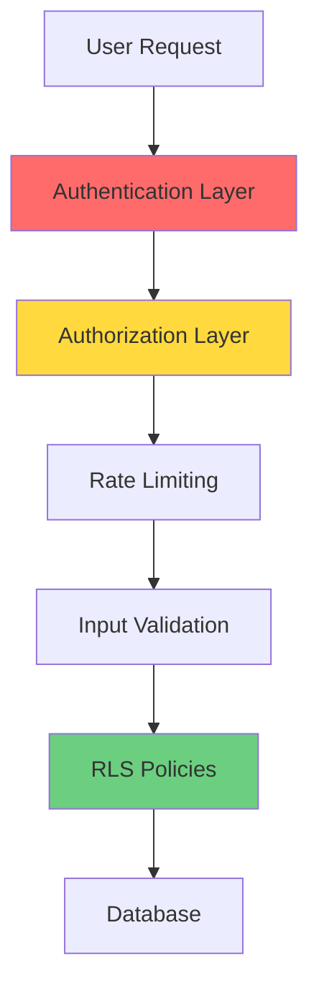

# Security Best Practices

**Document Version:** 1.0  
**Last Updated:** December 31, 2025  
**Owner:** Engineering Team  
**Status:** Active

---

## Table of Contents

1. [Overview](#overview)
2. [Authentication](#authentication)
3. [Authorization & Role Management](#authorization--role-management)
4. [Row-Level Security (RLS)](#row-level-security-rls)
5. [Input Validation](#input-validation)
6. [Rate Limiting](#rate-limiting)
7. [Secrets Management](#secrets-management)
8. [Edge Function Security](#edge-function-security)
9. [Common Vulnerabilities](#common-vulnerabilities)
10. [Security Checklist](#security-checklist)

---

## Overview

SkinLytix implements defense-in-depth security with multiple layers:

1. **Authentication**: Supabase Auth with JWT tokens
2. **Authorization**: Role-based access via `user_roles` table
3. **Row-Level Security**: Database-level access control
4. **Input Validation**: Client and server-side validation
5. **Rate Limiting**: Protect against abuse
6. **Secrets Management**: Secure credential storage



---

## Authentication

### Supabase Auth Implementation

SkinLytix uses Supabase Auth with email/password authentication.

**Auto-confirm email is enabled for beta** (disable in production).

```typescript
// Sign up
const { data, error } = await supabase.auth.signUp({
  email,
  password,
});

// Sign in
const { data, error } = await supabase.auth.signInWithPassword({
  email,
  password,
});

// Get current user
const { data: { user } } = await supabase.auth.getUser();

// Get JWT token for edge functions
const { data: { session } } = await supabase.auth.getSession();
const token = session?.access_token;
```

### Protected Routes

Use `ProtectedRoute` component for authenticated pages:

```typescript
// src/App.tsx
<Route path="/profile" element={
  <ProtectedRoute>
    <Profile />
  </ProtectedRoute>
} />
```

### Edge Function Authentication

```typescript
// In edge function
const authHeader = req.headers.get('Authorization');
if (!authHeader) {
  return new Response('Unauthorized', { status: 401 });
}

const { data: { user }, error } = await supabase.auth.getUser(
  authHeader.replace('Bearer ', '')
);

if (error || !user) {
  return new Response('Invalid token', { status: 401 });
}
```

---

## Authorization & Role Management

### ⚠️ CRITICAL: Role Storage

**NEVER store roles on the profiles table!** This creates privilege escalation vulnerabilities.

Roles MUST be stored in a separate `user_roles` table:

```sql
-- Role enum
CREATE TYPE public.app_role AS ENUM ('admin', 'moderator', 'user');

-- Roles table (separate from profiles!)
CREATE TABLE public.user_roles (
  id UUID PRIMARY KEY DEFAULT gen_random_uuid(),
  user_id UUID REFERENCES auth.users(id) ON DELETE CASCADE NOT NULL,
  role app_role NOT NULL,
  created_at TIMESTAMPTZ DEFAULT now(),
  UNIQUE (user_id, role)
);

-- Enable RLS
ALTER TABLE public.user_roles ENABLE ROW LEVEL SECURITY;
```

### Security Definer Function

Use a security definer function to check roles (prevents RLS recursion):

```sql
CREATE OR REPLACE FUNCTION public.has_role(_user_id UUID, _role app_role)
RETURNS BOOLEAN
LANGUAGE SQL
STABLE
SECURITY DEFINER
SET search_path = public
AS $$
  SELECT EXISTS (
    SELECT 1
    FROM public.user_roles
    WHERE user_id = _user_id
      AND role = _role
  )
$$;
```

### Checking Admin Status

**✅ CORRECT: Use server-side validation**

```typescript
// Check admin via user_roles table
const checkAdminStatus = async (userId: string): Promise<boolean> => {
  const { data } = await supabase
    .from('user_roles')
    .select('role')
    .eq('user_id', userId)
    .eq('role', 'admin')
    .maybeSingle();
  
  return !!data;
};

// Or use the has_role function
const { data: isAdmin } = await supabase
  .rpc('has_role', { _user_id: userId, _role: 'admin' });
```

**❌ WRONG: Never use client-side storage!**

```typescript
// NEVER DO THIS!
const isAdmin = localStorage.getItem('isAdmin') === 'true';  // ❌
const isAdmin = sessionStorage.getItem('role') === 'admin';   // ❌
const isAdmin = user.email === 'admin@example.com';          // ❌
```

### RLS Policies for Roles

```sql
-- Users can view their own roles
CREATE POLICY "Users can view their own roles"
ON public.user_roles FOR SELECT
USING (auth.uid() = user_id);

-- Only admins can manage roles
CREATE POLICY "Admins can manage all roles"
ON public.user_roles FOR ALL
USING (has_role(auth.uid(), 'admin'))
WITH CHECK (has_role(auth.uid(), 'admin'));
```

---

## Row-Level Security (RLS)

### Core Principles

1. **Enable RLS on ALL tables** containing user data
2. **Deny by default** - only allow explicit access
3. **Use `auth.uid()`** to restrict to own data
4. **Never use wildcards** (`USING (true)`) without reason

### Standard Policy Patterns

**Pattern 1: Users access own data**

```sql
-- Enable RLS
ALTER TABLE public.user_analyses ENABLE ROW LEVEL SECURITY;

-- Select own data
CREATE POLICY "Users can view their own analyses"
ON public.user_analyses FOR SELECT
USING (auth.uid() = user_id);

-- Insert own data
CREATE POLICY "Users can create their own analyses"
ON public.user_analyses FOR INSERT
WITH CHECK (auth.uid() = user_id);

-- Update own data
CREATE POLICY "Users can update their own analyses"
ON public.user_analyses FOR UPDATE
USING (auth.uid() = user_id);

-- Delete own data
CREATE POLICY "Users can delete their own analyses"
ON public.user_analyses FOR DELETE
USING (auth.uid() = user_id);
```

**Pattern 2: Nested access (via foreign key)**

```sql
-- Users can access routine_products through their routines
CREATE POLICY "Users can view their routine products"
ON public.routine_products FOR SELECT
USING (
  EXISTS (
    SELECT 1 FROM routines
    WHERE routines.id = routine_products.routine_id
    AND routines.user_id = auth.uid()
  )
);
```

**Pattern 3: Public read, authenticated write**

```sql
-- Anyone can read ingredient cache
CREATE POLICY "Anyone can read ingredient cache"
ON public.ingredient_cache FOR SELECT
USING (true);

-- Only system can write (no INSERT/UPDATE/DELETE policies)
-- Data inserted via service role in edge functions
```

### Current RLS Status

| Table | RLS Enabled | Policies |
|-------|-------------|----------|
| `profiles` | ✅ | Select/Update/Insert own |
| `user_analyses` | ✅ | Select/Insert own |
| `routines` | ✅ | Full CRUD own |
| `routine_products` | ✅ | CRUD via routine ownership |
| `chat_conversations` | ✅ | Select/Insert/Update own |
| `chat_messages` | ✅ | Select/Insert via conversation |
| `usage_limits` | ✅ | Select/Insert/Update own |
| `user_badges` | ✅ | Select/Insert own |
| `saved_dupes` | ✅ | Select/Insert/Delete own |
| `feedback` | ✅ | Insert any, Select own |
| `user_roles` | ✅ | Select own, Admin manage all |
| `product_cache` | ✅ | Select any (public) |
| `ingredient_cache` | ✅ | Select any (public) |

---

## Input Validation

### Client-Side Validation

Use Zod for schema validation:

```typescript
import { z } from 'zod';

const productAnalysisSchema = z.object({
  productName: z.string()
    .trim()
    .min(1, "Product name required")
    .max(200, "Product name too long"),
  ingredients: z.string()
    .trim()
    .min(10, "Ingredients list too short")
    .max(10000, "Ingredients list too long"),
  brand: z.string()
    .trim()
    .max(100)
    .optional(),
  price: z.number()
    .min(0)
    .max(10000)
    .optional(),
});

// Usage
const result = productAnalysisSchema.safeParse(formData);
if (!result.success) {
  // Handle validation errors
  console.error(result.error.errors);
  return;
}
```

### Server-Side Validation (Edge Functions)

```typescript
// In edge function
const validateRequest = (body: unknown): RequestBody => {
  const schema = z.object({
    productName: z.string().min(1).max(200),
    ingredients: z.string().min(10).max(10000),
  });
  
  return schema.parse(body);
};

Deno.serve(async (req) => {
  try {
    const body = await req.json();
    const validated = validateRequest(body);
    // Process validated data...
  } catch (error) {
    if (error instanceof z.ZodError) {
      return new Response(JSON.stringify({ 
        error: 'Validation failed',
        details: error.errors 
      }), { status: 400 });
    }
    throw error;
  }
});
```

### URL Parameter Encoding

Always encode user input in URLs:

```typescript
// ✅ Correct
const shareUrl = `https://skinlytix.com/share?product=${encodeURIComponent(productName)}`;

// ❌ Wrong - XSS risk
const shareUrl = `https://skinlytix.com/share?product=${productName}`;
```

### HTML Sanitization

Never use `dangerouslySetInnerHTML` with user content:

```typescript
// ❌ NEVER DO THIS with user-provided content
<div dangerouslySetInnerHTML={{ __html: userInput }} />

// ✅ Use react-markdown for markdown content
import ReactMarkdown from 'react-markdown';
<ReactMarkdown>{aiGeneratedContent}</ReactMarkdown>
```

---

## Rate Limiting

### Implementation

Rate limiting uses the `rate_limit_log` table and `check_rate_limit` function:

```sql
-- Rate limit function
CREATE OR REPLACE FUNCTION public.check_rate_limit(
  _endpoint TEXT,
  _identifier TEXT,
  _max_requests INTEGER,
  _window_minutes INTEGER
)
RETURNS JSONB
LANGUAGE plpgsql
SECURITY DEFINER
SET search_path = public
AS $$
DECLARE
  _window_start TIMESTAMPTZ;
  _current_count INTEGER;
  _allowed BOOLEAN;
BEGIN
  _window_start := NOW() - (INTERVAL '1 minute' * _window_minutes);
  
  SELECT COUNT(*) INTO _current_count
  FROM public.rate_limit_log
  WHERE endpoint = _endpoint 
    AND identifier = _identifier 
    AND created_at >= _window_start;
  
  _allowed := _current_count < _max_requests;
  
  IF _allowed THEN
    INSERT INTO public.rate_limit_log (endpoint, identifier)
    VALUES (_endpoint, _identifier);
  END IF;
  
  RETURN jsonb_build_object(
    'allowed', _allowed,
    'current_count', _current_count + 1,
    'max_requests', _max_requests,
    'retry_after_seconds', _window_minutes * 60
  );
END;
$$;
```

### Rate Limit Configuration

| Endpoint | Max Requests | Window |
|----------|--------------|--------|
| `analyze-product` | 10 | 5 min |
| `chat-skinlytix` | 20 | 5 min |
| `optimize-routine` | 5 | 5 min |
| `find-dupes` | 20 | 5 min |
| `create-checkout` | 5 | 5 min |

### Usage in Edge Functions

```typescript
const checkRateLimit = async (endpoint: string, userId: string) => {
  const { data } = await supabase.rpc('check_rate_limit', {
    _endpoint: endpoint,
    _identifier: userId,
    _max_requests: 10,
    _window_minutes: 5,
  });
  
  if (!data.allowed) {
    throw new Error(`Rate limit exceeded. Retry after ${data.retry_after_seconds}s`);
  }
};
```

---

## Secrets Management

### Available Secrets

| Secret | Purpose | Used In |
|--------|---------|---------|
| `LOVABLE_API_KEY` | Lovable AI Gateway | analyze-product, chat-skinlytix, etc. |
| `STRIPE_SECRET_KEY` | Stripe payments | create-checkout, check-subscription |
| `SUPABASE_URL` | Supabase project URL | All edge functions |
| `SUPABASE_ANON_KEY` | Supabase anon key | All edge functions |
| `SUPABASE_SERVICE_ROLE_KEY` | Supabase admin key | Edge functions (bypass RLS) |

### Accessing Secrets in Edge Functions

```typescript
// Access secret
const apiKey = Deno.env.get('LOVABLE_API_KEY');
if (!apiKey) {
  throw new Error('LOVABLE_API_KEY not configured');
}
```

### Security Rules

1. **Never log secrets** - even partially
2. **Never expose in responses** - API keys must stay server-side
3. **Use service role sparingly** - only when bypassing RLS is necessary
4. **Rotate regularly** - especially after team changes

---

## Edge Function Security

### CORS Headers

```typescript
const corsHeaders = {
  'Access-Control-Allow-Origin': '*',
  'Access-Control-Allow-Headers': 'authorization, x-client-info, apikey, content-type',
};

Deno.serve(async (req) => {
  // Handle preflight
  if (req.method === 'OPTIONS') {
    return new Response('ok', { headers: corsHeaders });
  }
  
  // ... handle request
});
```

### Error Handling

```typescript
try {
  // Process request
} catch (error) {
  console.error('Error:', error.message);
  
  // Don't expose internal errors to client
  return new Response(
    JSON.stringify({ error: 'An error occurred. Please try again.' }),
    { status: 500, headers: { ...corsHeaders, 'Content-Type': 'application/json' } }
  );
}
```

### Logging (Safe)

```typescript
// ✅ Safe logging
console.log('Processing analysis for user:', userId);
console.log('Product name:', productName);

// ❌ NEVER log these
console.log('API Key:', apiKey);           // ❌
console.log('Full request:', req);         // ❌ May contain auth tokens
console.log('User password:', password);   // ❌
```

---

## Common Vulnerabilities

### 1. RLS Bypass

**Vulnerability:** Forgetting to enable RLS or creating overly permissive policies.

**Prevention:**
- Always `ALTER TABLE ... ENABLE ROW LEVEL SECURITY`
- Test policies: try accessing data as different users
- Use Supabase linter

### 2. Privilege Escalation

**Vulnerability:** Storing roles on profiles table.

**Prevention:**
- Separate `user_roles` table
- Security definer function for role checks
- Server-side validation only

### 3. Injection Attacks

**Vulnerability:** Unvalidated user input in queries or URLs.

**Prevention:**
- Zod validation
- Parameterized queries (Supabase client handles this)
- URL encoding

### 4. Rate Limit Bypass

**Vulnerability:** Not implementing rate limits on expensive endpoints.

**Prevention:**
- `check_rate_limit` function on all AI endpoints
- IP-based limits for unauthenticated endpoints

### 5. Secret Exposure

**Vulnerability:** Logging or returning secrets in responses.

**Prevention:**
- Code review for `console.log` statements
- Never include secrets in error responses

---

## Security Checklist

### Before Every PR

- [ ] No secrets in code or logs
- [ ] Input validation on new endpoints
- [ ] RLS policies for new tables
- [ ] Rate limiting on new edge functions
- [ ] No `dangerouslySetInnerHTML` with user content
- [ ] Admin checks use `user_roles` table

### Quarterly Audit

- [ ] Review all RLS policies
- [ ] Check for overly permissive policies
- [ ] Rotate API keys
- [ ] Review rate limit thresholds
- [ ] Check for exposed endpoints
- [ ] Test authentication flows

### Incident Response

1. **Identify** - What data was exposed?
2. **Contain** - Disable affected endpoints
3. **Eradicate** - Fix the vulnerability
4. **Recover** - Restore service
5. **Document** - Post-mortem and prevention

See [Incident Response Guide](../operations/Incident-Response.md) for full procedures.
