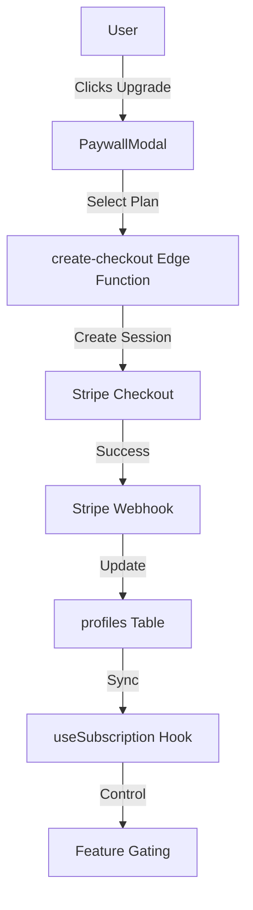
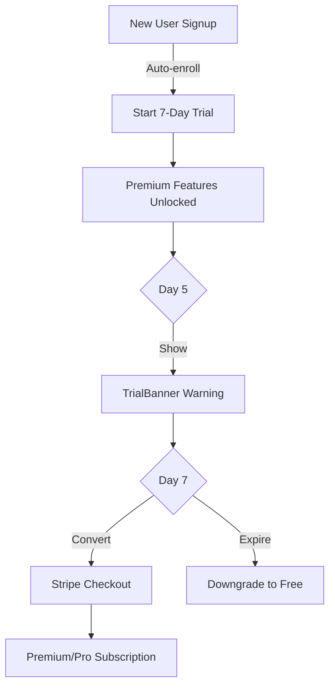

# Subscription System Documentation

**Document Version:** 1.0  
**Last Updated:** December 31, 2025  
**Owner:** Engineering Team  
**Status:** Active

---

## Table of Contents

1. [Overview](#overview)
2. [Subscription Tiers](#subscription-tiers)
3. [Feature Access Matrix](#feature-access-matrix)
4. [Stripe Integration](#stripe-integration)
5. [Database Schema](#database-schema)
6. [Frontend Hooks](#frontend-hooks)
7. [Paywall Components](#paywall-components)
8. [Trial System](#trial-system)
9. [Usage Tracking](#usage-tracking)
10. [Admin Demo Mode](#admin-demo-mode)

---

## Overview

SkinLytix implements a freemium subscription model with three tiers: Free, Premium, and Pro. The system is built on Stripe for payment processing with subscription data synced to the Supabase database.

### Architecture



---

## Subscription Tiers

### Pricing Structure

| Tier | Monthly | Annual | Savings |
|------|---------|--------|---------|
| **Free** | $0 | $0 | - |
| **Premium** | $7.99 | $79/yr | ~17% |
| **Pro** | $14.99 | $149/yr | ~17% |

### Stripe Product Configuration

```typescript
const PRICE_IDS = {
  'premium-monthly': 'price_premium_monthly',
  'premium-annual': 'price_premium_annual',
  'pro-monthly': 'price_pro_monthly',
  'pro-annual': 'price_pro_annual',
};
```

---

## Feature Access Matrix

| Feature | Free | Premium | Pro |
|---------|------|---------|-----|
| Product Analysis | ✅ Unlimited | ✅ Unlimited | ✅ Unlimited |
| EpiQ Score | ✅ | ✅ | ✅ |
| Basic Recommendations | ✅ | ✅ | ✅ |
| Score Breakdown | ❌ | ✅ | ✅ |
| AI Explanation | ❌ | ✅ | ✅ |
| SkinLytixGPT Chat | 3/month | 50/month | ✅ Unlimited |
| Routine Creation | 1 routine | 5 routines | ✅ Unlimited |
| Routine Optimization | ❌ Preview | 3/month | ✅ Unlimited |
| Product Comparison | ❌ | 5/month | ✅ Unlimited |
| PDF Export | ❌ | 5/month | ✅ Unlimited |
| Dupe Discovery | ✅ | ✅ | ✅ |
| Save Dupes | 5 dupes | ✅ Unlimited | ✅ Unlimited |
| Priority Support | ❌ | ❌ | ✅ |

---

## Stripe Integration

### Edge Functions

#### create-checkout

Creates a Stripe checkout session for subscription purchase.

**Location:** `supabase/functions/create-checkout/index.ts`

```typescript
// Request
interface CreateCheckoutRequest {
  plan: 'premium' | 'pro';
  billingCycle: 'monthly' | 'annual';
}

// Response
interface CreateCheckoutResponse {
  url: string;  // Redirect to Stripe Checkout
}
```

**Flow:**
1. Authenticate user via JWT
2. Find or create Stripe customer
3. Create checkout session with correct price ID
4. Return checkout URL

#### check-subscription

Syncs subscription status from Stripe to database.

**Location:** `supabase/functions/check-subscription/index.ts`

```typescript
// Response
interface CheckSubscriptionResponse {
  subscribed: boolean;
  tier: 'free' | 'premium' | 'pro';
  subscription_end: string | null;
}
```

**Flow:**
1. Authenticate user via JWT
2. Look up Stripe customer by email
3. Query active subscriptions
4. Map Stripe product to tier
5. Update profiles table
6. Return subscription status

#### customer-portal

Generates Stripe customer portal URL.

**Location:** `supabase/functions/customer-portal/index.ts`

```typescript
// Response
interface CustomerPortalResponse {
  url: string;  // Stripe Billing Portal URL
}
```

---

## Database Schema

### profiles Table (Subscription Fields)

```sql
ALTER TABLE profiles ADD COLUMN subscription_tier subscription_tier DEFAULT 'free';
ALTER TABLE profiles ADD COLUMN demo_mode_tier subscription_tier;
ALTER TABLE profiles ADD COLUMN trial_started_at TIMESTAMPTZ;
ALTER TABLE profiles ADD COLUMN trial_ends_at TIMESTAMPTZ;
ALTER TABLE profiles ADD COLUMN stripe_customer_id TEXT;
ALTER TABLE profiles ADD COLUMN stripe_subscription_id TEXT;
```

### usage_limits Table

```sql
CREATE TABLE usage_limits (
  id UUID PRIMARY KEY DEFAULT gen_random_uuid(),
  user_id UUID NOT NULL REFERENCES auth.users,
  period_start TIMESTAMPTZ DEFAULT date_trunc('month', now()),
  chat_messages_used INTEGER DEFAULT 0,
  routine_optimizations_used INTEGER DEFAULT 0,
  product_comparisons_used INTEGER DEFAULT 0,
  pdf_exports_used INTEGER DEFAULT 0,
  created_at TIMESTAMPTZ DEFAULT now(),
  updated_at TIMESTAMPTZ DEFAULT now()
);

-- RLS Policies
ALTER TABLE usage_limits ENABLE ROW LEVEL SECURITY;

CREATE POLICY "Users can view own limits"
  ON usage_limits FOR SELECT
  USING (auth.uid() = user_id);

CREATE POLICY "Users can insert own limits"
  ON usage_limits FOR INSERT
  WITH CHECK (auth.uid() = user_id);

CREATE POLICY "Users can update own limits"
  ON usage_limits FOR UPDATE
  USING (auth.uid() = user_id);
```

---

## Frontend Hooks

### useSubscription

**Location:** `src/hooks/useSubscription.ts`

```typescript
interface SubscriptionState {
  tier: SubscriptionTier;
  isAdmin: boolean;
  demoModeTier: SubscriptionTier | null;
  isLoading: boolean;
  trialEndsAt: Date | null;
  subscriptionEnd: Date | null;
}

function useSubscription() {
  // Returns
  return {
    ...state,
    effectiveTier: SubscriptionTier,
    canAccess: (feature: Feature) => boolean,
    setDemoMode: (tier: SubscriptionTier | null) => Promise<void>,
    refresh: () => Promise<void>,
  };
}
```

**Feature Access Check:**

```typescript
const FEATURE_ACCESS: Record<Feature, SubscriptionTier[]> = {
  score_breakdown: ['premium', 'pro'],
  ai_explanation: ['premium', 'pro'],
  chat: ['free', 'premium', 'pro'],  // All tiers, but limited
  routine_optimization: ['premium', 'pro'],
  product_comparison: ['premium', 'pro'],
  pdf_export: ['premium', 'pro'],
  unlimited_routines: ['pro'],
};
```

### useUsageLimits

**Location:** `src/hooks/useUsageLimits.ts`

```typescript
interface UsageLimits {
  chatMessagesUsed: number;
  routineOptimizationsUsed: number;
  productComparisonsUsed: number;
  pdfExportsUsed: number;
}

function useUsageLimits() {
  return {
    limits: UsageLimits,
    isLoading: boolean,
    canUseChat: () => boolean,
    canOptimizeRoutine: () => boolean,
    canCompareProducts: () => boolean,
    canExportPdf: () => boolean,
    incrementUsage: (feature: string) => Promise<void>,
    refresh: () => Promise<void>,
  };
}
```

---

## Paywall Components

### Component Architecture

```
src/components/paywall/
├── index.ts              # Barrel exports
├── PaywallModal.tsx      # Main upgrade modal
├── BlurredPreview.tsx    # Blurred content wrapper
├── UsageCounter.tsx      # Usage limit display
├── UrgencyBanner.tsx     # Trial/upgrade urgency
└── SocialProofBadge.tsx  # Trust signals
```

### PaywallModal

**Location:** `src/components/paywall/PaywallModal.tsx`

```typescript
interface PaywallModalProps {
  isOpen: boolean;
  onClose: () => void;
  feature?: string;
  requiredTier?: 'premium' | 'pro';
}
```

**Features:**
- Tier comparison display
- Monthly/Annual toggle
- Stripe checkout integration
- Feature highlights
- Social proof elements

### BlurredPreview

**Location:** `src/components/paywall/BlurredPreview.tsx`

```typescript
interface BlurredPreviewProps {
  children: React.ReactNode;
  isLocked: boolean;
  feature: string;
  requiredTier: 'premium' | 'pro';
}
```

**Usage:**

```tsx
<BlurredPreview
  isLocked={!canAccess('score_breakdown')}
  feature="Score Breakdown"
  requiredTier="premium"
>
  <ScoreBreakdownContent />
</BlurredPreview>
```

### UsageCounter

**Location:** `src/components/paywall/UsageCounter.tsx`

```typescript
interface UsageCounterProps {
  used: number;
  limit: number;
  feature: string;
}
```

**Display:** "3 of 5 analyses used this month"

---

## Trial System

### Trial Configuration

- **Duration:** 7 days
- **Auto-enrollment:** New signups automatically start trial
- **Trial Tier:** Premium features during trial
- **Conversion:** Prompted to subscribe before trial ends

### Trial Flow



### TrialBanner Component

**Location:** `src/components/subscription/TrialBanner.tsx`

```typescript
interface TrialBannerProps {
  trialEndsAt: Date;
}
```

**Display:** "Your trial ends in 2 days. Upgrade now to keep Premium features."

---

## Usage Tracking

### Increment Usage

```typescript
// In component
const { incrementUsage } = useUsageLimits();

const handleSendMessage = async () => {
  if (!canUseChat()) {
    openPaywall();
    return;
  }
  
  await sendMessage();
  await incrementUsage('chat_messages');
};
```

### Usage Limits by Tier

```typescript
const USAGE_LIMITS = {
  free: {
    chat_messages: 3,
    routine_optimizations: 0,
    product_comparisons: 0,
    pdf_exports: 0,
  },
  premium: {
    chat_messages: 50,
    routine_optimizations: 3,
    product_comparisons: 5,
    pdf_exports: 5,
  },
  pro: {
    chat_messages: Infinity,
    routine_optimizations: Infinity,
    product_comparisons: Infinity,
    pdf_exports: Infinity,
  },
};
```

### Period Reset

Usage limits reset monthly, tracked by `period_start` column:

```sql
-- Check if period needs reset
SELECT CASE
  WHEN period_start < date_trunc('month', now())
  THEN 'RESET_NEEDED'
  ELSE 'CURRENT'
END
FROM usage_limits
WHERE user_id = auth.uid();
```

---

## Admin Demo Mode

### Purpose

Allows admins to test the app as different subscription tiers without affecting their actual subscription.

### Implementation

```typescript
// In useSubscription hook
const setDemoMode = async (tier: SubscriptionTier | null) => {
  if (!isAdmin) return;
  
  await supabase
    .from('profiles')
    .update({ demo_mode_tier: tier })
    .eq('id', userId);
  
  refresh();
};

// Effective tier calculation
const getEffectiveTier = () => {
  if (isAdmin && demoModeTier) {
    return demoModeTier;
  }
  return tier;
};
```

### DemoModeToggle Component

**Location:** `src/components/DemoModeToggle.tsx`

Only visible to admin users. Allows quick switching between tiers for testing.

---

## Gated Components

### ScoreBreakdownAccordion

**Location:** `src/components/ScoreBreakdownAccordion.tsx`

- Gated to: Premium, Pro
- Shows: Sub-scores (safety, compatibility, quality, preservatives)
- Free users: Blurred preview with upgrade CTA

### AIExplanationAccordion

**Location:** `src/components/AIExplanationAccordion.tsx`

- Gated to: Premium, Pro
- Shows: AI-generated product explanation
- Free users: Blurred preview with upgrade CTA

### SkinLytixGPTChat

**Location:** `src/components/SkinLytixGPTChat.tsx`

- Free: 3 messages/month
- Premium: 50 messages/month
- Pro: Unlimited
- Usage counter displayed

### RoutineOptimization

**Location:** `src/pages/RoutineOptimization.tsx`

- Free: Preview only (blurred results)
- Premium: 3/month
- Pro: Unlimited

---

## Checkout Flow

### User Journey

1. User clicks "Upgrade" button or locked feature
2. `PaywallModal` opens with tier comparison
3. User selects plan (Premium/Pro) and cycle (Monthly/Annual)
4. Click "Subscribe" triggers `create-checkout` edge function
5. Redirect to Stripe Checkout
6. User completes payment
7. Stripe webhook updates database
8. User redirected back with active subscription

### Success/Cancel URLs

```typescript
const session = await stripe.checkout.sessions.create({
  success_url: `${origin}/profile?subscription=success`,
  cancel_url: `${origin}/profile?subscription=cancelled`,
  // ...
});
```

---

## Subscription Profile Section

**Location:** `src/components/subscription/SubscriptionSection.tsx`

Displays:
- Current subscription tier
- Usage statistics
- Upgrade/Manage buttons
- Trial countdown (if applicable)

```tsx
<SubscriptionSection
  tier={effectiveTier}
  usageLimits={limits}
  trialEndsAt={trialEndsAt}
  onUpgrade={openPaywall}
  onManage={openCustomerPortal}
/>
```
