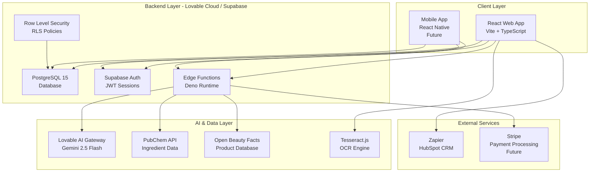
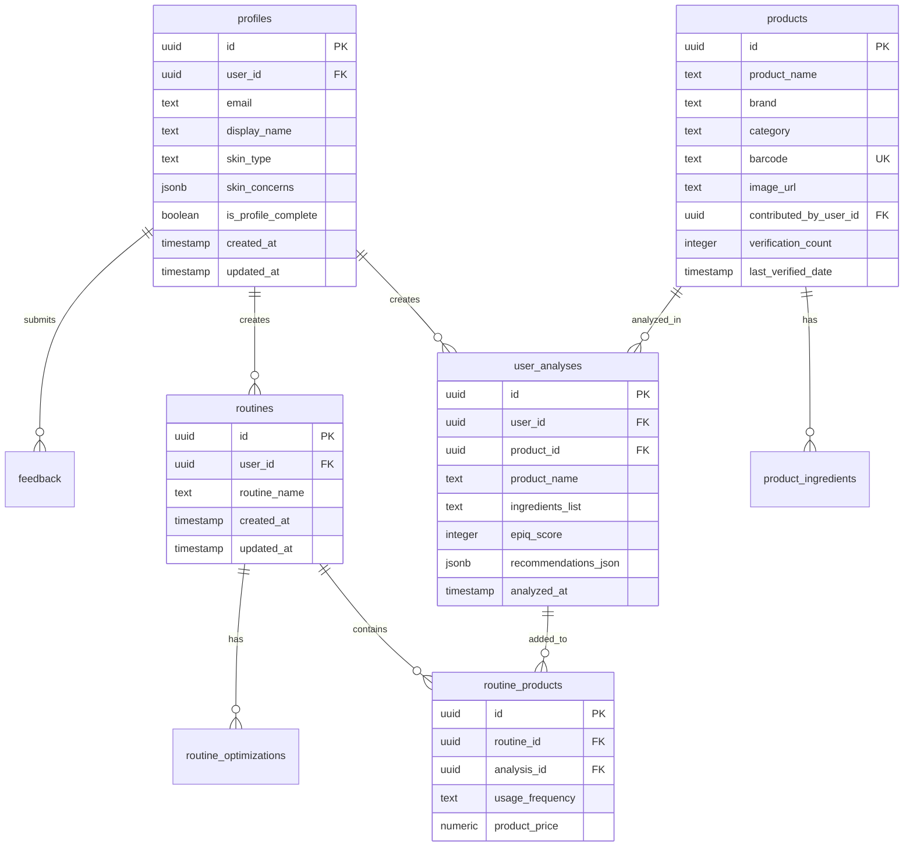
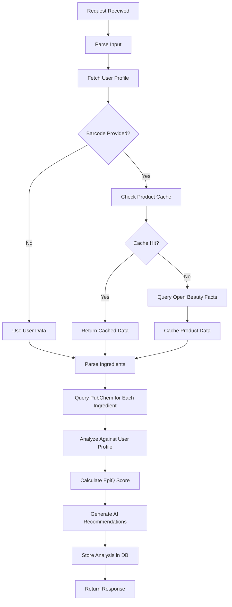

# Technical Stack & Setup Document
## SkinLytix - Complete Development Guide

**Document Version:** 1.0  
**Last Updated:** October 6, 2025  
**Status:** Active Development  
**Owner:** Engineering Team

---

## Table of Contents

1. [Architecture Overview](#architecture-overview)
2. [Technology Stack](#technology-stack)
3. [Development Setup](#development-setup)
4. [Database Design](#database-design)
5. [Backend Implementation](#backend-implementation)
6. [Frontend Implementation](#frontend-implementation)
7. [External Integrations](#external-integrations)
8. [Deployment & CI/CD](#deployment--cicd)
9. [Monitoring & Debugging](#monitoring--debugging)
10. [Security & Compliance](#security--compliance)
11. [Performance Optimization](#performance-optimization)
12. [Troubleshooting Guide](#troubleshooting-guide)

---

## Architecture Overview

### System Architecture Diagram



### Architecture Principles

**1. Serverless-First**
- Lovable Cloud / Supabase for auto-scaling backend
- Deno Edge Functions for serverless logic
- No server management or DevOps overhead

**2. Client-Side Heavy**
- React for rich, interactive UI
- Client-side OCR (Tesseract.js) to reduce server load
- Optimistic UI updates for perceived speed

**3. API-First Design**
- All backend logic exposed via edge functions
- RESTful API patterns
- JSON request/response format

**4. Security by Default**
- Row-Level Security (RLS) on all tables
- JWT-based authentication
- Environment variables for secrets

**5. Performance-Optimized**
- Caching at multiple layers (API, database, client)
- Lazy loading and code splitting
- Optimized database queries with indexes

---

## Technology Stack

### Frontend

#### Core Framework
```json
{
  "react": "^18.3.1",
  "react-dom": "^18.3.1",
  "typescript": "^5.x",
  "vite": "^6.x"
}
```

**Why React + Vite?**
- ✅ Fast development with hot module replacement (HMR)
- ✅ Modern TypeScript support out-of-the-box
- ✅ Optimized production builds
- ✅ Large ecosystem and community

---

#### Routing
```json
{
  "react-router-dom": "^6.30.1"
}
```

**Key Routes:**
- `/` - Landing page (pre-launch) or dashboard (post-launch)
- `/auth` - Signup/login
- `/onboarding` - Skin profile setup
- `/upload` - Product image upload + OCR
- `/analysis/:id` - Product analysis results
- `/routine` - Routine list
- `/routine/:id` - Routine detail view
- `/routine/:id/optimization` - Routine optimization results

---

#### Styling
```json
{
  "tailwindcss": "^3.x",
  "tailwindcss-animate": "^1.0.7",
  "tailwind-merge": "^2.6.0",
  "class-variance-authority": "^0.7.1"
}
```

**Design System:**
- Tailwind CSS for utility-first styling
- Custom design tokens in `src/index.css`
- shadcn/ui components (Radix UI primitives)
- Dark mode support (future)

---

#### UI Components (shadcn/ui)
```json
{
  "@radix-ui/react-accordion": "^1.2.11",
  "@radix-ui/react-alert-dialog": "^1.1.14",
  "@radix-ui/react-avatar": "^1.1.10",
  "@radix-ui/react-dialog": "^1.1.14",
  "@radix-ui/react-dropdown-menu": "^2.1.15",
  "@radix-ui/react-label": "^2.1.7",
  "@radix-ui/react-progress": "^1.1.7",
  "@radix-ui/react-select": "^2.2.5",
  "@radix-ui/react-toast": "^1.2.14",
  "sonner": "^1.7.4"
}
```

**Key Components:**
- `Button`, `Input`, `Label` - Form elements
- `Dialog`, `AlertDialog` - Modals
- `Toast` - Notifications (Sonner library)
- `Progress` - Loading indicators
- `Select`, `Checkbox` - Form inputs

---

#### State Management
```json
{
  "@tanstack/react-query": "^5.83.0",
  "@supabase/supabase-js": "^2.58.0"
}
```

**Strategy:**
- React Query for server state (API calls, caching)
- useState/useContext for local UI state
- Supabase client for real-time subscriptions (future use)

---

#### Forms & Validation
```json
{
  "react-hook-form": "^7.61.1",
  "@hookform/resolvers": "^3.10.0",
  "zod": "^3.25.76"
}
```

**Form Patterns:**
```typescript
// Define schema
const profileSchema = z.object({
  skinType: z.enum(['normal', 'oily', 'dry', 'combination', 'sensitive']),
  skinConcerns: z.array(z.string()).min(1, "Select at least one concern")
});

// Use in form
const form = useForm<z.infer<typeof profileSchema>>({
  resolver: zodResolver(profileSchema),
  defaultValues: {
    skinType: 'normal',
    skinConcerns: []
  }
});
```

---

#### OCR Library
```json
{
  "tesseract.js": "^6.0.1"
}
```

**Implementation:**
```typescript
import { createWorker } from 'tesseract.js';

const worker = await createWorker('eng');
const { data: { text } } = await worker.recognize(imageFile);
await worker.terminate();
```

**Performance:**
- Runs in Web Worker (non-blocking)
- Average processing time: 3-8 seconds
- Accuracy: 85-90% on clear images

---

### Backend (Lovable Cloud / Supabase)

#### Database
- **PostgreSQL 15.x**
- **Supabase managed**
- **Auto-backups** (daily)
- **Connection pooling** (PgBouncer)

---

#### Authentication
- **Supabase Auth**
- **Methods:** Email/password (MVP), Google OAuth (future)
- **Sessions:** JWT tokens with 7-day expiry
- **Auto-confirm emails:** Enabled for beta

---

#### Edge Functions (Deno)
- **Runtime:** Deno 1.x
- **Language:** TypeScript
- **Deployment:** Auto-deploy with Lovable Cloud
- **Concurrency:** Auto-scaling up to 500 concurrent executions

**Edge Functions:**
1. `analyze-product` - Core AI analysis
2. `optimize-routine` - AI routine optimization
3. `save-product` - Community database contribution
4. `query-pubchem` - Ingredient data fetching

---

#### AI Integration
```typescript
// Lovable AI Gateway
const LOVABLE_AI_URL = 'https://ai.gateway.lovable.dev/v1/chat/completions';
const LOVABLE_API_KEY = Deno.env.get('LOVABLE_API_KEY'); // Auto-provisioned

const response = await fetch(LOVABLE_AI_URL, {
  method: 'POST',
  headers: {
    'Authorization': `Bearer ${LOVABLE_API_KEY}`,
    'Content-Type': 'application/json'
  },
  body: JSON.stringify({
    model: 'google/gemini-2.5-flash', // Default model
    messages: [
      { role: 'system', content: 'You are a skincare expert...' },
      { role: 'user', content: 'Analyze this product...' }
    ]
  })
});
```

**Models Available:**
- `google/gemini-2.5-pro` - Best quality, slower
- `google/gemini-2.5-flash` - **Default**, balanced
- `google/gemini-2.5-flash-lite` - Fastest, lower quality
- `openai/gpt-5` - Premium, requires billing
- `openai/gpt-5-mini` - Mid-tier OpenAI
- `openai/gpt-5-nano` - Budget OpenAI

---

### External APIs

#### 1. PubChem API
- **Purpose:** Ingredient molecular data
- **Endpoint:** `https://pubchem.ncbi.nlm.nih.gov/rest/pug/compound/name/{ingredient}/JSON`
- **Rate Limit:** 5 requests/second
- **Authentication:** None required
- **Caching:** 90-day TTL in `ingredient_cache` table

---

#### 2. Open Beauty Facts API
- **Purpose:** Product metadata (brand, category, barcode lookup)
- **Endpoint:** `https://world.openfoodfacts.org/api/v0/product/{barcode}.json`
- **Rate Limit:** No official limit (be respectful)
- **Authentication:** None required
- **Caching:** 30-day TTL in `product_cache` table

---

#### 3. Zapier Webhooks
- **Purpose:** HubSpot CRM integration for waitlist
- **Authentication:** Webhook URL contains secret token
- **Method:** POST with JSON body

**Webhook Payload:**
```json
{
  "first_name": "Jane",
  "last_name": "Doe",
  "email": "jane@example.com",
  "skin_type": "combination",
  "skin_condition": "acne",
  "money_spent": "$100-300/year"
}
```

---

## Development Setup

### Prerequisites

**Required:**
- Node.js 18+ (LTS recommended)
- npm 9+ or bun 1.x
- Git
- Code editor (VS Code recommended)

**Optional:**
- Supabase CLI (for local database)
- Docker (for local Supabase setup)

---

### Initial Setup

#### 1. Clone Repository
```bash
git clone https://github.com/your-org/skinlytix.git
cd skinlytix
```

#### 2. Install Dependencies
```bash
npm install
# or
bun install
```

#### 3. Environment Variables

**File: `.env`** (auto-generated by Lovable Cloud)

```env
VITE_SUPABASE_URL=https://yflbjaetupvakadqjhfb.supabase.co
VITE_SUPABASE_PUBLISHABLE_KEY=eyJhbGciOiJIUzI1NiIsInR5cCI6IkpXVCJ9...
VITE_SUPABASE_PROJECT_ID=yflbjaetupvakadqjhfb
```

**DO NOT EDIT `.env` MANUALLY** - Lovable Cloud manages these values automatically.

---

#### 4. Run Development Server
```bash
npm run dev
# or
bun dev
```

**Dev server runs at:** `http://localhost:8080`

---

### Project Structure

```
skinlytix/
├── public/
│   ├── robots.txt
│   └── favicon.ico
├── src/
│   ├── assets/               # Images, icons
│   ├── components/           # React components
│   │   ├── ui/              # shadcn/ui components
│   │   ├── Hero.tsx
│   │   ├── Features.tsx
│   │   └── ...
│   ├── hooks/               # Custom React hooks
│   ├── integrations/
│   │   └── supabase/
│   │       ├── client.ts    # Supabase client (auto-generated)
│   │       └── types.ts     # Database types (auto-generated)
│   ├── lib/
│   │   └── utils.ts         # Helper functions
│   ├── pages/               # Route components
│   │   ├── Index.tsx        # Landing page
│   │   ├── Auth.tsx         # Login/signup
│   │   ├── Onboarding.tsx   # Profile setup
│   │   ├── Upload.tsx       # Product upload
│   │   ├── Analysis.tsx     # Analysis results
│   │   ├── Routine.tsx      # Routine list
│   │   └── RoutineOptimization.tsx
│   ├── App.tsx              # Main app component
│   ├── main.tsx             # Entry point
│   └── index.css            # Global styles + design system
├── supabase/
│   ├── functions/           # Edge functions
│   │   ├── analyze-product/
│   │   ├── optimize-routine/
│   │   ├── save-product/
│   │   └── query-pubchem/
│   ├── migrations/          # Database migrations (auto-generated)
│   └── config.toml          # Supabase config
├── docs/                    # Business documents
│   ├── business/
│   │   ├── PRD.md
│   │   ├── MVP.md
│   │   └── Scaling-Strategy.md
│   └── technical/
│       └── Technical-Stack-Setup.md
├── package.json
├── vite.config.ts
├── tailwind.config.ts
└── tsconfig.json
```

---

## Database Design

### Schema Overview

**11 Core Tables:**
1. `profiles` - User skin profiles
2. `products` - Community product database
3. `product_ingredients` - Ingredient lists
4. `user_analyses` - Analysis results
5. `routines` - User routines
6. `routine_products` - Products in routines
7. `routine_optimizations` - Optimization results
8. `feedback` - User feedback
9. `waitlist` - Pre-launch signups
10. `product_cache` - Open Beauty Facts cache
11. `ingredient_cache` - PubChem cache

---

### Entity Relationship Diagram



---

### Key Tables (Detailed)

#### profiles
```sql
CREATE TABLE profiles (
  id UUID PRIMARY KEY DEFAULT gen_random_uuid(),
  user_id UUID REFERENCES auth.users NOT NULL,
  email TEXT,
  display_name TEXT,
  skin_type TEXT CHECK (skin_type IN ('normal', 'oily', 'dry', 'combination', 'sensitive')),
  skin_concerns JSONB DEFAULT '[]'::jsonb,
  is_profile_complete BOOLEAN DEFAULT FALSE,
  created_at TIMESTAMP WITH TIME ZONE DEFAULT NOW(),
  updated_at TIMESTAMP WITH TIME ZONE DEFAULT NOW()
);

-- RLS Policies
CREATE POLICY "Users can view own profile"
  ON profiles FOR SELECT
  USING (auth.uid() = user_id);

CREATE POLICY "Users can update own profile"
  ON profiles FOR UPDATE
  USING (auth.uid() = user_id);

-- Indexes
CREATE INDEX idx_profiles_user_id ON profiles(user_id);
```

---

#### products
```sql
CREATE TABLE products (
  id UUID PRIMARY KEY DEFAULT gen_random_uuid(),
  product_name TEXT NOT NULL,
  brand TEXT,
  category TEXT,
  barcode TEXT UNIQUE,
  image_url TEXT,
  contributed_by_user_id UUID,
  verification_count INTEGER DEFAULT 1,
  last_verified_date TIMESTAMP WITH TIME ZONE DEFAULT NOW(),
  date_added TIMESTAMP WITH TIME ZONE DEFAULT NOW(),
  updated_at TIMESTAMP WITH TIME ZONE DEFAULT NOW()
);

-- RLS Policies
CREATE POLICY "Anyone can view products"
  ON products FOR SELECT
  USING (TRUE);

CREATE POLICY "Authenticated users can contribute"
  ON products FOR INSERT
  WITH CHECK (auth.uid() IS NOT NULL AND auth.uid() = contributed_by_user_id);

-- Indexes
CREATE INDEX idx_products_barcode ON products(barcode);
CREATE INDEX idx_products_product_name ON products(product_name);
```

---

#### user_analyses
```sql
CREATE TABLE user_analyses (
  id UUID PRIMARY KEY DEFAULT gen_random_uuid(),
  user_id UUID REFERENCES auth.users NOT NULL,
  product_id UUID REFERENCES products,
  product_name TEXT NOT NULL,
  brand TEXT,
  category TEXT,
  ingredients_list TEXT NOT NULL,
  epiq_score INTEGER CHECK (epiq_score >= 0 AND epiq_score <= 100),
  recommendations_json JSONB,
  analyzed_at TIMESTAMP WITH TIME ZONE DEFAULT NOW()
);

-- RLS Policies
CREATE POLICY "Users can view own analyses"
  ON user_analyses FOR SELECT
  USING (auth.uid() = user_id);

CREATE POLICY "Users can create analyses"
  ON user_analyses FOR INSERT
  WITH CHECK (auth.uid() = user_id);

-- Indexes
CREATE INDEX idx_user_analyses_user_id ON user_analyses(user_id);
CREATE INDEX idx_user_analyses_product_id ON user_analyses(product_id);
CREATE INDEX idx_user_analyses_analyzed_at ON user_analyses(analyzed_at DESC);
```

---

### Database Functions

#### update_updated_at_column()
```sql
CREATE OR REPLACE FUNCTION update_updated_at_column()
RETURNS TRIGGER AS $$
BEGIN
  NEW.updated_at = NOW();
  RETURN NEW;
END;
$$ LANGUAGE plpgsql SECURITY DEFINER SET search_path = public;

-- Apply to tables
CREATE TRIGGER update_profiles_updated_at
  BEFORE UPDATE ON profiles
  FOR EACH ROW
  EXECUTE FUNCTION update_updated_at_column();

CREATE TRIGGER update_products_updated_at
  BEFORE UPDATE ON products
  FOR EACH ROW
  EXECUTE FUNCTION update_updated_at_column();
```

---

#### handle_new_user()
```sql
CREATE OR REPLACE FUNCTION handle_new_user()
RETURNS TRIGGER AS $$
BEGIN
  INSERT INTO public.profiles (id, user_id, email, display_name)
  VALUES (
    NEW.id,
    NEW.id,
    NEW.email,
    COALESCE(NEW.raw_user_meta_data->>'display_name', split_part(NEW.email, '@', 1))
  );
  RETURN NEW;
END;
$$ LANGUAGE plpgsql SECURITY DEFINER SET search_path = public;

-- Trigger on auth.users
CREATE TRIGGER on_auth_user_created
  AFTER INSERT ON auth.users
  FOR EACH ROW
  EXECUTE FUNCTION handle_new_user();
```

---

## Backend Implementation

### Edge Function: analyze-product

**File:** `supabase/functions/analyze-product/index.ts`

#### Function Flow


---

#### Implementation

```typescript
import { serve } from "https://deno.land/std@0.168.0/http/server.ts";
import { createClient } from 'https://esm.sh/@supabase/supabase-js@2';

const corsHeaders = {
  'Access-Control-Allow-Origin': '*',
  'Access-Control-Allow-Headers': 'authorization, x-client-info, apikey, content-type',
};

serve(async (req) => {
  if (req.method === 'OPTIONS') {
    return new Response(null, { headers: corsHeaders });
  }

  try {
    const {
      productName,
      brand,
      category,
      ingredientsList,
      barcode
    } = await req.json();

    // Initialize Supabase client
    const supabaseUrl = Deno.env.get('SUPABASE_URL')!;
    const supabaseKey = Deno.env.get('SUPABASE_SERVICE_ROLE_KEY')!;
    const supabase = createClient(supabaseUrl, supabaseKey);

    // Authenticate user
    const authHeader = req.headers.get('Authorization')!;
    const { data: { user }, error: authError } = await supabase.auth.getUser(
      authHeader.replace('Bearer ', '')
    );

    if (authError || !user) {
      throw new Error('Unauthorized');
    }

    // Fetch user skin profile
    const { data: profile } = await supabase
      .from('profiles')
      .select('*')
      .eq('user_id', user.id)
      .single();

    // Query Open Beauty Facts if barcode provided
    let productData = null;
    if (barcode) {
      // Check cache first
      const { data: cachedProduct } = await supabase
        .from('product_cache')
        .select('*')
        .eq('barcode', barcode)
        .single();

      if (cachedProduct) {
        productData = cachedProduct.obf_data_json;
      } else {
        // Query API
        const obfResponse = await fetch(
          `https://world.openfoodfacts.org/api/v0/product/${barcode}.json`
        );
        const obfData = await obfResponse.json();
        
        if (obfData.product) {
          productData = obfData.product;
          
          // Cache the result
          await supabase.from('product_cache').insert({
            barcode,
            obf_data_json: productData
          });
        }
      }
    }

    // Parse ingredients
    const ingredients = ingredientsList
      .split(',')
      .map((ing: string) => ing.trim())
      .filter(Boolean);

    // Query PubChem for each ingredient (with caching)
    const ingredientData = await queryPubChemBatch(supabase, ingredients);

    // Analyze ingredients against user profile
    const goodIngredients: string[] = [];
    const badIngredients: string[] = [];

    ingredients.forEach((ingredient) => {
      const ingData = ingredientData[ingredient.toLowerCase()];
      
      // Ingredient analysis logic
      if (isBeneficial(ingredient, profile)) {
        goodIngredients.push(ingredient);
      }
      if (isProblematic(ingredient, profile)) {
        badIngredients.push(ingredient);
      }
    });

    // Calculate EpiQ Score
    let score = 70; // Base score
    
    goodIngredients.forEach(() => score += 3);
    badIngredients.forEach(() => score -= 10);
    
    score = Math.max(0, Math.min(100, score)); // Clamp 0-100

    // Generate AI recommendations
    const recommendations = await generateRecommendations(
      supabase,
      productName,
      ingredients,
      profile,
      goodIngredients,
      badIngredients
    );

    // Store analysis
    const { data: analysis } = await supabase
      .from('user_analyses')
      .insert({
        user_id: user.id,
        product_name: productName,
        brand,
        category,
        ingredients_list: ingredientsList,
        epiq_score: score,
        recommendations_json: recommendations
      })
      .select()
      .single();

    return new Response(
      JSON.stringify({
        analysisId: analysis.id,
        epiqScore: score,
        goodIngredients,
        badIngredients,
        recommendations
      }),
      { headers: { ...corsHeaders, 'Content-Type': 'application/json' } }
    );

  } catch (error) {
    console.error('Error:', error);
    return new Response(
      JSON.stringify({ error: error.message }),
      { status: 500, headers: { ...corsHeaders, 'Content-Type': 'application/json' } }
    );
  }
});

// Helper: Query PubChem with caching
async function queryPubChemBatch(supabase: any, ingredients: string[]) {
  const results: Record<string, any> = {};
  
  for (const ingredient of ingredients) {
    const ingKey = ingredient.toLowerCase();
    
    // Check cache
    const { data: cached } = await supabase
      .from('ingredient_cache')
      .select('*')
      .eq('ingredient_name', ingKey)
      .single();

    if (cached) {
      results[ingKey] = cached.properties_json;
    } else {
      // Query PubChem API
      try {
        const response = await fetch(
          `https://pubchem.ncbi.nlm.nih.gov/rest/pug/compound/name/${encodeURIComponent(ingredient)}/JSON`
        );
        const data = await response.json();
        
        const properties = data.PC_Compounds?.[0];
        
        // Cache result
        await supabase.from('ingredient_cache').insert({
          ingredient_name: ingKey,
          pubchem_cid: properties?.id?.id?.cid?.toString(),
          molecular_weight: properties?.props?.find((p: any) => p.urn.label === 'Molecular Weight')?.value?.fval,
          properties_json: properties
        });
        
        results[ingKey] = properties;
      } catch (err) {
        console.error(`PubChem query failed for ${ingredient}:`, err);
        results[ingKey] = null;
      }
      
      // Rate limiting
      await new Promise(resolve => setTimeout(resolve, 200)); // 5 req/sec
    }
  }
  
  return results;
}

// Helper: Check if ingredient is beneficial
function isBeneficial(ingredient: string, profile: any): boolean {
  const ing = ingredient.toLowerCase();
  
  // Active ingredients
  if (ing.includes('hyaluronic') || ing.includes('niacinamide') || 
      ing.includes('vitamin c') || ing.includes('retinol')) {
    return true;
  }
  
  // Match skin concerns
  const concerns = profile.skin_concerns || [];
  if (concerns.includes('dryness') && ing.includes('glycerin')) return true;
  if (concerns.includes('aging') && ing.includes('peptide')) return true;
  
  return false;
}

// Helper: Check if ingredient is problematic
function isProblematic(ingredient: string, profile: any): boolean {
  const ing = ingredient.toLowerCase();
  
  // Sensitive skin irritants
  if (profile.skin_type === 'sensitive') {
    if (ing.includes('fragrance') || ing.includes('alcohol') || 
        ing.includes('essential oil')) {
      return true;
    }
  }
  
  // Acne-prone comedogenic ingredients
  const concerns = profile.skin_concerns || [];
  if (concerns.includes('acne')) {
    if (ing.includes('coconut oil') || ing.includes('isopropyl myristate')) {
      return true;
    }
  }
  
  return false;
}

// Helper: Generate AI recommendations
async function generateRecommendations(
  supabase: any,
  productName: string,
  ingredients: string[],
  profile: any,
  goodIngredients: string[],
  badIngredients: string[]
) {
  const LOVABLE_API_KEY = Deno.env.get('LOVABLE_API_KEY')!;
  
  const prompt = `Analyze this skincare product for a user with ${profile.skin_type} skin and concerns: ${profile.skin_concerns.join(', ')}.

Product: ${productName}
Ingredients: ${ingredients.join(', ')}

Beneficial ingredients: ${goodIngredients.join(', ')}
Problematic ingredients: ${badIngredients.join(', ')}

Provide 3-5 concise, actionable recommendations covering:
1. Optimal usage time (AM/PM)
2. Application technique
3. Interaction warnings
4. Skin type-specific tips
5. Routine integration suggestions

Format as JSON array of strings.`;

  const response = await fetch('https://ai.gateway.lovable.dev/v1/chat/completions', {
    method: 'POST',
    headers: {
      'Authorization': `Bearer ${LOVABLE_API_KEY}`,
      'Content-Type': 'application/json'
    },
    body: JSON.stringify({
      model: 'google/gemini-2.5-flash',
      messages: [
        { role: 'system', content: 'You are a skincare expert providing personalized advice.' },
        { role: 'user', content: prompt }
      ]
    })
  });

  const aiData = await response.json();
  const content = aiData.choices[0].message.content;
  
  // Parse JSON array from response
  const recommendations = JSON.parse(content);
  
  return recommendations;
}
```

---

### Edge Function: optimize-routine

**File:** `supabase/functions/optimize-routine/index.ts`

**See PRD for detailed implementation** - Similar structure to `analyze-product` but:
- Fetches all products in routine
- Analyzes ingredient overlap and conflicts
- Calculates cost optimization
- Returns structured JSON with redundancies, conflicts, savings

---

## Frontend Implementation

### Key Components

#### Upload Page

**File:** `src/pages/Upload.tsx`

```typescript
import { useState } from 'react';
import { createWorker } from 'tesseract.js';
import { Button } from '@/components/ui/button';
import { Progress } from '@/components/ui/progress';

export default function Upload() {
  const [file, setFile] = useState<File | null>(null);
  const [extractedText, setExtractedText] = useState('');
  const [progress, setProgress] = useState(0);
  const [isProcessing, setIsProcessing] = useState(false);

  const handleFileChange = (e: React.ChangeEvent<HTMLInputElement>) => {
    if (e.target.files?.[0]) {
      setFile(e.target.files[0]);
    }
  };

  const handleOCR = async () => {
    if (!file) return;

    setIsProcessing(true);
    setProgress(0);

    const worker = await createWorker('eng', 1, {
      logger: (m) => {
        if (m.status === 'recognizing text') {
          setProgress(Math.round(m.progress * 100));
        }
      }
    });

    const { data: { text } } = await worker.recognize(file);
    await worker.terminate();

    setExtractedText(text);
    setIsProcessing(false);
  };

  return (
    <div className="container mx-auto p-6">
      <h1 className="text-3xl font-bold mb-6">Upload Product Image</h1>
      
      <div className="space-y-6">
        <div>
          <input
            type="file"
            accept="image/*"
            onChange={handleFileChange}
            className="hidden"
            id="file-upload"
          />
          <label htmlFor="file-upload">
            <Button as="span">Choose Image</Button>
          </label>
        </div>

        {file && (
          <div>
            
            <Button onClick={handleOCR} disabled={isProcessing} className="mt-4">
              Extract Text
            </Button>
          </div>
        )}

        {isProcessing && (
          <div>
            <Progress value={progress} />
            <p className="text-sm text-muted-foreground mt-2">
              Processing... {progress}%
            </p>
          </div>
        )}

        {extractedText && (
          <div>
            <label className="block text-sm font-medium mb-2">
              Extracted Ingredients (edit if needed):
            </label>
            <textarea
              value={extractedText}
              onChange={(e) => setExtractedText(e.target.value)}
              rows={10}
              className="w-full p-3 border rounded-md"
            />
            <Button onClick={() => {/* Proceed to analysis */}} className="mt-4">
              Analyze Product
            </Button>
          </div>
        )}
      </div>
    </div>
  );
}
```

---

#### Analysis Results Page

**File:** `src/pages/Analysis.tsx`

```typescript
import { useParams } from 'react-router-dom';
import { useQuery } from '@tanstack/react-query';
import { supabase } from '@/integrations/supabase/client';
import { Card } from '@/components/ui/card';
import { Badge } from '@/components/ui/badge';

export default function Analysis() {
  const { id } = useParams<{ id: string }>();

  const { data: analysis, isLoading } = useQuery({
    queryKey: ['analysis', id],
    queryFn: async () => {
      const { data, error } = await supabase
        .from('user_analyses')
        .select('*')
        .eq('id', id)
        .single();

      if (error) throw error;
      return data;
    }
  });

  if (isLoading) return <div>Loading...</div>;
  if (!analysis) return <div>Analysis not found</div>;

  const getScoreColor = (score: number) => {
    if (score >= 90) return 'bg-green-500';
    if (score >= 70) return 'bg-green-400';
    if (score >= 50) return 'bg-yellow-400';
    return 'bg-orange-500';
  };

  return (
    <div className="container mx-auto p-6">
      <Card className="p-8">
        <div className="text-center mb-8">
          <div className={`inline-block p-8 rounded-full ${getScoreColor(analysis.epiq_score)}`}>
            <span className="text-6xl font-bold text-white">{analysis.epiq_score}</span>
          </div>
          <h2 className="text-2xl font-semibold mt-4">
            {analysis.epiq_score >= 70 ? 'Good Match' : 'Fair Match'}
          </h2>
        </div>

        <div className="space-y-6">
          <div>
            <h3 className="text-xl font-semibold mb-2">Product Details</h3>
            <p><strong>Name:</strong> {analysis.product_name}</p>
            <p><strong>Brand:</strong> {analysis.brand}</p>
            <p><strong>Category:</strong> {analysis.category}</p>
          </div>

          <div>
            <h3 className="text-xl font-semibold mb-2">Recommendations</h3>
            <ul className="list-disc list-inside space-y-2">
              {analysis.recommendations_json.map((rec: string, i: number) => (
                <li key={i}>{rec}</li>
              ))}
            </ul>
          </div>
        </div>
      </Card>
    </div>
  );
}
```

---

### Routing Setup

**File:** `src/App.tsx`

```typescript
import { BrowserRouter as Router, Routes, Route } from 'react-router-dom';
import { QueryClient, QueryClientProvider } from '@tanstack/react-query';
import Index from './pages/Index';
import Auth from './pages/Auth';
import Onboarding from './pages/Onboarding';
import Upload from './pages/Upload';
import Analysis from './pages/Analysis';
import Routine from './pages/Routine';
import RoutineOptimization from './pages/RoutineOptimization';
import NotFound from './pages/NotFound';

const queryClient = new QueryClient();

function App() {
  return (
    <QueryClientProvider client={queryClient}>
      <Router>
        <Routes>
          <Route path="/" element={<Index />} />
          <Route path="/auth" element={<Auth />} />
          <Route path="/onboarding" element={<Onboarding />} />
          <Route path="/upload" element={<Upload />} />
          <Route path="/analysis/:id" element={<Analysis />} />
          <Route path="/routine" element={<Routine />} />
          <Route path="/routine/:id/optimization" element={<RoutineOptimization />} />
          <Route path="*" element={<NotFound />} />
        </Routes>
      </Router>
    </QueryClientProvider>
  );
}

export default App;
```

---

## External Integrations

### Zapier Webhook (HubSpot CRM)

**Implementation in `src/components/WaitlistDialog.tsx`:**

```typescript
const handleSubmit = async (data: WaitlistFormData) => {
  // Save to Supabase
  const { error } = await supabase
    .from('waitlist')
    .insert({
      first_name: data.firstName,
      last_name: data.lastName,
      email: data.email,
      skin_type: data.skinType,
      skin_condition: data.skinCondition,
      money_spent: data.moneySpent
    });

  if (error) throw error;

  // Trigger Zapier webhook
  const webhookUrl = 'https://hooks.zapier.com/hooks/catch/XXXXX/YYYYY/';
  
  await fetch(webhookUrl, {
    method: 'POST',
    headers: { 'Content-Type': 'application/json' },
    mode: 'no-cors', // Required for Zapier
    body: JSON.stringify({
      first_name: data.firstName,
      last_name: data.lastName,
      email: data.email,
      skin_type: data.skinType,
      skin_condition: data.skinCondition,
      money_spent: data.moneySpent
    })
  });

  toast({
    title: "Success!",
    description: "You've been added to the waitlist."
  });
};
```

---

## Deployment & CI/CD

### Lovable Cloud Deployment

**Auto-Deployment:**
- Every commit to `main` branch triggers auto-deploy
- Edge functions are automatically deployed
- Database migrations are applied
- No manual intervention required

**Deployment Process:**
1. Push code to GitHub repository
2. Lovable Cloud detects changes
3. Builds Vite app (`npm run build`)
4. Deploys to CDN
5. Deploys edge functions to Deno runtime
6. Applies database migrations

**Deployment URL:**
- Production: `https://your-project.lovable.app`
- Custom domain: Configure in Lovable settings (paid plan)

---

### Manual Deployment (Alternative)

**Build for Production:**
```bash
npm run build
```

**Output:** `dist/` folder with optimized static assets

**Deploy to:**
- Vercel: `vercel deploy`
- Netlify: `netlify deploy --prod`
- AWS S3 + CloudFront
- Any static hosting provider

---

## Monitoring & Debugging

### Supabase Dashboard

**Access:** Lovable Cloud backend view (click "View Backend" in project)

**Available Tools:**
- **Database:** Browse tables, run SQL queries
- **Auth:** View users, sessions
- **Edge Functions:** View logs, execution times
- **Storage:** (Future) Manage uploaded files

---

### Application Logs

**Edge Function Logs:**
```typescript
// In edge functions
console.log('Info message');
console.error('Error message');
```

**View logs:**
- Lovable Cloud backend → Edge Functions → Select function → Logs

---

### Error Tracking

**Client-Side Errors:**
```typescript
// Add error boundary in App.tsx
import { ErrorBoundary } from 'react-error-boundary';

function ErrorFallback({ error }: { error: Error }) {
  return (
    <div className="p-6 text-center">
      <h2 className="text-2xl font-bold text-red-500">Something went wrong</h2>
      <pre className="mt-4 text-left bg-gray-100 p-4 rounded">
        {error.message}
      </pre>
    </div>
  );
}

function App() {
  return (
    <ErrorBoundary FallbackComponent={ErrorFallback}>
      {/* App content */}
    </ErrorBoundary>
  );
}
```

**Recommended:** Integrate Sentry for production error tracking

---

### Performance Monitoring

**Web Vitals:**
```typescript
// src/main.tsx
import { onCLS, onFID, onLCP } from 'web-vitals';

onCLS(console.log);
onFID(console.log);
onLCP(console.log);
```

**Analytics:**
- Google Analytics 4 (optional)
- Plausible Analytics (privacy-friendly)
- PostHog (product analytics)

---

## Security & Compliance

### Authentication Security

**Best Practices:**
- ✅ Use Supabase Auth (secure by default)
- ✅ HTTPS-only in production
- ✅ JWT tokens with 7-day expiry
- ✅ Implement logout functionality
- ✅ No sensitive data in localStorage

---

### Row-Level Security (RLS)

**Critical: All user data tables MUST have RLS enabled**

```sql
-- Enable RLS
ALTER TABLE profiles ENABLE ROW LEVEL SECURITY;

-- Create policy
CREATE POLICY "Users can view own profile"
  ON profiles FOR SELECT
  USING (auth.uid() = user_id);
```

**Verify RLS:**
```sql
-- Check if RLS is enabled
SELECT tablename, rowsecurity 
FROM pg_tables 
WHERE schemaname = 'public';
```

---

### API Security

**Edge Function Authentication:**
```typescript
// Verify JWT token
const authHeader = req.headers.get('Authorization')!;
const { data: { user }, error } = await supabase.auth.getUser(
  authHeader.replace('Bearer ', '')
);

if (error || !user) {
  return new Response(
    JSON.stringify({ error: 'Unauthorized' }),
    { status: 401, headers: corsHeaders }
  );
}
```

---

### Data Privacy

**GDPR Compliance:**
- User data export: Implement data download feature
- User data deletion: Implement account deletion with cascade
- Privacy policy: Required on landing page
- Cookie consent: (Future) If using analytics

---

## Performance Optimization

### Frontend Optimization

**Code Splitting:**
```typescript
// Lazy load routes
import { lazy, Suspense } from 'react';

const Analysis = lazy(() => import('./pages/Analysis'));

// In Routes
<Route 
  path="/analysis/:id" 
  element={
    <Suspense fallback={<div>Loading...</div>}>
      <Analysis />
    </Suspense>
  } 
/>
```

**Image Optimization:**
```typescript
// Use WebP format


// Or use image CDN (Cloudinary, Imgix)

```

---

### Database Optimization

**Indexes:**
```sql
-- Add indexes on frequently queried columns
CREATE INDEX idx_user_analyses_user_id ON user_analyses(user_id);
CREATE INDEX idx_products_barcode ON products(barcode);
CREATE INDEX idx_routine_products_routine_id ON routine_products(routine_id);
```

**Query Optimization:**
```typescript
// Good: Select only needed columns
const { data } = await supabase
  .from('user_analyses')
  .select('id, product_name, epiq_score')
  .eq('user_id', userId);

// Bad: Select all columns
const { data } = await supabase
  .from('user_analyses')
  .select('*')
  .eq('user_id', userId);
```

---

### Caching Strategy

**API Caching:**
- Product cache: 30-day TTL
- Ingredient cache: 90-day TTL
- Analysis cache: 7-day TTL (same product + same user)

**React Query Caching:**
```typescript
const { data } = useQuery({
  queryKey: ['analysis', id],
  queryFn: fetchAnalysis,
  staleTime: 5 * 60 * 1000, // 5 minutes
  cacheTime: 30 * 60 * 1000, // 30 minutes
});
```

---

## Troubleshooting Guide

### Common Issues

#### Issue: OCR Returns Empty Text
**Cause:** Poor image quality, low contrast, rotated text

**Solution:**
1. Add image preprocessing (contrast adjustment)
2. Prompt user to take clearer photo
3. Allow manual text input as fallback

---

#### Issue: Analysis Takes Too Long (>30 seconds)
**Cause:** PubChem API rate limiting, slow AI response

**Solution:**
1. Check PubChem cache hit rate (target 60%+)
2. Batch ingredient queries
3. Implement timeout (30s) with retry logic
4. Show progress indicator to user

---

#### Issue: Database Query Timeouts
**Cause:** Missing indexes, large table scans

**Solution:**
```sql
-- Check slow queries in Supabase Dashboard
-- Add indexes on filtered/joined columns
CREATE INDEX idx_user_analyses_analyzed_at ON user_analyses(analyzed_at DESC);
```

---

#### Issue: RLS Policy Denies Access
**Cause:** User trying to access another user's data

**Solution:**
```sql
-- Check RLS policies
SELECT * FROM pg_policies WHERE tablename = 'user_analyses';

-- Verify user auth
SELECT auth.uid(); -- Should return user's UUID
```

---

## Appendix

### Useful Commands

**Development:**
```bash
npm run dev          # Start dev server
npm run build        # Build for production
npm run preview      # Preview production build
```

**Database:**
```bash
# Connect to remote database (Supabase CLI)
supabase db dump -f dump.sql
supabase db push
```

**Git:**
```bash
git add .
git commit -m "feat: add feature"
git push origin main
```

---

### Environment Variables Reference

**Auto-Generated (.env):**
```env
VITE_SUPABASE_URL=https://yflbjaetupvakadqjhfb.supabase.co
VITE_SUPABASE_PUBLISHABLE_KEY=eyJhbGciOiJIUzI1NiIsInR5cCI6IkpXVCJ9...
VITE_SUPABASE_PROJECT_ID=yflbjaetupvakadqjhfb
```

**Supabase Secrets (Edge Functions):**
- `SUPABASE_URL`
- `SUPABASE_SERVICE_ROLE_KEY`
- `LOVABLE_API_KEY` (auto-provisioned)

---

### API Rate Limits

| Service | Rate Limit | Caching Strategy |
|---------|------------|------------------|
| **PubChem** | 5 req/sec | 90-day cache, batch requests |
| **Open Beauty Facts** | Unlimited (be respectful) | 30-day cache |
| **Lovable AI** | Workspace-based | No caching (personalized) |

---

### Database Maintenance

**Archive Old Data:**
```sql
-- Archive analyses older than 12 months
UPDATE user_analyses
SET archived = TRUE
WHERE analyzed_at < NOW() - INTERVAL '12 months';
```

**Vacuum Database:**
```sql
-- Reclaim space (Supabase manages this)
VACUUM ANALYZE;
```

---

## Contact & Support

**Engineering Team:**
- CTO / Lead Engineer: [Name]
- Backend Engineer: [Name]
- Frontend Engineer: [Name]

**Support Channels:**
- Internal Docs: [Notion/Confluence URL]
- Code Repository: https://github.com/your-org/skinlytix
- Slack Channel: #skinlytix-engineering

---

**End of Document**

*For technical questions or documentation updates, contact the Engineering Team.*
